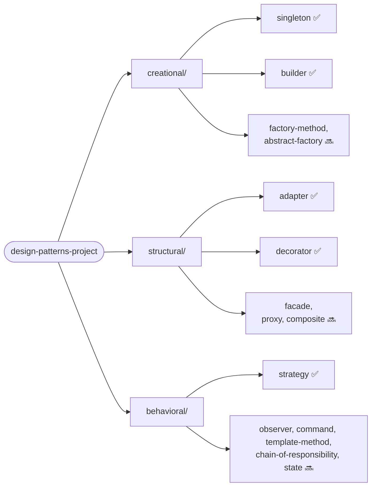

# The Grand Design Patterns Project


A modular Java project demonstrating the Gang of Four design patterns that actually earn
their keep in backend/enterprise code — one Gradle module per pattern, each with its own
README, a textbook example, and a second example pulled from a real scenario where that
exact problem shows up in production (payments, insurance, legacy modernization, batch
processing). Everything is plain JVM: no hosted demo, no external services, `./gradlew build`
and you're done.

This is a portfolio project by [Leonardo Lourenço Gomes](https://www.linkedin.com/in/leonardo-lourenço-gomes),
a senior backend engineer, built in public in scoped batches.

## Contents

- [Why two examples per pattern](#why-two-examples-per-pattern)
- [Patterns](#patterns)
  - [Creational](#creational)
  - [Structural](#structural)
  - [Behavioral](#behavioral)
- [Structure](#structure)
- [Tech stack](#tech-stack)
- [Running it](#running-it)
- [License](#license)

## Why two examples per pattern

Most design pattern write-ups stop at the textbook example, which proves you can copy a
diagram but not that you know when to reach for the pattern. Each module here pairs the
classic example with an **applied** one, chosen by asking: what's the real problem this
pattern solves, and where has that exact problem actually shown up? The mapping isn't
fintech-only by default — it's deliberately pulled from wherever in the author's background
(payments, insurance, telecom, mainframe modernization) the underlying problem is the most
natural fit, so it reads as engineering judgment rather than a forced tie-in.

Every module's own README also closes with a **Further reading** section: the papers and
books that actually established the ideas the pattern leans on (information hiding,
substitutability, memory-model guarantees, and so on), not just a link back to the GoF book.

## Patterns

Jump straight to a category, or to any module that's already built. ⬜ rows are scoped
(scenario already decided) but not implemented yet.

### Creational

| Pattern | Applied scenario | Status |
|---|---|---|
| [Singleton](creational/singleton) | PIX regulatory limit registry (BACEN), hand-rolled vs. Spring-managed | ✅ |
| [Builder](creational/builder) | Auto loan proposal assembly (installments, insurance, collateral) | ✅ |
| Factory Method | Payment provider selection (PIX/Boleto/card) from a declared method | ⬜ |
| Abstract Factory | Insurance policy + form + premium calculation, coherent per region | ⬜ |

### Structural

| Pattern | Applied scenario | Status |
|---|---|---|
| [Adapter](structural/adapter) | Fronting a mainframe/COBOL account system with a modern port | ✅ |
| [Decorator](structural/decorator) | Transaction enrichment pipeline (fraud check, LGPD audit, rate limit) | ✅ |
| Facade | Salary portability orchestration (account check, Bacen lookup, notice) | ⬜ |
| Proxy | Caching an expensive external credit-score bureau lookup | ⬜ |
| Composite | Composable credit/insurance approval rule engine | ⬜ |

### Behavioral

| Pattern | Applied scenario | Status |
|---|---|---|
| [Strategy](behavioral/strategy) | Per-transaction-type fee calculation (PIX/TED/Boleto) | ✅ |
| Observer | Transaction status change fan-out (webhook, audit, push) | ⬜ |
| Command | Replayable batch processing queue (millions of records/day) | ⬜ |
| Template Method | Legacy system migration pipeline (read, validate, transform, write) | ⬜ |
| Chain of Responsibility | Transaction compliance pipeline (KYC, AML, limit, fraud) | ⬜ |
| State | Transaction lifecycle (PENDING → PROCESSING → SETTLED/FAILED) | ⬜ |

## Structure



Every pattern module follows the same skeleton:

```
<category>/<pattern>/
├── build.gradle.kts          # only present when the module needs extra dependencies
├── README.md                 # problem, solution, both examples, trade-offs, coverage, references
└── src/
    ├── main/java/com/designpatterns/<category>/<pattern>/
    │   ├── classic/           # the textbook example
    │   └── applied/           # the real-scenario example
    └── test/java/...           # mirrors the same classic/applied split
```

## Tech stack

Java 26, Gradle 9.7 (Kotlin DSL, wrapper committed — `./gradlew` works without installing
Gradle), JUnit 5, AssertJ, JaCoCo 0.8.15. Spring Context (no Boot, no server) is used in
exactly one module — Singleton — to contrast a hand-rolled singleton against a
container-managed one; every other module is plain Java.

## Running it

```bash
./gradlew build                                    # compiles every module
./gradlew test                                      # runs every module's tests
./gradlew :creational:singleton:jacocoTestReport    # per-module coverage report (HTML)
```

No Docker, no database, no network calls — every test is a plain JUnit test against
in-process code (including the Spring context tests, which use a plain
`AnnotationConfigApplicationContext`, not a full application). Coverage numbers quoted in
each module's README are copied from a real local run, not estimated.

## License

MIT — see [LICENSE](LICENSE).
