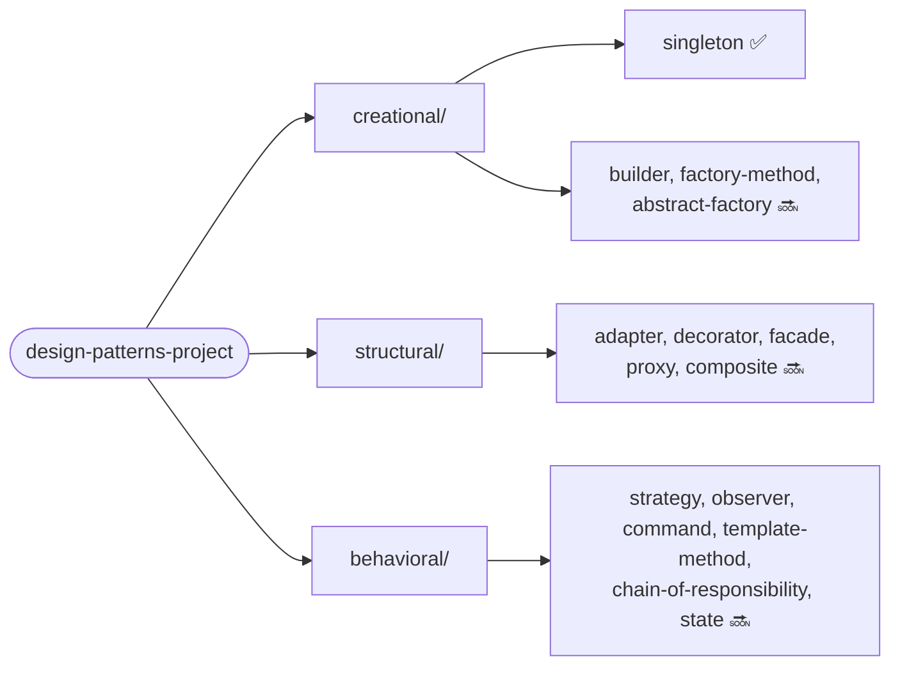

# The Grand Design Patterns Project

A modular Java project demonstrating the Gang of Four design patterns that actually earn
their keep in backend/enterprise code — one Gradle module per pattern, each with its own
README, a textbook example, and a second example pulled from a real scenario where that
exact problem shows up in production (payments, insurance, legacy modernization, batch
processing). Everything is plain JVM: no hosted demo, no external services, `./gradlew build`
and you're done.

This is a portfolio project by [Leonardo Lourenço Gomes](https://www.linkedin.com/in/leonardo-lourenço-gomes),
a senior backend engineer, built in public in scoped batches.

## Why two examples per pattern

Most design pattern write-ups stop at the textbook example, which proves you can copy a
diagram but not that you know when to reach for the pattern. Each module here pairs the
classic example with an **applied** one, chosen by asking: what's the real problem this
pattern solves, and where has that exact problem actually shown up? The mapping isn't
fintech-only by default — it's deliberately pulled from wherever in the author's background
(payments, insurance, telecom, mainframe modernization) the underlying problem is the most
natural fit, so it reads as engineering judgment rather than a forced tie-in.

## Status

| # | Pattern | Category | Applied scenario | Status |
|---|---------|----------|-------------------|--------|
| 1 | [Singleton](creational/singleton) | Creational | PIX regulatory limit registry (BACEN), hand-rolled vs. Spring-managed | ✅ |
| 2 | Builder | Creational | Auto loan proposal assembly (installments, insurance, collateral) | ⬜ |
| 3 | Factory Method | Creational | Payment provider selection (PIX/Boleto/card) from a declared method | ⬜ |
| 4 | Abstract Factory | Creational | Insurance policy + form + premium calculation, coherent per region | ⬜ |
| 5 | Adapter | Structural | Fronting a mainframe/COBOL account system with a modern port | ⬜ |
| 6 | Decorator | Structural | Transaction enrichment pipeline (fraud check, LGPD audit, rate limit) | ⬜ |
| 7 | Facade | Structural | Salary portability orchestration (account check, Bacen lookup, notice) | ⬜ |
| 8 | Proxy | Structural | Caching an expensive external credit-score bureau lookup | ⬜ |
| 9 | Composite | Structural | Composable credit/insurance approval rule engine | ⬜ |
| 10 | Strategy | Behavioral | Per-transaction-type fee calculation (PIX/TED/Boleto) | ⬜ |
| 11 | Observer | Behavioral | Transaction status change fan-out (webhook, audit, push) | ⬜ |
| 12 | Command | Behavioral | Replayable batch processing queue (millions of records/day) | ⬜ |
| 13 | Template Method | Behavioral | Legacy system migration pipeline (read, validate, transform, write) | ⬜ |
| 14 | Chain of Responsibility | Behavioral | Transaction compliance pipeline (KYC, AML, limit, fraud) | ⬜ |
| 15 | State | Behavioral | Transaction lifecycle (PENDING → PROCESSING → SETTLED/FAILED) | ⬜ |

Only the Singleton row is implemented so far. The rest are scoped and mapped (see the table
above) but not yet built — they'll land in the same structure, one module per commit, without
needing to re-decide what each one demonstrates.

## Structure



Every pattern module follows the same skeleton:

```
<category>/<pattern>/
├── build.gradle.kts          # only present when the module needs extra dependencies
├── README.md                 # problem, solution, both examples, trade-offs, coverage
└── src/
    ├── main/java/com/designpatterns/<category>/<pattern>/
    │   ├── classic/           # the textbook example
    │   └── applied/           # the real-scenario example
    └── test/java/...           # mirrors the same classic/applied split
```

## Tech stack

Java 26, Gradle 9.7 (Kotlin DSL, wrapper committed — `./gradlew` works without installing
Gradle), JUnit 5, AssertJ, JaCoCo 0.8.15. Spring Context (no Boot, no server) is used in
exactly one module — Singleton — to contrast a hand-rolled singleton against a
container-managed one; every other module is plain Java.

## Running it

```bash
./gradlew build                                    # compiles every module
./gradlew test                                      # runs every module's tests
./gradlew :creational:singleton:jacocoTestReport    # per-module coverage report (HTML)
```

No Docker, no database, no network calls — every test is a plain JUnit test against
in-process code (including the Spring context tests, which use a plain
`AnnotationConfigApplicationContext`, not a full application). Coverage numbers quoted in
each module's README are copied from a real local run, not estimated.

## License

MIT — see [LICENSE](LICENSE).
