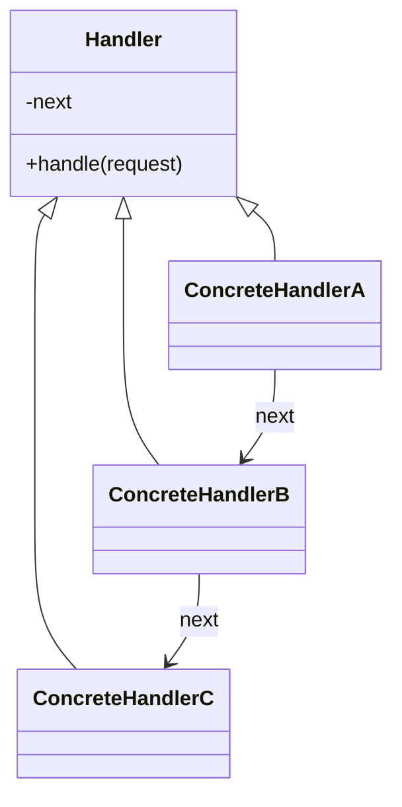

# Chain of Responsibility

**Category:** Behavioral

## El problema

Una solicitud puede necesitar ser manejada por uno entre varios handlers posibles, pero quien
la envía no debería tener que saber cuál, ni tener la lógica de decisión de selección
incrustada. Una única cadena de `if`/`else if` comprobando la condición de elegibilidad de cada
handler funciona al principio, pero pone la regla de negocio de cada handler en un solo lugar,
acoplada a la regla de cualquier otro handler, y agregar un handler nuevo significa editar ese
método compartido.

## La solución

Encadenar los handlers, cada uno sosteniendo una referencia al siguiente. Cada handler decide
por sí mismo si puede (o debe) manejar la solicitud; si no, la pasa adelante. Quien envía solo
habla con el primer eslabón — no sabe cuán larga es la cadena, ni qué eslabón procesa
realmente la solicitud.



## Ejemplo clásico

[`classic/Approver`](src/main/java/com/designpatterns/behavioral/chainofresponsibility/classic/Approver.java)
es la cadena canónica de aprobación de compra: [`Supervisor`](src/main/java/com/designpatterns/behavioral/chainofresponsibility/classic/Supervisor.java) →
[`Manager`](src/main/java/com/designpatterns/behavioral/chainofresponsibility/classic/Manager.java) →
[`Director`](src/main/java/com/designpatterns/behavioral/chainofresponsibility/classic/Director.java),
cada uno con su propio tope de aprobación. Una solicitud dentro del límite del Supervisor nunca
llega al Manager; una solicitud más allá del límite de todos cae fuera del final de la cadena
con un resultado claro de "ningún aprobador disponible", en vez de una excepción o un no-op
silencioso.
[`ApproverTest`](src/test/java/com/designpatterns/behavioral/chainofresponsibility/classic/ApproverTest.java)
cubre un monto deteniéndose en cada uno de los tres niveles, más el caso más allá de todos.

## Ejemplo aplicado: pipeline de cumplimiento de transacciones

[`applied/ComplianceHandler`](src/main/java/com/designpatterns/behavioral/chainofresponsibility/applied/ComplianceHandler.java)
encadena [`KycHandler`](src/main/java/com/designpatterns/behavioral/chainofresponsibility/applied/KycHandler.java) →
[`AmlHandler`](src/main/java/com/designpatterns/behavioral/chainofresponsibility/applied/AmlHandler.java) →
[`LimitHandler`](src/main/java/com/designpatterns/behavioral/chainofresponsibility/applied/LimitHandler.java) →
[`FraudHandler`](src/main/java/com/designpatterns/behavioral/chainofresponsibility/applied/FraudHandler.java)
— verificación de identidad antes de la detección contra listas de vigilancia, antes de la
verificación del límite de negocio, antes de la heurística de fraude (más costosa), reflejando
cómo se ordena realmente un pipeline de cumplimiento real: las verificaciones más baratas y más
decisivas primero. El primer handler en rechazar una transacción detiene la cadena de
inmediato; los handlers posteriores ni siquiera llegan a verla, que es exactamente lo que evita
que, digamos, la heurística de fraude corra sobre una transacción que de todas formas nunca iba
a pasar el KYC.
[`ComplianceHandlerTest`](src/test/java/com/designpatterns/behavioral/chainofresponsibility/applied/ComplianceHandlerTest.java)
cubre una transacción que pasa cada verificación, y cada handler individual siendo el que
rechaza.

## Cuándo no usarlo

- Si cada handler siempre necesita correr sin importar lo que decidieron los anteriores (no
  "el primero que coincida gana"), esto no es Chain of Responsibility — eso es solo una
  secuencia simple de pasos, o [Decorator](../../structural/decorator) si cada paso envuelve y
  enriquece un resultado en vez de cortarlo.
- Una cadena que creció demasiado, o cuyo orden de eslabones importa de formas que no son
  obvias leyendo cualquier eslabón individual, se vuelve difícil de depurar — "por qué se
  rechazó esta solicitud" exige reconstruir mentalmente toda la cadena. Mantenga el orden de la
  cadena intencional y documentado, como el orden KYC-antes-de-AML-antes-de-límites-antes-de-fraude
  usado aquí.
- Si exactamente un handler siempre debería correr según un valor conocido de antemano (no
  "el que sea que acepte primero"), una búsqueda directa (vea los módulos [Strategy](../../behavioral/strategy)
  o [Factory Method](../../creational/factorymethod) de este repositorio) es más explícita que
  una cadena.

## Cobertura de pruebas

100% de cobertura de instrucciones, 100% de cobertura de ramas (JaCoCo). Reprodúzcalo usted
mismo:

```bash
./gradlew :behavioral:chainofresponsibility:jacocoTestReport
```

Informe en `behavioral/chainofresponsibility/build/reports/jacoco/test/html/index.html`.

## Lecturas adicionales

- Gamma, E., Helm, R., Johnson, R., & Vlissides, J. (1994). *Design Patterns: Elements of
  Reusable Object-Oriented Software*. Addison-Wesley. — el Capítulo 5 formaliza Chain of
  Responsibility; el propio ejemplo del libro (un sistema de ayuda sensible al contexto
  escalando por widgets de UI) es un antecesor directo de ambos ejemplos aquí.
- Parnas, D. L. (1972). "On the Criteria to Be Used in Decomposing Systems into Modules."
  *Communications of the ACM*, 15(12), 1053–1058. — el mismo argumento de ocultación de
  información citado en el módulo [Strategy](../../behavioral/strategy) de este repositorio se
  aplica aquí también: cada handler oculta su propia regla de elegibilidad de cualquier otro
  handler y de quien envía, que es exactamente lo que permite agregar un handler nuevo sin
  tocar los existentes.
