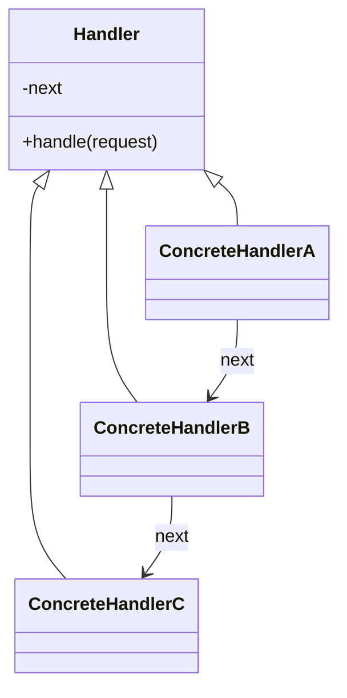

# Chain of Responsibility

**Category:** Behavioral

## The problem

A request might need to be handled by one of several possible handlers, but the sender
shouldn't have to know which one, or hard-code the decision logic for picking it. A single
`if`/`else if` chain checking every handler's eligibility condition works at first, but it puts
every handler's business rule in one place, coupled to every other handler's rule, and adding
a new handler means editing that shared method.

## The solution

Chain the handlers together, each holding a reference to the next. Each handler decides for
itself whether it can (or should) handle the request; if not, it passes the request along.
The sender only ever talks to the first link — it doesn't know how long the chain is, or which
link actually processes the request.



## Classic example

[`classic/Approver`](src/main/java/com/designpatterns/behavioral/chainofresponsibility/classic/Approver.java)
is the canonical purchase-approval chain: [`Supervisor`](src/main/java/com/designpatterns/behavioral/chainofresponsibility/classic/Supervisor.java) →
[`Manager`](src/main/java/com/designpatterns/behavioral/chainofresponsibility/classic/Manager.java) →
[`Director`](src/main/java/com/designpatterns/behavioral/chainofresponsibility/classic/Director.java),
each with its own approval ceiling. A request for an amount within the Supervisor's limit never
reaches the Manager at all; a request beyond every link's limit falls off the end of the chain
with a clear "no approver available" result rather than an exception or a silent no-op.
[`ApproverTest`](src/test/java/com/designpatterns/behavioral/chainofresponsibility/classic/ApproverTest.java)
covers an amount stopping at each of the three tiers, plus the beyond-everyone case.

## Applied example: transaction compliance pipeline

[`applied/ComplianceHandler`](src/main/java/com/designpatterns/behavioral/chainofresponsibility/applied/ComplianceHandler.java)
chains [`KycHandler`](src/main/java/com/designpatterns/behavioral/chainofresponsibility/applied/KycHandler.java) →
[`AmlHandler`](src/main/java/com/designpatterns/behavioral/chainofresponsibility/applied/AmlHandler.java) →
[`LimitHandler`](src/main/java/com/designpatterns/behavioral/chainofresponsibility/applied/LimitHandler.java) →
[`FraudHandler`](src/main/java/com/designpatterns/behavioral/chainofresponsibility/applied/FraudHandler.java)
— identity verification before watchlist screening before the business limit check before the
(more expensive) fraud heuristic, mirroring how a real compliance pipeline is actually ordered:
cheapest, most-decisive checks first. The first handler to reject a transaction stops the chain
immediately; later handlers never even see it, which is exactly what keeps, say, the fraud
heuristic from running on a transaction that was never going to pass KYC anyway.
[`ComplianceHandlerTest`](src/test/java/com/designpatterns/behavioral/chainofresponsibility/applied/ComplianceHandlerTest.java)
covers a transaction clearing every check, and each individual handler being the one to reject.

## When not to use it

- If every handler always needs to run regardless of what earlier ones decided (not "first
  match wins"), this isn't Chain of Responsibility — that's just a plain sequence of steps, or
  [Decorator](../../structural/decorator) if each step wraps and enriches a result rather than
  short-circuiting it.
- A chain that's grown very long, or whose link order matters in ways that aren't obvious from
  reading any single link, becomes hard to debug — "why did this request get rejected" requires
  mentally replaying the whole chain. Keep chain order intentional and documented, like the
  KYC-before-AML-before-limits-before-fraud ordering here.
- If exactly one handler should always run based on a value that's known up front (not
  "whichever one happens to accept first"), a direct lookup (see this repo's
  [Strategy](../../behavioral/strategy) or [Factory Method](../../creational/factorymethod)
  modules) is more explicit than a chain.

## Test coverage

100% instruction coverage, 100% branch coverage (JaCoCo). Reproduce it yourself:

```bash
./gradlew :behavioral:chainofresponsibility:jacocoTestReport
```

Report at `behavioral/chainofresponsibility/build/reports/jacoco/test/html/index.html`.

## Further reading

- Gamma, E., Helm, R., Johnson, R., & Vlissides, J. (1994). *Design Patterns: Elements of
  Reusable Object-Oriented Software*. Addison-Wesley. — Chapter 5 formalizes Chain of
  Responsibility; the book's own example (a context-sensitive help system escalating through
  UI widgets) is a direct ancestor of both examples here.
- Parnas, D. L. (1972). "On the Criteria to Be Used in Decomposing Systems into Modules."
  *Communications of the ACM*, 15(12), 1053–1058. — the same information-hiding argument cited
  in this repo's [Strategy](../../behavioral/strategy) module applies here too: each handler
  hides its own eligibility rule from every other handler and from the sender, which is exactly
  what lets a new handler be added without touching existing ones.
