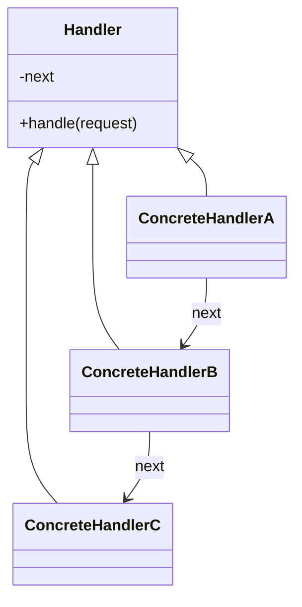

# Chain of Responsibility

**Category:** Behavioral

## O problema

Uma solicitação pode precisar ser tratada por um entre vários handlers possíveis, mas quem
envia não deveria precisar saber qual, nem ter a lógica de decisão de escolha embutida. Uma
única cadeia de `if`/`else if` checando a condição de elegibilidade de cada handler funciona no
início, mas coloca a regra de negócio de cada handler num único lugar, acoplada à regra de todo
outro handler, e adicionar um handler novo significa editar esse método compartilhado.

## A solução

Encadear os handlers, cada um segurando uma referência pro próximo. Cada handler decide por
conta própria se consegue (ou deve) tratar a solicitação; se não, passa ela adiante. Quem envia
só conversa com o primeiro elo — não sabe quão longa é a cadeia, nem qual elo de fato processa
a solicitação.



## Exemplo clássico

[`classic/Approver`](src/main/java/com/designpatterns/behavioral/chainofresponsibility/classic/Approver.java)
é a cadeia canônica de aprovação de compra: [`Supervisor`](src/main/java/com/designpatterns/behavioral/chainofresponsibility/classic/Supervisor.java) →
[`Manager`](src/main/java/com/designpatterns/behavioral/chainofresponsibility/classic/Manager.java) →
[`Director`](src/main/java/com/designpatterns/behavioral/chainofresponsibility/classic/Director.java),
cada um com seu próprio teto de aprovação. Uma solicitação dentro do limite do Supervisor nunca
chega ao Manager; uma solicitação além do limite de todo mundo cai fora do fim da cadeia com um
resultado claro de "nenhum aprovador disponível", em vez de uma exceção ou um no-op silencioso.
[`ApproverTest`](src/test/java/com/designpatterns/behavioral/chainofresponsibility/classic/ApproverTest.java)
cobre um valor parando em cada um dos três níveis, mais o caso além de todo mundo.

## Exemplo aplicado: pipeline de compliance de transação

[`applied/ComplianceHandler`](src/main/java/com/designpatterns/behavioral/chainofresponsibility/applied/ComplianceHandler.java)
encadeia [`KycHandler`](src/main/java/com/designpatterns/behavioral/chainofresponsibility/applied/KycHandler.java) →
[`AmlHandler`](src/main/java/com/designpatterns/behavioral/chainofresponsibility/applied/AmlHandler.java) →
[`LimitHandler`](src/main/java/com/designpatterns/behavioral/chainofresponsibility/applied/LimitHandler.java) →
[`FraudHandler`](src/main/java/com/designpatterns/behavioral/chainofresponsibility/applied/FraudHandler.java)
— verificação de identidade antes de triagem contra watchlist antes da checagem de limite de
negócio antes da heurística de fraude (mais cara), espelhando como um pipeline de compliance
real de fato é ordenado: as checagens mais baratas e mais decisivas primeiro. O primeiro
handler a rejeitar uma transação para a cadeia imediatamente; handlers seguintes nem chegam a
vê-la, que é exatamente o que impede, digamos, a heurística de fraude de rodar numa transação
que já nem ia passar no KYC.
[`ComplianceHandlerTest`](src/test/java/com/designpatterns/behavioral/chainofresponsibility/applied/ComplianceHandlerTest.java)
cobre uma transação passando por toda checagem, e cada handler individual sendo o que rejeita.

## Quando não usar

- Se todo handler sempre precisa rodar independente do que os anteriores decidiram (não
  "o primeiro que casar ganha"), isso não é Chain of Responsibility — isso é só uma sequência
  simples de passos, ou [Decorator](../../structural/decorator) se cada passo envolve e
  enriquece um resultado em vez de fazer short-circuit nele.
- Uma cadeia que cresceu demais, ou cuja ordem dos elos importa de formas que não ficam óbvias
  lendo qualquer elo individual, fica difícil de depurar — "por que essa solicitação foi
  rejeitada" exige reconstruir mentalmente a cadeia inteira. Mantenha a ordem da cadeia
  intencional e documentada, como a ordem KYC-antes-de-AML-antes-de-limites-antes-de-fraude
  aqui.
- Se exatamente um handler sempre deveria rodar com base num valor conhecido de antemão (não
  "o que quer que aceite primeiro"), uma busca direta (ver os módulos [Strategy](../../behavioral/strategy)
  ou [Factory Method](../../creational/factorymethod) deste repositório) é mais explícita do
  que uma cadeia.

## Cobertura de testes

100% de cobertura de instrução, 100% de cobertura de branch (JaCoCo). Reproduza você mesmo:

```bash
./gradlew :behavioral:chainofresponsibility:jacocoTestReport
```

Relatório em `behavioral/chainofresponsibility/build/reports/jacoco/test/html/index.html`.

## Leitura complementar

- Gamma, E., Helm, R., Johnson, R., & Vlissides, J. (1994). *Design Patterns: Elements of
  Reusable Object-Oriented Software*. Addison-Wesley. — o Capítulo 5 formaliza Chain of
  Responsibility; o próprio exemplo do livro (um sistema de ajuda sensível ao contexto
  escalando por widgets de UI) é um ancestral direto dos dois exemplos aqui.
- Parnas, D. L. (1972). "On the Criteria to Be Used in Decomposing Systems into Modules."
  *Communications of the ACM*, 15(12), 1053–1058. — o mesmo argumento de ocultação de
  informação citado no módulo [Strategy](../../behavioral/strategy) deste repositório se aplica
  aqui também: cada handler esconde sua própria regra de elegibilidade de todo outro handler e
  de quem envia, que é exatamente o que permite adicionar um handler novo sem tocar nos
  existentes.
