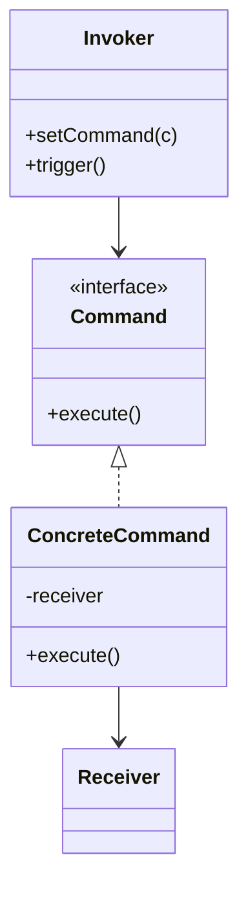

# Command

**Category:** Behavioral

## El problema

Una solicitud necesita ser tratada como algo más que una simple llamada a método inmediata:
puede necesitar ponerse en cola para después, registrarse, reintentarse, o deshacerse. Llamar
directamente al método del receptor pierde esa solicitud en el instante en que retorna — no
queda nada para repetir si falla, y nada para revertir si necesita deshacerse.

## La solución

Envolver la propia solicitud en un objeto: qué llamar, sobre qué, con qué argumentos. Quien
invoca mantiene y dispara objetos de comando sin saber qué hacen realmente; como un comando es
un objeto real en vez de una llamada a método ya completada, se puede poner en cola, registrar,
reintentar, o dotar de una operación inversa para deshacer.



## Ejemplo clásico

[`classic/RemoteControl`](src/main/java/com/designpatterns/behavioral/command/classic/RemoteControl.java)
es el ejemplo canónico: mantiene el último [`Command`](src/main/java/com/designpatterns/behavioral/command/classic/Command.java)
presionado y puede deshacerlo, sin saber nunca que en realidad es una
[`Light`](src/main/java/com/designpatterns/behavioral/command/classic/Light.java) la que se
enciende o apaga. [`LightOnCommand`](src/main/java/com/designpatterns/behavioral/command/classic/LightOnCommand.java)
y [`LightOffCommand`](src/main/java/com/designpatterns/behavioral/command/classic/LightOffCommand.java)
cada uno conoce su propia inversa, que es lo que hace posible el undo genérico a nivel del
control remoto.
[`RemoteControlTest`](src/test/java/com/designpatterns/behavioral/command/classic/RemoteControlTest.java)
cubre ambos comandos ejecutándose y deshaciéndose correctamente, y undo siendo un no-op seguro
antes de que se haya presionado nada.

## Ejemplo aplicado: cola de procesamiento por lotes reproducible

[`applied/RecordProcessingCommand`](src/main/java/com/designpatterns/behavioral/command/applied/RecordProcessingCommand.java)
envuelve el procesamiento de un registro como un objeto en vez de ejecutarlo de inmediato.
[`BatchQueue`](src/main/java/com/designpatterns/behavioral/command/applied/BatchQueue.java)
pone comandos en cola y, ante un fallo, vuelve a encolar *el mismo objeto de comando exacto*
hasta un límite de reintentos — el replay funciona porque la solicitud se capturó como un
objeto desde el principio, no porque la cola reconstruya la solicitud desde cero en cada
intento. Esta es la forma que realmente necesita un pipeline por lotes real que procesa
millones de registros al día: los fallos transitorios (un servicio downstream momentáneamente
no disponible) se reintentan automáticamente, y solo los registros que fallan en cada intento
terminan necesitando atención manual.
[`BatchQueueTest`](src/test/java/com/designpatterns/behavioral/command/applied/BatchQueueTest.java)
cubre registros que tienen éxito de inmediato, uno que falla dos veces antes de tener éxito en
el tercer intento, y uno que agota cada reintento y termina en la lista de fallidos.

## Cuándo no usarlo

- Si la solicitud siempre se ejecuta de inmediato y nunca necesita ponerse en cola,
  registrarse, reintentarse, o deshacerse, envolverla en un objeto de comando es indirección
  sin beneficio — simplemente llame al método.
- Los comandos que necesitan cargar mucho estado contextual para ser reproducibles después
  pueden terminar duplicando la mitad del propio estado del receptor dentro del objeto de
  comando. Si eso está pasando, considere si el comando debería obtener estado fresco de nuevo
  en vez de guardar en caché el estado que tenía cuando se creó originalmente.
- Específicamente para undo: si las operaciones no son naturalmente invertibles (una llamada de
  red con efectos secundarios fuera de su sistema, por ejemplo), "deshacer" a menudo tiene que
  significar "emitir un nuevo comando compensatorio", no "revertir la mutación en el lugar" —
  planifique esa distinción de antemano en vez de descubrir que se necesita después del hecho.

## Cobertura de pruebas

100% de cobertura de instrucciones, 100% de cobertura de ramas (JaCoCo). Reprodúzcalo usted
mismo:

```bash
./gradlew :behavioral:command:jacocoTestReport
```

Informe en `behavioral/command/build/reports/jacoco/test/html/index.html`.

## Lecturas adicionales

- Gamma, E., Helm, R., Johnson, R., & Vlissides, J. (1994). *Design Patterns: Elements of
  Reusable Object-Oriented Software*. Addison-Wesley. — el Capítulo 5 formaliza Command,
  incluyendo undo/redo como uno de sus casos de uso motivadores.
- Hohpe, G., & Woolf, B. (2003). *Enterprise Integration Patterns: Designing, Building, and
  Deploying Messaging Solutions*. Addison-Wesley. — el patrón "Command Message" de este libro
  es Command aplicado a la escala que sugiere `BatchQueue`: una solicitud capturada como un
  mensaje real, serializable, para que pueda ponerse en cola, reintentarse, y procesarse de
  forma asíncrona en vez de invocarse como una llamada directa dentro del proceso.
