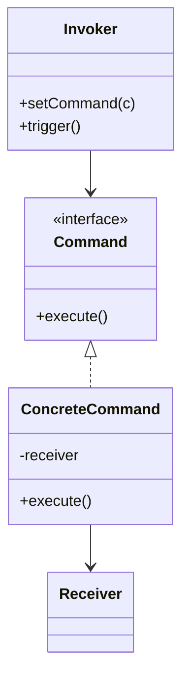

# Command

**Category:** Behavioral

## The problem

A request needs to be handled as more than just an immediate method call: it might need to be
queued for later, logged, retried, or undone. Calling the receiver's method directly loses
that request the instant it returns — there's nothing left to replay if it fails, and nothing
to reverse if it needs undoing.

## The solution

Wrap the request itself in an object: what to call, on what, with what arguments. The invoker
holds and triggers command objects without knowing what they actually do; because a command is
a real object rather than a completed method call, it can be queued, logged, retried, or
handed an inverse operation for undo.



## Classic example

[`classic/RemoteControl`](src/main/java/com/designpatterns/behavioral/command/classic/RemoteControl.java)
is the canonical example: it holds whatever [`Command`](src/main/java/com/designpatterns/behavioral/command/classic/Command.java)
was last pressed and can undo it, without ever knowing it's actually a
[`Light`](src/main/java/com/designpatterns/behavioral/command/classic/Light.java) being turned
on or off. [`LightOnCommand`](src/main/java/com/designpatterns/behavioral/command/classic/LightOnCommand.java)
and [`LightOffCommand`](src/main/java/com/designpatterns/behavioral/command/classic/LightOffCommand.java)
each know their own inverse, which is what makes generic undo possible at the remote's level.
[`RemoteControlTest`](src/test/java/com/designpatterns/behavioral/command/classic/RemoteControlTest.java)
covers both commands executing and undoing correctly, and undo being a safe no-op before
anything has been pressed.

## Applied example: replayable batch processing queue

[`applied/RecordProcessingCommand`](src/main/java/com/designpatterns/behavioral/command/applied/RecordProcessingCommand.java)
wraps one record's processing as an object instead of running it immediately.
[`BatchQueue`](src/main/java/com/designpatterns/behavioral/command/applied/BatchQueue.java)
queues commands and, on failure, re-queues the *exact same command object* up to a retry limit
— replay works because the request was captured as an object in the first place, not because
the queue reconstructs the request from scratch on each attempt. This is the shape a real
batch pipeline processing millions of records a day actually needs: transient failures (a
downstream service momentarily unavailable) get retried automatically, and only records that
fail every attempt end up needing manual attention.
[`BatchQueueTest`](src/test/java/com/designpatterns/behavioral/command/applied/BatchQueueTest.java)
covers records that succeed immediately, one that fails twice before succeeding on the third
attempt, and one that exhausts every retry and lands in the failed list.

## When not to use it

- If the request is always executed immediately and never needs to be queued, logged, retried,
  or undone, wrapping it in a command object is indirection with no payoff — just call the
  method.
- Commands that need to carry a lot of contextual state to be replayable later can end up
  duplicating half the receiver's own state inside the command object. If that's happening,
  consider whether the command should re-fetch fresh state instead of caching the state it had
  when originally created.
- For undo specifically: if operations aren't naturally invertible (a network call with side
  effects outside your system, say), "undo" often has to mean "issue a new compensating
  command," not "reverse the mutation in place" — plan for that distinction up front rather
  than discovering it's needed after the fact.

## Test coverage

100% instruction coverage, 100% branch coverage (JaCoCo). Reproduce it yourself:

```bash
./gradlew :behavioral:command:jacocoTestReport
```

Report at `behavioral/command/build/reports/jacoco/test/html/index.html`.

## Further reading

- Gamma, E., Helm, R., Johnson, R., & Vlissides, J. (1994). *Design Patterns: Elements of
  Reusable Object-Oriented Software*. Addison-Wesley. — Chapter 5 formalizes Command, including
  undo/redo as one of its motivating use cases.
- Hohpe, G., & Woolf, B. (2003). *Enterprise Integration Patterns: Designing, Building, and
  Deploying Messaging Solutions*. Addison-Wesley. — the "Command Message" pattern in this book
  is Command applied at the scale `BatchQueue` gestures at: a request captured as a real,
  serializable message so it can be queued, retried, and processed asynchronously rather than
  invoked as a direct in-process call.
