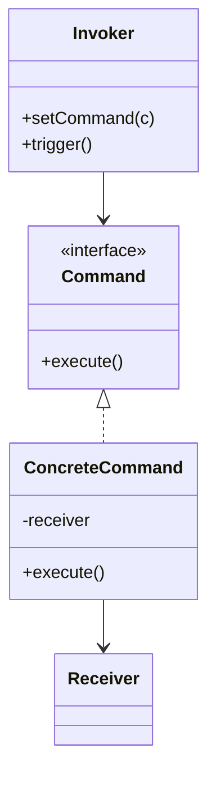

# Command

**Category:** Behavioral

## O problema

Uma solicitação precisa ser tratada como mais do que só uma chamada de método imediata: ela
pode precisar ser enfileirada pra depois, registrada em log, repetida, ou desfeita. Chamar o
método do receptor diretamente perde essa solicitação no instante em que ela retorna — não
sobra nada pra reproduzir se ela falhar, e nada pra reverter se precisar ser desfeita.

## A solução

Envolver a própria solicitação num objeto: o que chamar, em quê, com quais argumentos. Quem
invoca guarda e dispara objetos de comando sem saber o que eles de fato fazem; como um comando
é um objeto de verdade em vez de uma chamada de método já concluída, ele pode ser enfileirado,
registrado em log, repetido, ou receber uma operação inversa pra desfazer.



## Exemplo clássico

[`classic/RemoteControl`](src/main/java/com/designpatterns/behavioral/command/classic/RemoteControl.java)
é o exemplo canônico: ele guarda qual [`Command`](src/main/java/com/designpatterns/behavioral/command/classic/Command.java)
foi pressionado por último e consegue desfazê-lo, sem nunca saber que na verdade é uma
[`Light`](src/main/java/com/designpatterns/behavioral/command/classic/Light.java) sendo ligada
ou desligada. [`LightOnCommand`](src/main/java/com/designpatterns/behavioral/command/classic/LightOnCommand.java)
e [`LightOffCommand`](src/main/java/com/designpatterns/behavioral/command/classic/LightOffCommand.java)
cada um conhece sua própria inversa, que é o que torna possível o undo genérico no nível do
controle remoto.
[`RemoteControlTest`](src/test/java/com/designpatterns/behavioral/command/classic/RemoteControlTest.java)
cobre os dois comandos executando e desfazendo corretamente, e undo sendo um no-op seguro antes
de qualquer coisa ter sido pressionada.

## Exemplo aplicado: fila de processamento em lote reproduzível

[`applied/RecordProcessingCommand`](src/main/java/com/designpatterns/behavioral/command/applied/RecordProcessingCommand.java)
envolve o processamento de um registro como um objeto em vez de rodá-lo imediatamente.
[`BatchQueue`](src/main/java/com/designpatterns/behavioral/command/applied/BatchQueue.java)
enfileira comandos e, em caso de falha, reenfileira *o exato mesmo objeto de comando* até um
limite de tentativas — o replay funciona porque a solicitação foi capturada como um objeto
desde o início, não porque a fila reconstrói a solicitação do zero a cada tentativa. Essa é a
forma que um pipeline de lote real processando milhões de registros por dia de fato precisa:
falhas transitórias (um serviço downstream momentaneamente indisponível) são repetidas
automaticamente, e só os registros que falham em toda tentativa acabam precisando de atenção
manual.
[`BatchQueueTest`](src/test/java/com/designpatterns/behavioral/command/applied/BatchQueueTest.java)
cobre registros que têm sucesso imediatamente, um que falha duas vezes antes de ter sucesso na
terceira tentativa, e um que esgota toda tentativa e vai parar na lista de falhas.

## Quando não usar

- Se a solicitação sempre é executada imediatamente e nunca precisa ser enfileirada, registrada
  em log, repetida, ou desfeita, envolvê-la num objeto de comando é indireção sem retorno — só
  chame o método.
- Comandos que precisam carregar bastante estado contextual pra serem reproduzíveis depois
  podem acabar duplicando metade do próprio estado do receptor dentro do objeto de comando. Se
  isso está acontecendo, considere se o comando deveria buscar estado fresco de novo em vez de
  guardar em cache o estado que tinha quando foi criado originalmente.
- Especificamente pra undo: se as operações não são naturalmente invertíveis (uma chamada de
  rede com efeitos colaterais fora do seu sistema, por exemplo), "desfazer" muitas vezes tem que
  significar "emitir um novo comando compensatório", não "reverter a mutação no lugar" —
  planeje essa distinção com antecedência em vez de descobrir que ela é necessária depois do
  fato.

## Cobertura de testes

100% de cobertura de instrução, 100% de cobertura de branch (JaCoCo). Reproduza você mesmo:

```bash
./gradlew :behavioral:command:jacocoTestReport
```

Relatório em `behavioral/command/build/reports/jacoco/test/html/index.html`.

## Leitura complementar

- Gamma, E., Helm, R., Johnson, R., & Vlissides, J. (1994). *Design Patterns: Elements of
  Reusable Object-Oriented Software*. Addison-Wesley. — o Capítulo 5 formaliza o Command,
  incluindo undo/redo como um dos seus casos de uso motivadores.
- Hohpe, G., & Woolf, B. (2003). *Enterprise Integration Patterns: Designing, Building, and
  Deploying Messaging Solutions*. Addison-Wesley. — o padrão "Command Message" desse livro é o
  Command aplicado na escala pra qual `BatchQueue` aponta: uma solicitação capturada como uma
  mensagem real, serializável, de modo que possa ser enfileirada, repetida, e processada
  assincronamente em vez de invocada como uma chamada direta em processo.
