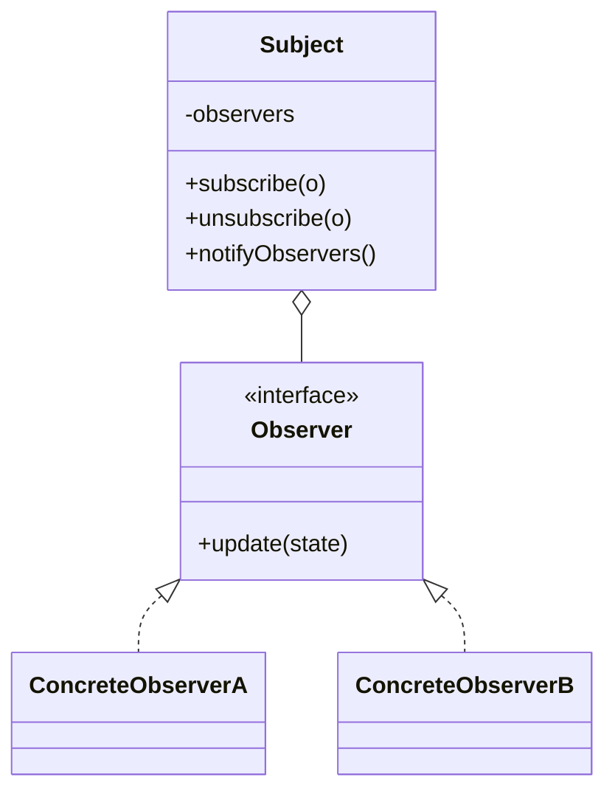

# Observer

**Category:** Behavioral

## El problema

El cambio de estado de un objeto necesita reflejarse en varios otros, pero esos otros no
deberían estar cableados directamente al objeto que cambió. Llamar a cada dependiente
directamente desde dentro del sujeto lo acopla al tipo concreto de cada consumidor, y agregar un
nuevo consumidor significa editar el código del sujeto de nuevo. Lo que se necesita es una forma
de que las partes interesadas se registren y sean notificadas, sin que el sujeto sepa nada de
ellas más allá de una interfaz común.

## La solución

El sujeto mantiene una lista de observadores detrás de una interfaz común y notifica a todos
ellos cada vez que su estado cambia; cada observador decide independientemente qué hacer con esa
notificación. Suscribirse y cancelar la suscripción no requieren tocar la lógica del propio
sujeto.



## Ejemplo clásico

[`classic/WeatherStation`](src/main/java/com/designpatterns/behavioral/observer/classic/WeatherStation.java)
es el ejemplo canónico: un sujeto que envía lecturas de `temperature`/`humidity` a cada
[`WeatherObserver`](src/main/java/com/designpatterns/behavioral/observer/classic/WeatherObserver.java)
suscrito. [`CurrentConditionsDisplay`](src/main/java/com/designpatterns/behavioral/observer/classic/CurrentConditionsDisplay.java)
solo almacena la lectura más reciente; [`HeatAlertObserver`](src/main/java/com/designpatterns/behavioral/observer/classic/HeatAlertObserver.java)
deriva un booleano de alerta a partir de ella — dos observadores haciendo cosas genuinamente
distintas con la misma notificación exacta, ninguno consciente de la existencia del otro.
[`WeatherStationTest`](src/test/java/com/designpatterns/behavioral/observer/classic/WeatherStationTest.java)
cubre a los dos observadores reaccionando independientemente a una medición, un observador con
suscripción cancelada que ya no recibe actualizaciones, y la alerta de calor limpiándose cuando
la temperatura vuelve a bajar.

## Ejemplo aplicado: fan-out de estado de transacción

[`applied/TransactionStatusPublisher`](src/main/java/com/designpatterns/behavioral/observer/applied/TransactionStatusPublisher.java)
notifica a tres observadores independientes cada vez que cambia el estado de una transacción:
[`WebhookNotifierObserver`](src/main/java/com/designpatterns/behavioral/observer/applied/WebhookNotifierObserver.java)
(registra una llamada de webhook saliente), [`AuditLogObserver`](src/main/java/com/designpatterns/behavioral/observer/applied/AuditLogObserver.java)
(registra cada transición para compliance), y [`PushNotificationObserver`](src/main/java/com/designpatterns/behavioral/observer/applied/PushNotificationObserver.java)
(solo reacciona a los estados terminales, `SETTLED`/`FAILED` — un cliente no necesita un push
por cada estado intermedio). Esta es exactamente la forma que necesita un gateway de pagos real
cuando el ciclo de vida de una transacción tiene que llegar a varios sistemas independientes: el
publisher no sabe ni le importa cuántos consumidores existen, ni qué hace cada uno realmente con
la notificación.
[`TransactionStatusPublisherTest`](src/test/java/com/designpatterns/behavioral/observer/applied/TransactionStatusPublisherTest.java)
cubre a los tres observadores reaccionando a una secuencia completa PENDING→PROCESSING→SETTLED,
al observador de push disparando también en FAILED, y a un observador con suscripción cancelada
que ya no recibe actualizaciones.

## Cuándo no usarlo

- Si existe exactamente un consumidor y nunca va a ser más de uno, una llamada directa al método
  es más simple y más fácil de seguir que un mecanismo de suscripción construido para un caso
  que todavía no existe.
- Observadores que deben ejecutarse en un orden específico, o cuya falla debería detener a los
  demás, no encajan bien en este patrón — el Observer puro no da ninguna garantía de orden ni de
  aislamiento de errores. Eso necesita un pipeline explícito en su lugar.
- Cuidado con observadores que silenciosamente mantienen viva una referencia a un sujeto por más
  tiempo del previsto (una forma clásica de fuga de memoria en sujetos de vida larga con
  observadores de vida corta) — un observador que terminó necesita cancelar su suscripción, no
  solo salir de alcance.

## Cobertura de pruebas

100% de cobertura de instrucciones, 100% de cobertura de ramas (JaCoCo). Reprodúzcalo usted
mismo:

```bash
./gradlew :behavioral:observer:jacocoTestReport
```

Informe en `behavioral/observer/build/reports/jacoco/test/html/index.html`.

## Lecturas adicionales

- Gamma, E., Helm, R., Johnson, R., & Vlissides, J. (1994). *Design Patterns: Elements of
  Reusable Object-Oriented Software*. Addison-Wesley. — el Capítulo 5 formaliza Observer.
- Eugster, P. T., Felber, P. A., Guerraoui, R., & Kermarrec, A.-M. (2003). "The Many Faces of
  Publish/Subscribe." *ACM Computing Surveys*, 35(2), 114–131. — Observer es el caso especial,
  dentro de un único proceso y limitado a una clase, de los sistemas publish/subscribe que cubre
  esta revisión; el fan-out de webhook/auditoría/push del ejemplo aplicado es una miniatura
  exactamente de lo que describe a escala de sistemas distribuidos.
