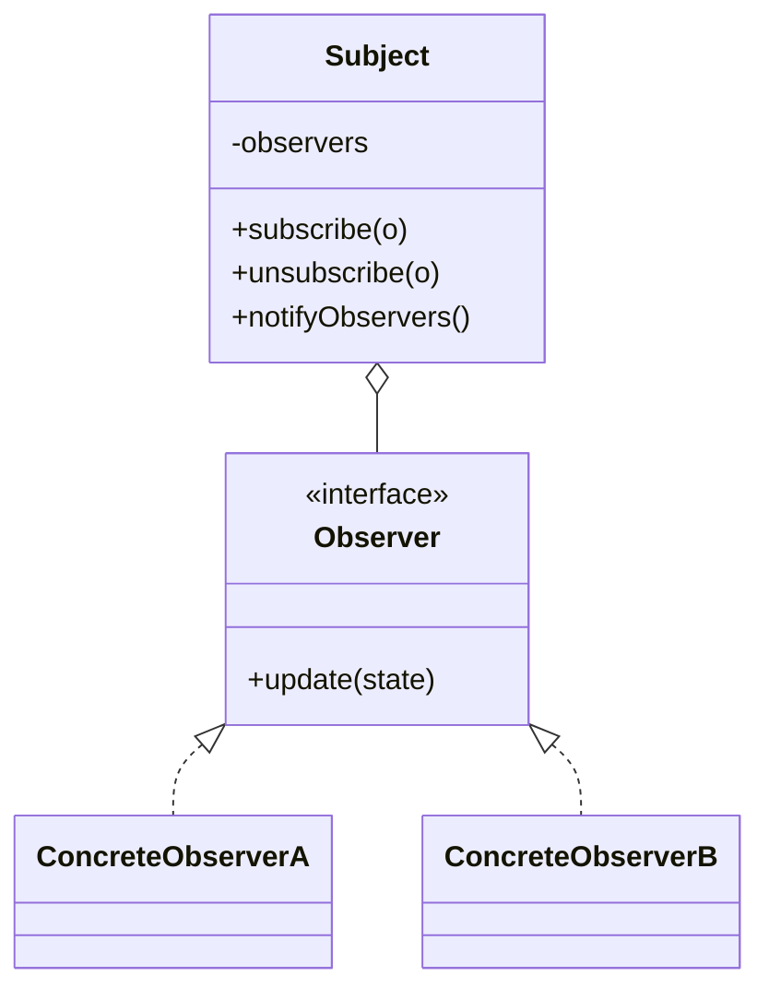

# Observer

**Category:** Behavioral

## The problem

One object's state change needs to be reflected in several others, but those others shouldn't
be hard-wired into the object that changed. Calling each dependent directly from inside the
subject couples it to every consumer's concrete type, and adding a new consumer means editing
the subject's code again. What's needed is a way for interested parties to register themselves
and be notified, without the subject knowing anything about them beyond a common interface.

## The solution

The subject keeps a list of observers behind a common interface and notifies all of them
whenever its state changes; each observer decides independently what to do with that
notification. Subscribing and unsubscribing don't require touching the subject's own logic.



## Classic example

[`classic/WeatherStation`](src/main/java/com/designpatterns/behavioral/observer/classic/WeatherStation.java)
is the canonical example: a subject that pushes `temperature`/`humidity` readings to every
subscribed [`WeatherObserver`](src/main/java/com/designpatterns/behavioral/observer/classic/WeatherObserver.java).
[`CurrentConditionsDisplay`](src/main/java/com/designpatterns/behavioral/observer/classic/CurrentConditionsDisplay.java)
just stores the latest reading; [`HeatAlertObserver`](src/main/java/com/designpatterns/behavioral/observer/classic/HeatAlertObserver.java)
derives a boolean alert from it — two observers doing genuinely different things with the exact
same notification, neither aware the other exists.
[`WeatherStationTest`](src/test/java/com/designpatterns/behavioral/observer/classic/WeatherStationTest.java)
covers both observers reacting independently to one measurement, an unsubscribed observer no
longer receiving updates, and the heat alert clearing once the temperature drops back down.

## Applied example: transaction status fan-out

[`applied/TransactionStatusPublisher`](src/main/java/com/designpatterns/behavioral/observer/applied/TransactionStatusPublisher.java)
notifies three independent observers whenever a transaction's status changes:
[`WebhookNotifierObserver`](src/main/java/com/designpatterns/behavioral/observer/applied/WebhookNotifierObserver.java)
(records an outbound webhook call), [`AuditLogObserver`](src/main/java/com/designpatterns/behavioral/observer/applied/AuditLogObserver.java)
(logs every transition for compliance), and [`PushNotificationObserver`](src/main/java/com/designpatterns/behavioral/observer/applied/PushNotificationObserver.java)
(only reacts to the terminal states, `SETTLED`/`FAILED` — a customer doesn't need a push for
every intermediate state). This is exactly the shape a real payment gateway needs when a
transaction's lifecycle has to reach several independent systems: the publisher doesn't know or
care how many consumers exist, or what any of them actually do with the notification.
[`TransactionStatusPublisherTest`](src/test/java/com/designpatterns/behavioral/observer/applied/TransactionStatusPublisherTest.java)
covers all three observers reacting to a full PENDING→PROCESSING→SETTLED sequence, the push
observer also firing on FAILED, and an unsubscribed observer no longer receiving updates.

## When not to use it

- If there's exactly one consumer and it's never going to be more than one, a direct method call
  is simpler and easier to follow than a subscription mechanism built for a case that doesn't
  exist yet.
- Observers that must run in a specific order, or whose failure should stop the others from
  running, don't fit this pattern well — plain Observer makes no ordering or error-isolation
  guarantees. That needs an explicit pipeline instead.
- Watch for observers that silently keep a reference to a subject alive longer than intended
  (a classic memory-leak shape in long-lived subjects with short-lived observers) — an observer
  that's done needs to unsubscribe, not just go out of scope.

## Test coverage

100% instruction coverage, 100% branch coverage (JaCoCo). Reproduce it yourself:

```bash
./gradlew :behavioral:observer:jacocoTestReport
```

Report at `behavioral/observer/build/reports/jacoco/test/html/index.html`.

## Further reading

- Gamma, E., Helm, R., Johnson, R., & Vlissides, J. (1994). *Design Patterns: Elements of
  Reusable Object-Oriented Software*. Addison-Wesley. — Chapter 5 formalizes Observer.
- Eugster, P. T., Felber, P. A., Guerraoui, R., & Kermarrec, A.-M. (2003). "The Many Faces of
  Publish/Subscribe." *ACM Computing Surveys*, 35(2), 114–131. — Observer is the in-process,
  single-class-boundary special case of the publish/subscribe systems this survey covers; the
  applied example's webhook/audit/push fan-out is a miniature of exactly what it describes at
  distributed-systems scale.
