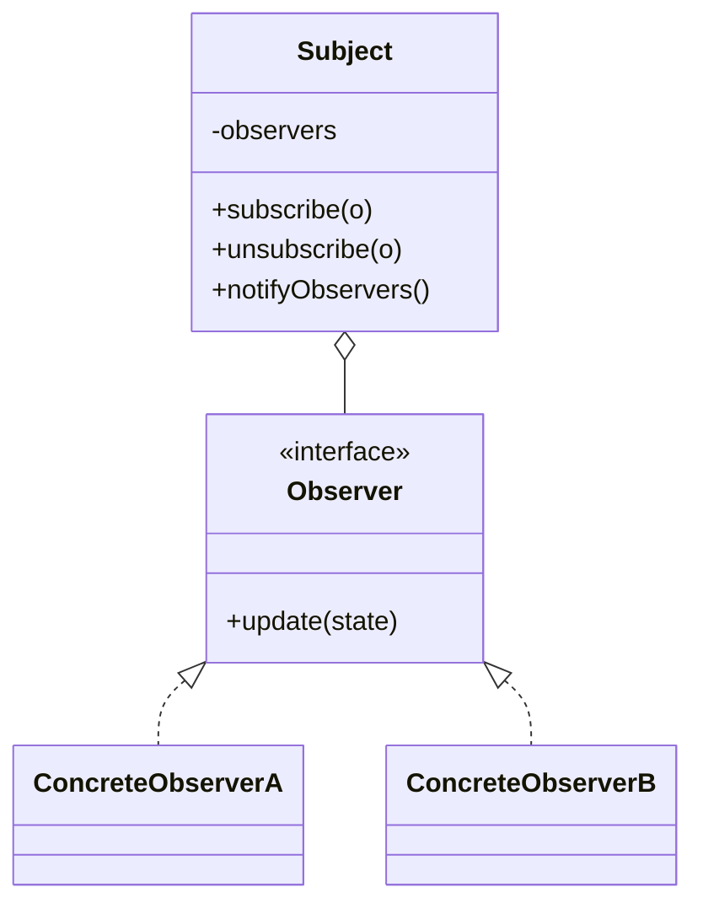

# Observer

**Category:** Behavioral

## O problema

A mudança de estado de um objeto precisa se refletir em vários outros, mas esses outros não
deveriam estar amarrados diretamente ao objeto que mudou. Chamar cada dependente diretamente de
dentro do sujeito o acopla ao tipo concreto de cada consumidor, e adicionar um novo consumidor
significa editar o código do sujeito de novo. O que se precisa é de uma forma de partes
interessadas se registrarem e serem notificadas, sem que o sujeito saiba nada sobre elas além de
uma interface comum.

## A solução

O sujeito mantém uma lista de observadores atrás de uma interface comum e notifica todos eles
sempre que seu estado muda; cada observador decide independentemente o que fazer com essa
notificação. Inscrever e cancelar inscrição não exigem tocar na lógica do próprio sujeito.



## Exemplo clássico

[`classic/WeatherStation`](src/main/java/com/designpatterns/behavioral/observer/classic/WeatherStation.java)
é o exemplo canônico: um sujeito que empurra leituras de `temperature`/`humidity` pra cada
[`WeatherObserver`](src/main/java/com/designpatterns/behavioral/observer/classic/WeatherObserver.java)
inscrito. [`CurrentConditionsDisplay`](src/main/java/com/designpatterns/behavioral/observer/classic/CurrentConditionsDisplay.java)
só armazena a leitura mais recente; [`HeatAlertObserver`](src/main/java/com/designpatterns/behavioral/observer/classic/HeatAlertObserver.java)
deriva um booleano de alerta a partir dela — dois observadores fazendo coisas genuinamente
diferentes com a mesma notificação exata, nenhum ciente da existência do outro.
[`WeatherStationTest`](src/test/java/com/designpatterns/behavioral/observer/classic/WeatherStationTest.java)
cobre os dois observadores reagindo independentemente a uma medição, um observador com
inscrição cancelada não recebendo mais atualizações, e o alerta de calor limpando quando a
temperatura volta a cair.

## Exemplo aplicado: fan-out de status de transação

[`applied/TransactionStatusPublisher`](src/main/java/com/designpatterns/behavioral/observer/applied/TransactionStatusPublisher.java)
notifica três observadores independentes sempre que o status de uma transação muda:
[`WebhookNotifierObserver`](src/main/java/com/designpatterns/behavioral/observer/applied/WebhookNotifierObserver.java)
(registra uma chamada de webhook de saída), [`AuditLogObserver`](src/main/java/com/designpatterns/behavioral/observer/applied/AuditLogObserver.java)
(registra cada transição pra compliance), e [`PushNotificationObserver`](src/main/java/com/designpatterns/behavioral/observer/applied/PushNotificationObserver.java)
(só reage aos estados terminais, `SETTLED`/`FAILED` — um cliente não precisa de push pra cada
estado intermediário). Essa é exatamente a estrutura que um gateway de pagamento real precisa
quando o ciclo de vida de uma transação tem que alcançar vários sistemas independentes: o
publisher não sabe nem se importa quantos consumidores existem, ou o que cada um faz de fato com
a notificação.
[`TransactionStatusPublisherTest`](src/test/java/com/designpatterns/behavioral/observer/applied/TransactionStatusPublisherTest.java)
cobre os três observadores reagindo a uma sequência completa PENDING→PROCESSING→SETTLED, o
observador de push também disparando em FAILED, e um observador com inscrição cancelada não
recebendo mais atualizações.

## Quando não usar

- Se existe exatamente um consumidor e ele nunca vai ser mais que um, uma chamada de método
  direta é mais simples e mais fácil de acompanhar do que um mecanismo de inscrição construído
  pra um caso que ainda não existe.
- Observadores que precisam rodar numa ordem específica, ou cuja falha deveria impedir os outros
  de rodar, não se encaixam bem nesse padrão — o Observer puro não dá nenhuma garantia de ordem
  ou isolamento de erro. Isso precisa de um pipeline explícito em vez disso.
- Cuidado com observadores que silenciosamente mantêm uma referência a um sujeito viva por mais
  tempo do que o pretendido (uma forma clássica de vazamento de memória em sujeitos de vida
  longa com observadores de vida curta) — um observador que terminou precisa cancelar a
  inscrição, não só sair de escopo.

## Cobertura de testes

100% de cobertura de instrução, 100% de cobertura de branch (JaCoCo). Reproduza você mesmo:

```bash
./gradlew :behavioral:observer:jacocoTestReport
```

Relatório em `behavioral/observer/build/reports/jacoco/test/html/index.html`.

## Leitura complementar

- Gamma, E., Helm, R., Johnson, R., & Vlissides, J. (1994). *Design Patterns: Elements of
  Reusable Object-Oriented Software*. Addison-Wesley. — o Capítulo 5 formaliza o Observer.
- Eugster, P. T., Felber, P. A., Guerraoui, R., & Kermarrec, A.-M. (2003). "The Many Faces of
  Publish/Subscribe." *ACM Computing Surveys*, 35(2), 114–131. — o Observer é o caso especial,
  dentro de um único processo e limitado a uma classe, dos sistemas publish/subscribe que essa
  revisão cobre; o fan-out de webhook/auditoria/push do exemplo aplicado é uma miniatura
  exatamente do que ela descreve em escala de sistemas distribuídos.
