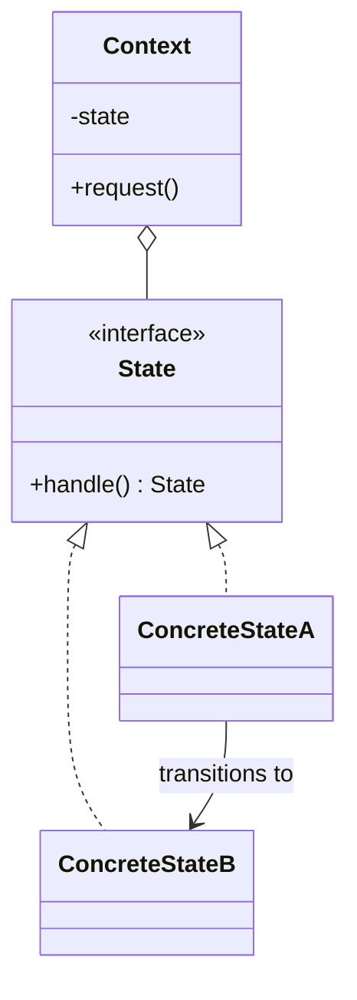

# State

**Category:** Behavioral

## El problema

El comportamiento de un objeto necesita cambiar dependiendo de alguna condición interna, y qué
transiciones son siquiera legales también depende de la condición actual. Modelar esto con un
campo de estado más declaraciones `if`/`switch` esparcidas por cada método funciona hasta que
crece el número de estados o transiciones — en ese punto cada método necesita conocer cada
estado, las transiciones ilegales son fáciles de permitir por accidente, y agregar un estado
nuevo significa tocar cada método existente que hace switch sobre él.

## La solución

Darle a cada estado su propia clase implementando una interfaz compartida, y dejar que cada
estado decida por sí mismo qué transiciones son legales desde ahí — normalmente devolviendo el
objeto del siguiente estado, o rechazando la solicitud directamente. El objeto de contexto
mantiene una referencia a su estado actual y le delega; nunca contiene un condicional de
comprobación de estado por sí mismo.



## Ejemplo clásico

[`classic/TrafficLight`](src/main/java/com/designpatterns/behavioral/state/classic/TrafficLight.java)
mantiene un [`TrafficLightState`](src/main/java/com/designpatterns/behavioral/state/classic/TrafficLightState.java)
y le delega `advance()`; [`RedState`](src/main/java/com/designpatterns/behavioral/state/classic/RedState.java),
[`GreenState`](src/main/java/com/designpatterns/behavioral/state/classic/GreenState.java), y
[`YellowState`](src/main/java/com/designpatterns/behavioral/state/classic/YellowState.java)
solo saben cada uno una cosa: qué estado viene después. `TrafficLight` en sí no tiene ningún
`if (color == "RED")` en ningún lado.
[`TrafficLightTest`](src/test/java/com/designpatterns/behavioral/state/classic/TrafficLightTest.java)
recorre un ciclo completo rojo→verde→amarillo→rojo.

## Ejemplo aplicado: ciclo de vida de una transacción

[`applied/TransactionState`](src/main/java/com/designpatterns/behavioral/state/applied/TransactionState.java)
rechaza toda transición por defecto; [`PendingState`](src/main/java/com/designpatterns/behavioral/state/applied/PendingState.java)
sobrescribe solo `startProcessing()`, [`ProcessingState`](src/main/java/com/designpatterns/behavioral/state/applied/ProcessingState.java)
sobrescribe solo `settle()` y `fail()`, y [`SettledState`](src/main/java/com/designpatterns/behavioral/state/applied/SettledState.java)/[`FailedState`](src/main/java/com/designpatterns/behavioral/state/applied/FailedState.java)
no sobrescriben nada — son terminales, así que cada intento de transición falla correctamente.
Este es el mismo ciclo de vida PENDING → PROCESSING → SETTLED/FAILED sobre el que *notifica* el
módulo [Observer](../../behavioral/observer) de este repositorio — la diferencia es para qué
sirve cada patrón: Observer distribuye un cambio de estado a los oyentes interesados una vez
que ya ocurrió; State es lo que realmente decide si ese cambio es legal en primer lugar. Un
gateway de pagos real necesita ambos, normalmente en capas: State aplica la transición, luego
algo publica el evento al que reaccionan los oyentes de Observer.
[`TransactionTest`](src/test/java/com/designpatterns/behavioral/state/applied/TransactionTest.java)
cubre ambos caminos terminales (settled, failed) y tres casos de transición ilegal, incluyendo
que ninguno de los dos estados terminales permite ninguna transición adicional.

## Cuándo no usarlo

- Si los "estados" en realidad no tienen comportamiento distinto — son solo etiquetas en
  objetos por lo demás idénticos — un campo enum simple es más sencillo y este patrón es
  ceremonia innecesaria.
- Para un número pequeño y fijo de estados con transiciones simples, una única clase con
  `switch` puede ser perfectamente legible; State vale su complejidad una vez que el
  comportamiento por estado (no solo qué estado viene después) realmente difiere.
- No confunda esto con [Strategy](../../behavioral/strategy): las variantes de Strategy las
  elige una vez quien llama y no se cambian entre sí; las variantes de State transitan entre
  ellas como parte del propio ciclo de vida del objeto, y el objeto no sabe de antemano en qué
  estado estará a continuación.

## Cobertura de pruebas

100% de cobertura de instrucciones (JaCoCo; la cobertura de ramas reporta n/a — nada aquí
ramifica, cada método de cada estado es incondicional). Reprodúzcalo usted mismo:

```bash
./gradlew :behavioral:state:jacocoTestReport
```

Informe en `behavioral/state/build/reports/jacoco/test/html/index.html`.

## Lecturas adicionales

- Gamma, E., Helm, R., Johnson, R., & Vlissides, J. (1994). *Design Patterns: Elements of
  Reusable Object-Oriented Software*. Addison-Wesley. — el Capítulo 5 formaliza State,
  contrastándolo explícitamente con Strategy (misma forma de diagrama de clases, intención
  distinta — vea "Cuándo no usarlo" arriba).
- Harel, D. (1987). "Statecharts: A Visual Formalism for Complex Systems." *Science of Computer
  Programming*, 8(3), 231–274. — la teoría formal de máquina de estados finitos de la que este
  patrón es una técnica de implementación orientada a objetos; la clase base
  reject-by-default de `TransactionState` es exactamente cómo se implementa la semántica de
  transición ilegal de Harel sin una tabla de transición explícita.
