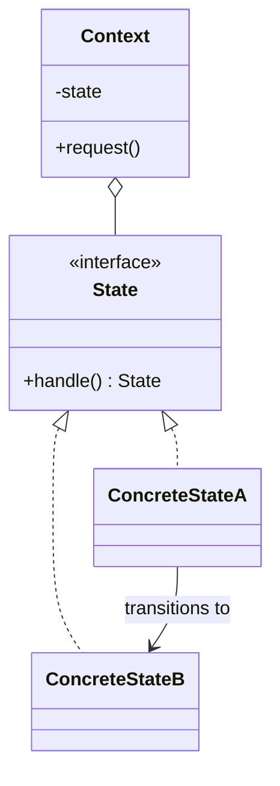

# State

**Category:** Behavioral

## The problem

An object's behavior needs to change depending on some internal condition, and which
transitions are even legal depends on the current condition too. Modeling this with a status
field plus `if`/`switch` statements scattered across every method works until the number of
states or transitions grows — at that point every method needs to know every state, illegal
transitions are easy to allow by accident, and adding one new state means touching every
existing method that switches on it.

## The solution

Give each state its own class implementing a shared interface, and let each state decide for
itself which transitions are legal from there — usually by returning the next state object, or
rejecting the request outright. The context object holds a reference to its current state and
delegates to it; it never contains a state-checking conditional itself.



## Classic example

[`classic/TrafficLight`](src/main/java/com/designpatterns/behavioral/state/classic/TrafficLight.java)
holds a [`TrafficLightState`](src/main/java/com/designpatterns/behavioral/state/classic/TrafficLightState.java)
and delegates `advance()` to it; [`RedState`](src/main/java/com/designpatterns/behavioral/state/classic/RedState.java),
[`GreenState`](src/main/java/com/designpatterns/behavioral/state/classic/GreenState.java), and
[`YellowState`](src/main/java/com/designpatterns/behavioral/state/classic/YellowState.java) each
know only one thing: which state comes next. `TrafficLight` itself has no `if (color ==
"RED")` anywhere. [`TrafficLightTest`](src/test/java/com/designpatterns/behavioral/state/classic/TrafficLightTest.java)
walks a full red→green→yellow→red cycle.

## Applied example: transaction lifecycle

[`applied/TransactionState`](src/main/java/com/designpatterns/behavioral/state/applied/TransactionState.java)
rejects every transition by default; [`PendingState`](src/main/java/com/designpatterns/behavioral/state/applied/PendingState.java)
overrides only `startProcessing()`, [`ProcessingState`](src/main/java/com/designpatterns/behavioral/state/applied/ProcessingState.java)
overrides only `settle()` and `fail()`, and [`SettledState`](src/main/java/com/designpatterns/behavioral/state/applied/SettledState.java)/[`FailedState`](src/main/java/com/designpatterns/behavioral/state/applied/FailedState.java)
override nothing at all — they're terminal, so every transition attempt correctly fails. This is
the same PENDING → PROCESSING → SETTLED/FAILED lifecycle this repo's [Observer](../../behavioral/observer)
module *notifies* about — the difference is what each pattern is for: Observer fans a status
change out to interested listeners once it's already happened; State is what actually decides
whether that change is legal in the first place. A real payment gateway needs both, usually
layered: State enforces the transition, then something publishes the event Observer's listeners
react to.
[`TransactionTest`](src/test/java/com/designpatterns/behavioral/state/applied/TransactionTest.java)
covers both terminal paths (settled, failed) and three illegal-transition cases, including that
neither terminal state allows any further transition.

## When not to use it

- If the "states" don't actually have different behavior — they're just labels on otherwise
  identical objects — a plain enum field is simpler and this pattern is unnecessary ceremony.
- For a small, fixed number of states with simple transitions, a single class with a `switch`
  can be perfectly readable; State earns its complexity once the per-state behavior itself
  (not just which state comes next) genuinely differs.
- Don't confuse this with [Strategy](../../behavioral/strategy): Strategy's variants are chosen
  once by the caller and don't change each other; State's variants transition among themselves
  as part of the object's own lifecycle, and the object doesn't know in advance which state it
  will be in next.

## Test coverage

100% instruction coverage (JaCoCo; branch coverage reports as n/a — nothing here branches,
every state's methods are unconditional). Reproduce it yourself:

```bash
./gradlew :behavioral:state:jacocoTestReport
```

Report at `behavioral/state/build/reports/jacoco/test/html/index.html`.

## Further reading

- Gamma, E., Helm, R., Johnson, R., & Vlissides, J. (1994). *Design Patterns: Elements of
  Reusable Object-Oriented Software*. Addison-Wesley. — Chapter 5 formalizes State, explicitly
  contrasting it with Strategy (same class diagram shape, different intent — see "When not to
  use it" above).
- Harel, D. (1987). "Statecharts: A Visual Formalism for Complex Systems." *Science of Computer
  Programming*, 8(3), 231–274. — the formal finite-state-machine theory this pattern is an
  object-oriented implementation technique for; `TransactionState`'s reject-by-default base
  class is exactly how you implement Harel's illegal-transition semantics without an explicit
  transition table.
