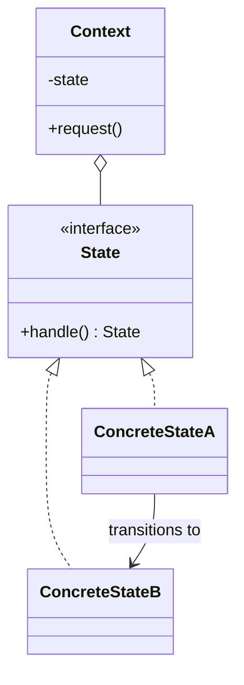

# State

**Category:** Behavioral

## O problema

O comportamento de um objeto precisa mudar dependendo de alguma condição interna, e quais
transições são sequer legais também depende da condição atual. Modelar isso com um campo de
status mais declarações `if`/`switch` espalhadas por todo método funciona até o número de
estados ou transições crescer — nesse ponto todo método precisa conhecer todo estado, transições
ilegais são fáceis de permitir por acidente, e adicionar um estado novo significa tocar em todo
método existente que faz switch sobre ele.

## A solução

Dar a cada estado sua própria classe implementando uma interface compartilhada, e deixar cada
estado decidir por conta própria quais transições são legais a partir dali — normalmente
retornando o objeto do próximo estado, ou rejeitando a solicitação de vez. O objeto de contexto
guarda uma referência pro seu estado atual e delega a ele; ele nunca contém um condicional de
checagem de estado por conta própria.



## Exemplo clássico

[`classic/TrafficLight`](src/main/java/com/designpatterns/behavioral/state/classic/TrafficLight.java)
guarda um [`TrafficLightState`](src/main/java/com/designpatterns/behavioral/state/classic/TrafficLightState.java)
e delega `advance()` a ele; [`RedState`](src/main/java/com/designpatterns/behavioral/state/classic/RedState.java),
[`GreenState`](src/main/java/com/designpatterns/behavioral/state/classic/GreenState.java), e
[`YellowState`](src/main/java/com/designpatterns/behavioral/state/classic/YellowState.java)
sabem cada um só uma coisa: qual estado vem a seguir. `TrafficLight` em si não tem nenhum
`if (color == "RED")` em lugar nenhum.
[`TrafficLightTest`](src/test/java/com/designpatterns/behavioral/state/classic/TrafficLightTest.java)
percorre um ciclo completo vermelho→verde→amarelo→vermelho.

## Exemplo aplicado: ciclo de vida de transação

[`applied/TransactionState`](src/main/java/com/designpatterns/behavioral/state/applied/TransactionState.java)
rejeita toda transição por padrão; [`PendingState`](src/main/java/com/designpatterns/behavioral/state/applied/PendingState.java)
sobrescreve só `startProcessing()`, [`ProcessingState`](src/main/java/com/designpatterns/behavioral/state/applied/ProcessingState.java)
sobrescreve só `settle()` e `fail()`, e [`SettledState`](src/main/java/com/designpatterns/behavioral/state/applied/SettledState.java)/[`FailedState`](src/main/java/com/designpatterns/behavioral/state/applied/FailedState.java)
não sobrescrevem nada — são terminais, então toda tentativa de transição corretamente falha.
Esse é o mesmo ciclo de vida PENDING → PROCESSING → SETTLED/FAILED sobre o qual o módulo
[Observer](../../behavioral/observer) deste repositório *notifica* — a diferença é pra que cada
padrão serve: Observer distribui uma mudança de status pra ouvintes interessados depois que ela
já aconteceu; State é o que de fato decide se essa mudança é legal em primeiro lugar. Um
gateway de pagamento real precisa dos dois, normalmente em camadas: State aplica a transição,
depois algo publica o evento ao qual os ouvintes do Observer reagem.
[`TransactionTest`](src/test/java/com/designpatterns/behavioral/state/applied/TransactionTest.java)
cobre os dois caminhos terminais (settled, failed) e três casos de transição ilegal, incluindo
que nenhum dos dois estados terminais permite qualquer transição adicional.

## Quando não usar

- Se os "estados" na verdade não têm comportamento diferente — são só rótulos em objetos
  idênticos — um campo enum simples é mais simples e esse padrão é cerimônia desnecessária.
- Pra um número pequeno e fixo de estados com transições simples, uma única classe com `switch`
  pode ser perfeitamente legível; o State só compensa a complexidade quando o comportamento por
  estado (não só qual estado vem a seguir) de fato difere.
- Não confunda com [Strategy](../../behavioral/strategy): as variantes do Strategy são
  escolhidas uma vez por quem chama e não mudam umas às outras; as variantes do State transitam
  entre si como parte do próprio ciclo de vida do objeto, e o objeto não sabe de antemão em
  qual estado vai estar em seguida.

## Cobertura de testes

100% de cobertura de instrução (JaCoCo; cobertura de branch reporta n/a — nada aqui ramifica,
todo método de todo estado é incondicional). Reproduza você mesmo:

```bash
./gradlew :behavioral:state:jacocoTestReport
```

Relatório em `behavioral/state/build/reports/jacoco/test/html/index.html`.

## Leitura complementar

- Gamma, E., Helm, R., Johnson, R., & Vlissides, J. (1994). *Design Patterns: Elements of
  Reusable Object-Oriented Software*. Addison-Wesley. — o Capítulo 5 formaliza o State,
  contrastando-o explicitamente com o Strategy (mesma forma de diagrama de classes, intenção
  diferente — ver "Quando não usar" acima).
- Harel, D. (1987). "Statecharts: A Visual Formalism for Complex Systems." *Science of Computer
  Programming*, 8(3), 231–274. — a teoria formal de máquina de estados finita da qual esse
  padrão é uma técnica de implementação orientada a objetos; a classe base
  reject-by-default de `TransactionState` é exatamente como se implementa a semântica de
  transição ilegal de Harel sem uma tabela de transição explícita.
