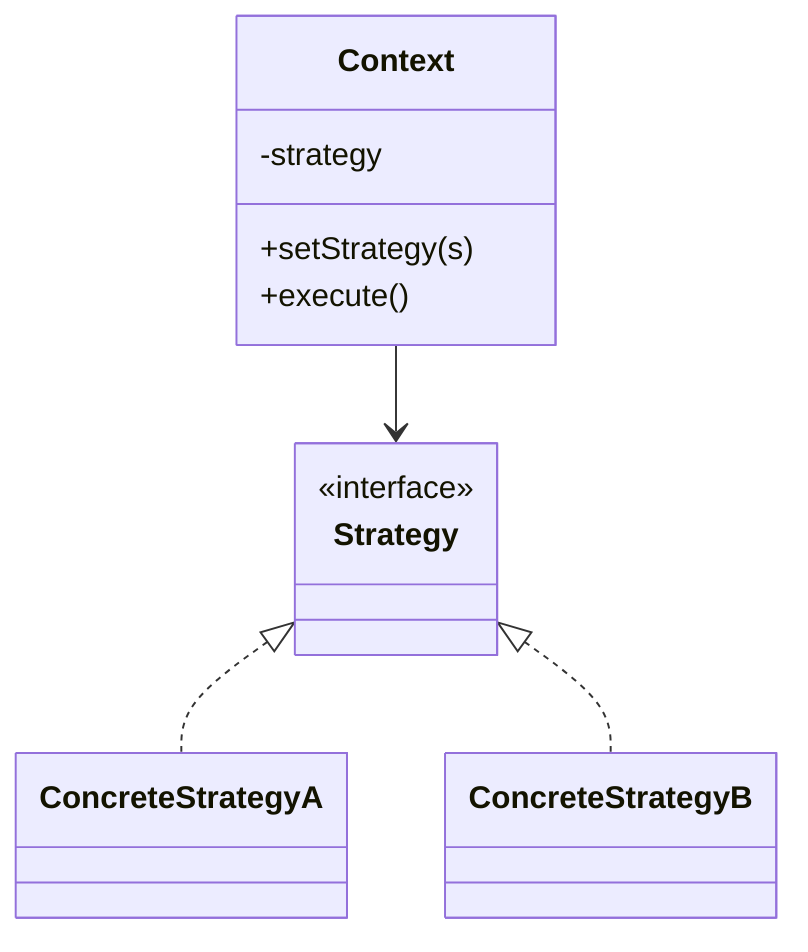

# Strategy

**Category:** Behavioral

## El problema

Un fragmento de comportamiento tiene varias variantes válidas, y cuál aplica depende de alguna
condición en tiempo de ejecución — el modo de transporte, el tipo de transacción, el orden de
clasificación. La primera implementación tentadora es un único método con un gran `if`/`else` o
`switch` sobre esa condición. Funciona hasta que aparece la tercera o cuarta variante, momento
en el que el método se vuelve largo, cada cambio arriesga romper una rama no relacionada, y
agregar una variante nueva significa editar código que ya funciona en vez de solo agregar código
nuevo al lado.

## La solución

Extraer cada variante detrás de una interfaz común, y darle al código que la llama una forma de
conectar la implementación que aplica — intercambiable en tiempo de ejecución, y cada variante
es una clase autocontenida que se puede probar, leer y cambiar de forma aislada.



## Ejemplo clásico

[`classic/RouteStrategy`](src/main/java/com/designpatterns/behavioral/strategy/classic/RouteStrategy.java)
calcula una ruta entre dos puntos; [`DrivingRouteStrategy`](src/main/java/com/designpatterns/behavioral/strategy/classic/DrivingRouteStrategy.java),
[`WalkingRouteStrategy`](src/main/java/com/designpatterns/behavioral/strategy/classic/WalkingRouteStrategy.java)
y [`PublicTransportRouteStrategy`](src/main/java/com/designpatterns/behavioral/strategy/classic/PublicTransportRouteStrategy.java)
cada una aplica un factor de desvío, velocidad y (para el transporte público) un tiempo de
espera fijo distintos sobre el mismo cálculo de distancia en línea recta.
[`Navigator`](src/main/java/com/designpatterns/behavioral/strategy/classic/Navigator.java) es
el contexto: mantiene una estrategia y le delega, y `setStrategy(...)` permite que quien llama
cambie el modo de viaje para el mismo trayecto sin tocar el propio `Navigator`.
[`NavigatorTest`](src/test/java/com/designpatterns/behavioral/strategy/classic/NavigatorTest.java)
verifica tanto las matemáticas de cada estrategia como que cambiar de estrategia realmente
cambia el resultado para el mismo par origen/destino.

## Ejemplo aplicado: cálculo de tarifa por tipo de transacción

[`applied/FeeCalculator`](src/main/java/com/designpatterns/behavioral/strategy/applied/FeeCalculator.java)
busca una [`FeeCalculationStrategy`](src/main/java/com/designpatterns/behavioral/strategy/applied/FeeCalculationStrategy.java)
por [`TransactionType`](src/main/java/com/designpatterns/behavioral/strategy/applied/TransactionType.java)
en vez de ramificar sobre él: [`PixFeeStrategy`](src/main/java/com/designpatterns/behavioral/strategy/applied/PixFeeStrategy.java)
es gratuita (BACEN exige PIX gratuito entre personas físicas), [`TedFeeStrategy`](src/main/java/com/designpatterns/behavioral/strategy/applied/TedFeeStrategy.java)
cobra una tarifa fija sin importar el monto, y [`BoletoFeeStrategy`](src/main/java/com/designpatterns/behavioral/strategy/applied/BoletoFeeStrategy.java)
cobra un porcentaje con un piso mínimo. Este es precisamente el escenario para el que existe el
patrón: un gateway de pagos real que agrega un cuarto tipo de transacción más adelante
significa agregar una clase de estrategia nueva, no reabrir un método de cálculo de tarifa del
que ya depende cada tipo de transacción existente.
[`FeeCalculatorTest`](src/test/java/com/designpatterns/behavioral/strategy/applied/FeeCalculatorTest.java)
cubre las tres estrategias más el caso de falla de "tipo no registrado".

## Cuándo no usarlo

- Si hoy realmente solo existe una variante y ningún plan concreto para una segunda, una
  interfaz de estrategia es abstracción especulativa — un método simple es más claro hasta que
  la segunda variante realmente aparezca.
- Si las variantes comparten la mayor parte de su lógica y difieren solo en uno o dos pasos,
  Template Method (fijando el esqueleto, sobrescribiendo los pasos) suele ser un mejor encaje
  que Strategy (intercambiando el algoritmo completo).
- No deje que la clase de contexto acumule lógica de negocio que decida *qué* estrategia usar
  según reglas de dominio profundas — si esa lógica de selección se vuelve compleja, merece su
  propia fábrica (vea los módulos Factory Method / Abstract Factory de este repositorio cuando
  lleguen).

## Cobertura de pruebas

100% de cobertura de instrucciones, 100% de cobertura de ramas (JaCoCo). Reprodúzcalo usted
mismo:

```bash
./gradlew :behavioral:strategy:jacocoTestReport
```

Informe en `behavioral/strategy/build/reports/jacoco/test/html/index.html`.

## Lecturas adicionales

- Gamma, E., Helm, R., Johnson, R., & Vlissides, J. (1994). *Design Patterns: Elements of
  Reusable Object-Oriented Software*. Addison-Wesley. — el Capítulo 5 formaliza Strategy.
- Parnas, D. L. (1972). "On the Criteria to Be Used in Decomposing Systems into Modules."
  *Communications of the ACM*, 15(12), 1053–1058. — el argumento fundacional de ocultación de
  información de por qué una variante de algoritmo pertenece detrás de una interfaz estable
  (un límite de módulo) en vez de dentro de un condicional que cada llamador tiene que conocer.
- Liskov, B. (1987). "Data Abstraction and Hierarchy." OOPSLA '87 Addendum to the Proceedings,
  *ACM SIGPLAN Notices*, 23(5). — la declaración original de lo que se convirtió en el
  Principio de Sustitución de Liskov: toda estrategia concreta debe ser sustituible por
  `RouteStrategy` / `FeeCalculationStrategy` sin cambiar la corrección del código que la llama,
  que es exactamente el contrato del que dependen `Navigator` y `FeeCalculator`.
