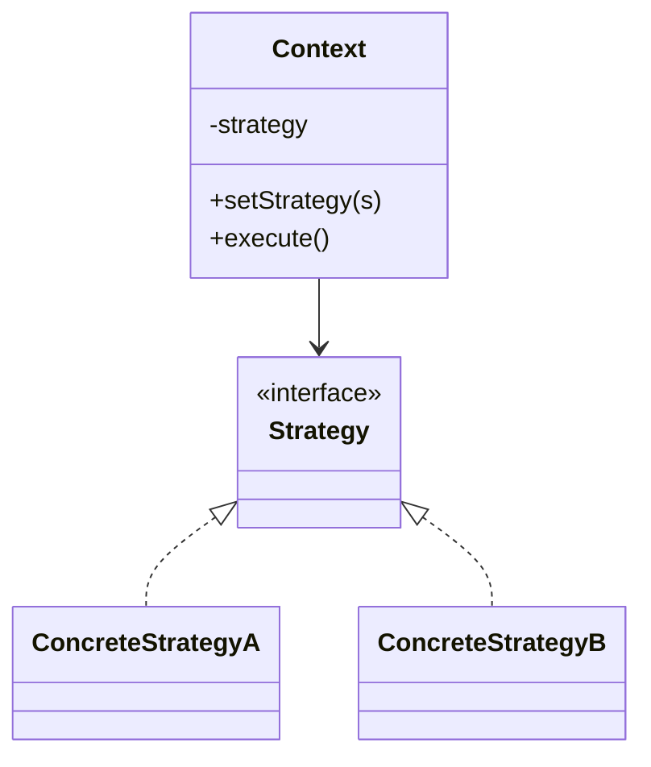

# Strategy

**Category:** Behavioral

## The problem

A piece of behavior has several valid variants, and which one applies depends on some
runtime condition — the transport mode, the transaction type, the sorting order. The
tempting first implementation is a single method with a big `if`/`else` or `switch` over
that condition. It works until the third or fourth variant shows up, at which point the
method is long, every change risks breaking an unrelated branch, and adding a new variant
means editing code that already works instead of just adding new code next to it.

## The solution

Extract each variant behind a common interface, and give the calling code a way to plug in
whichever implementation applies — swappable at runtime, and each variant is a self-contained
class that can be tested, read, and changed in isolation.



## Classic example

[`classic/RouteStrategy`](src/main/java/com/designpatterns/behavioral/strategy/classic/RouteStrategy.java)
computes a route between two points; [`DrivingRouteStrategy`](src/main/java/com/designpatterns/behavioral/strategy/classic/DrivingRouteStrategy.java),
[`WalkingRouteStrategy`](src/main/java/com/designpatterns/behavioral/strategy/classic/WalkingRouteStrategy.java)
and [`PublicTransportRouteStrategy`](src/main/java/com/designpatterns/behavioral/strategy/classic/PublicTransportRouteStrategy.java)
each apply a different detour factor, speed, and (for transit) a fixed wait time on top of
the same straight-line distance calculation. [`Navigator`](src/main/java/com/designpatterns/behavioral/strategy/classic/Navigator.java)
is the context: it holds a strategy and delegates to it, and `setStrategy(...)` lets a caller
swap the travel mode for the same trip without touching `Navigator` itself.
[`NavigatorTest`](src/test/java/com/designpatterns/behavioral/strategy/classic/NavigatorTest.java)
checks both the per-strategy math and that swapping strategies actually changes the outcome
for an identical origin/destination pair.

## Applied example: per-transaction-type fee calculation

[`applied/FeeCalculator`](src/main/java/com/designpatterns/behavioral/strategy/applied/FeeCalculator.java)
looks up a [`FeeCalculationStrategy`](src/main/java/com/designpatterns/behavioral/strategy/applied/FeeCalculationStrategy.java)
by [`TransactionType`](src/main/java/com/designpatterns/behavioral/strategy/applied/TransactionType.java)
instead of branching on it: [`PixFeeStrategy`](src/main/java/com/designpatterns/behavioral/strategy/applied/PixFeeStrategy.java)
is free (BACEN mandates free PIX between individuals), [`TedFeeStrategy`](src/main/java/com/designpatterns/behavioral/strategy/applied/TedFeeStrategy.java)
charges a flat fee regardless of amount, and [`BoletoFeeStrategy`](src/main/java/com/designpatterns/behavioral/strategy/applied/BoletoFeeStrategy.java)
charges a percentage with a minimum floor. This is precisely the scenario the pattern is for:
a real payment gateway adding a fourth transaction type later means adding one new strategy
class, not reopening a fee-calculation method that every existing transaction type already
depends on. [`FeeCalculatorTest`](src/test/java/com/designpatterns/behavioral/strategy/applied/FeeCalculatorTest.java)
covers all three strategies plus the "unregistered type" failure case.

## When not to use it

- If there's really only one variant today and no concrete plan for a second, a strategy
  interface is speculative abstraction — a plain method is clearer until the second variant
  actually shows up.
- If the variants share most of their logic and differ only in one or two steps, Template
  Method (fixing the skeleton, overriding the steps) is usually a better fit than Strategy
  (swapping the whole algorithm).
- Don't let the context class grow business logic that decides *which* strategy to use based
  on deep domain rules — if that selection logic gets complex, it deserves its own factory
  (see this repo's Factory Method / Abstract Factory modules once they land).

## Test coverage

100% instruction coverage, 100% branch coverage (JaCoCo). Reproduce it yourself:

```bash
./gradlew :behavioral:strategy:jacocoTestReport
```

Report at `behavioral/strategy/build/reports/jacoco/test/html/index.html`.

## Further reading

- Gamma, E., Helm, R., Johnson, R., & Vlissides, J. (1994). *Design Patterns: Elements of
  Reusable Object-Oriented Software*. Addison-Wesley. — Chapter 5 formalizes Strategy.
- Parnas, D. L. (1972). "On the Criteria to Be Used in Decomposing Systems into Modules."
  *Communications of the ACM*, 15(12), 1053–1058. — the foundational information-hiding
  argument for why an algorithm variant belongs behind a stable interface (a module boundary)
  instead of inside a conditional that every caller has to know about.
- Liskov, B. (1987). "Data Abstraction and Hierarchy." OOPSLA '87 Addendum to the Proceedings,
  *ACM SIGPLAN Notices*, 23(5). — the original statement of what became the Liskov
  Substitution Principle: every concrete strategy must be swappable for `RouteStrategy` /
  `FeeCalculationStrategy` without changing the correctness of the code that calls it, which is
  exactly the contract `Navigator` and `FeeCalculator` depend on.
