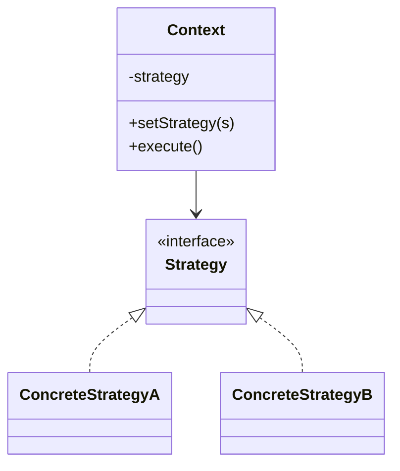

# Strategy

**Category:** Behavioral

## O problema

Um trecho de comportamento tem várias variantes válidas, e qual delas se aplica depende de
alguma condição em tempo de execução — o modo de transporte, o tipo de transação, a ordem de
classificação. A primeira implementação tentadora é um único método com um grande `if`/`else`
ou `switch` sobre essa condição. Funciona até a terceira ou quarta variante aparecer, ponto em
que o método fica longo, toda mudança arrisca quebrar um branch não relacionado, e adicionar
uma variante nova significa editar código que já funciona em vez de só adicionar código novo do
lado.

## A solução

Extrair cada variante atrás de uma interface comum, e dar ao código chamador uma forma de
plugar qual implementação se aplica — trocável em tempo de execução, e cada variante é uma
classe autocontida que pode ser testada, lida e alterada isoladamente.



## Exemplo clássico

[`classic/RouteStrategy`](src/main/java/com/designpatterns/behavioral/strategy/classic/RouteStrategy.java)
calcula uma rota entre dois pontos; [`DrivingRouteStrategy`](src/main/java/com/designpatterns/behavioral/strategy/classic/DrivingRouteStrategy.java),
[`WalkingRouteStrategy`](src/main/java/com/designpatterns/behavioral/strategy/classic/WalkingRouteStrategy.java)
e [`PublicTransportRouteStrategy`](src/main/java/com/designpatterns/behavioral/strategy/classic/PublicTransportRouteStrategy.java)
cada uma aplica um fator de desvio, velocidade e (pro transporte público) um tempo de espera
fixo diferentes em cima do mesmo cálculo de distância em linha reta.
[`Navigator`](src/main/java/com/designpatterns/behavioral/strategy/classic/Navigator.java) é o
contexto: ele guarda uma estratégia e delega a ela, e `setStrategy(...)` deixa quem chama trocar
o modo de viagem pra mesma jornada sem tocar no próprio `Navigator`.
[`NavigatorTest`](src/test/java/com/designpatterns/behavioral/strategy/classic/NavigatorTest.java)
verifica tanto a matemática de cada estratégia quanto que trocar de estratégia de fato muda o
resultado pro mesmo par origem/destino.

## Exemplo aplicado: cálculo de tarifa por tipo de transação

[`applied/FeeCalculator`](src/main/java/com/designpatterns/behavioral/strategy/applied/FeeCalculator.java)
busca uma [`FeeCalculationStrategy`](src/main/java/com/designpatterns/behavioral/strategy/applied/FeeCalculationStrategy.java)
por [`TransactionType`](src/main/java/com/designpatterns/behavioral/strategy/applied/TransactionType.java)
em vez de ramificar sobre ele: [`PixFeeStrategy`](src/main/java/com/designpatterns/behavioral/strategy/applied/PixFeeStrategy.java)
é gratuita (o BACEN exige PIX gratuito entre pessoas físicas), [`TedFeeStrategy`](src/main/java/com/designpatterns/behavioral/strategy/applied/TedFeeStrategy.java)
cobra uma tarifa fixa independente do valor, e [`BoletoFeeStrategy`](src/main/java/com/designpatterns/behavioral/strategy/applied/BoletoFeeStrategy.java)
cobra um percentual com um piso mínimo. Esse é precisamente o cenário pro qual o padrão existe:
um gateway de pagamento real adicionando um quarto tipo de transação depois significa
adicionar uma classe de estratégia nova, não reabrir um método de cálculo de tarifa do qual
todo tipo de transação já existente depende.
[`FeeCalculatorTest`](src/test/java/com/designpatterns/behavioral/strategy/applied/FeeCalculatorTest.java)
cobre as três estratégias mais o caso de falha de "tipo não registrado".

## Quando não usar

- Se hoje realmente só existe uma variante e nenhum plano concreto pra uma segunda, uma
  interface de estratégia é abstração especulativa — um método simples é mais claro até a
  segunda variante de fato aparecer.
- Se as variantes compartilham a maior parte da lógica e diferem só em um ou dois passos,
  Template Method (fixando o esqueleto, sobrescrevendo os passos) costuma ser um encaixe melhor
  do que Strategy (trocando o algoritmo inteiro).
- Não deixe a classe de contexto acumular lógica de negócio que decide *qual* estratégia usar
  com base em regras profundas de domínio — se essa lógica de seleção fica complexa, ela merece
  sua própria fábrica (ver os módulos Factory Method / Abstract Factory deste repositório
  quando chegarem).

## Cobertura de testes

100% de cobertura de instrução, 100% de cobertura de branch (JaCoCo). Reproduza você mesmo:

```bash
./gradlew :behavioral:strategy:jacocoTestReport
```

Relatório em `behavioral/strategy/build/reports/jacoco/test/html/index.html`.

## Leitura complementar

- Gamma, E., Helm, R., Johnson, R., & Vlissides, J. (1994). *Design Patterns: Elements of
  Reusable Object-Oriented Software*. Addison-Wesley. — o Capítulo 5 formaliza o Strategy.
- Parnas, D. L. (1972). "On the Criteria to Be Used in Decomposing Systems into Modules."
  *Communications of the ACM*, 15(12), 1053–1058. — o argumento fundacional de ocultação de
  informação de por que uma variante de algoritmo pertence atrás de uma interface estável (uma
  fronteira de módulo) em vez de dentro de um condicional que todo chamador precisa conhecer.
- Liskov, B. (1987). "Data Abstraction and Hierarchy." OOPSLA '87 Addendum to the Proceedings,
  *ACM SIGPLAN Notices*, 23(5). — a declaração original do que se tornou o Princípio da
  Substituição de Liskov: toda estratégia concreta precisa ser substituível por `RouteStrategy` /
  `FeeCalculationStrategy` sem mudar a correção do código que a chama, que é exatamente o
  contrato do qual `Navigator` e `FeeCalculator` dependem.
