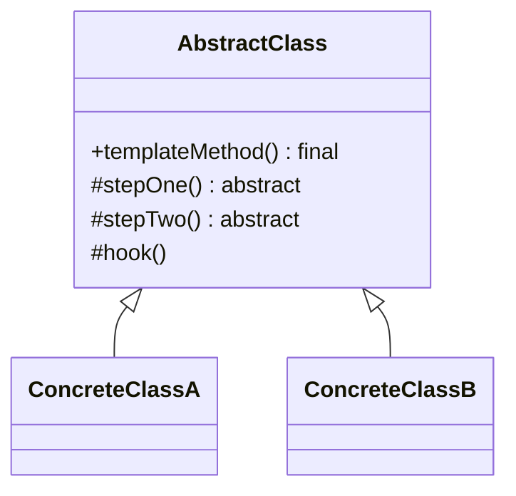

# Template Method

**Category:** Behavioral

## El problema

Varias variantes de un proceso comparten la misma forma general — los mismos pasos, en el
mismo orden — pero difieren en cómo se ejecutan realmente uno o dos de esos pasos. Duplicar el
proceso completo para cada variante hace que las partes compartidas (el orden, el manejo de
errores, cualquier cosa que no debería variar) se distancien con el tiempo, y una corrección de
bug en la lógica compartida hay que aplicarla a cada copia por separado.

## La solución

Poner la secuencia fija de pasos en una clase base como un método `final`, con cada paso
delegado a un método abstracto (o un "hook" opcionalmente sobrescribible). Las subclases
completan los pasos; no pueden reordenar, saltar, ni duplicar la secuencia en sí, porque nunca
la ven.



## Ejemplo clásico

[`classic/Game`](src/main/java/com/designpatterns/behavioral/templatemethod/classic/Game.java)
fija la secuencia `initialize() → startPlay() → endPlay() → announceWinner()` en un `play()`
`final`. [`Chess`](src/main/java/com/designpatterns/behavioral/templatemethod/classic/Chess.java)
y [`Checkers`](src/main/java/com/designpatterns/behavioral/templatemethod/classic/Checkers.java)
implementan los tres pasos obligatorios de forma distinta, y `announceWinner()` es un **hook**
— un paso con una implementación por defecto vacía que una subclase puede sobrescribir pero no
está obligada a. Chess lo sobrescribe; Checkers no, y eso es una elección completamente válida.
[`GameTest`](src/test/java/com/designpatterns/behavioral/templatemethod/classic/GameTest.java)
verifica el orden exacto de los pasos para ambos, y que el log de Checkers tiene una entrada
menos que el de Chess porque dejó el hook en su valor por defecto.

## Ejemplo aplicado: pipeline de migración de sistema heredado

[`applied/LegacyMigrationPipeline`](src/main/java/com/designpatterns/behavioral/templatemethod/applied/LegacyMigrationPipeline.java)
fija `read → validate → transform → write` en un `migrate()` `final`.
[`CobolFixedWidthMigrationPipeline`](src/main/java/com/designpatterns/behavioral/templatemethod/applied/CobolFixedWidthMigrationPipeline.java)
analiza registros posicionales de ancho fijo; [`CsvLegacyMigrationPipeline`](src/main/java/com/designpatterns/behavioral/templatemethod/applied/CsvLegacyMigrationPipeline.java)
analiza registros separados por comas — dos formatos de exportación heredados de la misma
época, ambos migrando al mismo formato JSON moderno a través de la misma forma de pipeline.
Como `validate()` corre antes que `transform()`/`write()` dentro de la secuencia fija, una
falla de validación nunca puede llegar accidentalmente al [`MigrationSink`](src/main/java/com/designpatterns/behavioral/templatemethod/applied/MigrationSink.java)
— ninguna subclase puede equivocar ese orden, porque ninguna subclase controla el orden.
[`LegacyMigrationPipelineTest`](src/test/java/com/designpatterns/behavioral/templatemethod/applied/LegacyMigrationPipelineTest.java)
cubre ambos formatos migrando exitosamente y ambos rechazando un registro malformado antes de
que nada se escriba.

## Cuándo no usarlo

- Si los pasos en realidad no comparten un orden fijo — cada variante podría razonablemente
  ejecutar sus pasos de forma distinta, u omitir algunos — este es el patrón equivocado; eso
  está más cerca de [Strategy](../../behavioral/strategy) (intercambiar el algoritmo completo)
  que de Template Method (fijar el esqueleto, variar los pasos).
- La herencia es todo el mecanismo aquí, lo que significa que una subclase solo puede
  personalizar un proceso a la vez y no puede combinar fácilmente pasos de jerarquías no
  relacionadas. Si esa flexibilidad importa más que el esqueleto compartido, los enfoques
  basados en composición (pasando las implementaciones de los pasos directamente) suelen
  envejecer mejor.
- Demasiados hooks hacen que la secuencia fija sea difícil de seguir — si casi todo paso es
  opcional, el "template" ya no está realmente plantillando nada.

## Cobertura de pruebas

100% de cobertura de instrucciones, 100% de cobertura de ramas (JaCoCo). Reprodúzcalo usted
mismo:

```bash
./gradlew :behavioral:templatemethod:jacocoTestReport
```

Informe en `behavioral/templatemethod/build/reports/jacoco/test/html/index.html`.

## Lecturas adicionales

- Gamma, E., Helm, R., Johnson, R., & Vlissides, J. (1994). *Design Patterns: Elements of
  Reusable Object-Oriented Software*. Addison-Wesley. — el Capítulo 5 formaliza Template
  Method, incluyendo la terminología de "hook operation" usada aquí para `announceWinner()`, y
  nombra el Principio de Hollywood ("no nos llames, nosotros te llamamos") como la idea detrás
  de él: el método `final` de la clase base es el que llama al código de la subclase, nunca al
  revés.
- Fowler, M. (1999). *Refactoring: Improving the Design of Existing Code*. Addison-Wesley. —
  cataloga "Form Template Method" como una refactorización con nombre propio para exactamente
  el problema inicial de este módulo: dos subclases con procedimientos casi idénticos que
  difieren solo en un par de pasos, separadas en una plantilla compartida más los puntos reales
  de variación.
