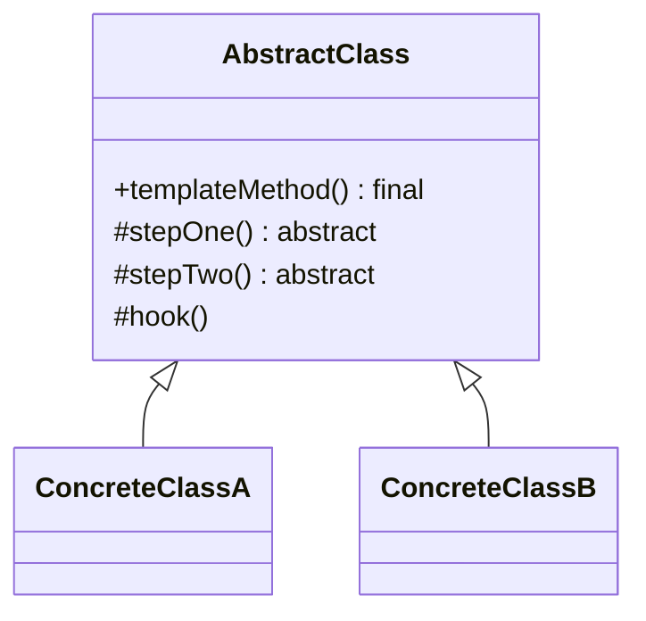

# Template Method

**Category:** Behavioral

## The problem

Several variants of a process share the same overall shape — the same steps, in the same
order — but differ in how one or two of those steps are actually done. Duplicating the whole
process for each variant means the shared parts (ordering, error handling, anything that
shouldn't vary) drift apart over time, and a bug fix in the shared logic has to be applied to
every copy separately.

## The solution

Put the fixed sequence of steps in a base class as a `final` method, with each step delegated to
an abstract (or optionally-overridable "hook") method. Subclasses fill in the steps; they cannot
reorder, skip, or duplicate the sequence itself, because they never see it.



## Classic example

[`classic/Game`](src/main/java/com/designpatterns/behavioral/templatemethod/classic/Game.java)
fixes the sequence `initialize() → startPlay() → endPlay() → announceWinner()` in a `final
play()`. [`Chess`](src/main/java/com/designpatterns/behavioral/templatemethod/classic/Chess.java)
and [`Checkers`](src/main/java/com/designpatterns/behavioral/templatemethod/classic/Checkers.java)
each implement the three required steps differently, and `announceWinner()` is a **hook** — a
step with a default no-op implementation that a subclass may override but doesn't have to.
Chess overrides it; Checkers doesn't, and that's a completely valid choice.
[`GameTest`](src/test/java/com/designpatterns/behavioral/templatemethod/classic/GameTest.java)
asserts the exact step order for both, and that Checkers' log has one fewer entry than Chess'
because it left the hook at its default.

## Applied example: legacy system migration pipeline

[`applied/LegacyMigrationPipeline`](src/main/java/com/designpatterns/behavioral/templatemethod/applied/LegacyMigrationPipeline.java)
fixes `read → validate → transform → write` in a `final migrate()`.
[`CobolFixedWidthMigrationPipeline`](src/main/java/com/designpatterns/behavioral/templatemethod/applied/CobolFixedWidthMigrationPipeline.java)
parses fixed-width positional records; [`CsvLegacyMigrationPipeline`](src/main/java/com/designpatterns/behavioral/templatemethod/applied/CsvLegacyMigrationPipeline.java)
parses comma-separated ones — two legacy export formats from the same era, both migrating into
the identical modern JSON shape through the identical pipeline shape. Because `validate()` runs
before `transform()`/`write()` inside the fixed sequence, a validation failure can never
accidentally reach the [`MigrationSink`](src/main/java/com/designpatterns/behavioral/templatemethod/applied/MigrationSink.java)
— no subclass can get that ordering wrong, because no subclass controls the ordering.
[`LegacyMigrationPipelineTest`](src/test/java/com/designpatterns/behavioral/templatemethod/applied/LegacyMigrationPipelineTest.java)
covers both formats migrating successfully and both rejecting a malformed record before
anything is written.

## When not to use it

- If the steps don't actually share a fixed order — each variant could reasonably run its steps
  differently, or skip some — this is the wrong pattern; that's closer to
  [Strategy](../../behavioral/strategy) (swap the whole algorithm) than Template Method (fix the
  skeleton, vary the steps).
- Inheritance is the whole mechanism here, which means a subclass can only customize one
  process at a time and can't easily mix and match steps from unrelated hierarchies. If that
  flexibility matters more than the shared skeleton, composition-based approaches (passing in
  step implementations directly) usually age better.
- Too many hooks makes the fixed sequence hard to reason about — if nearly every step is
  optional, the "template" isn't really templating anything anymore.

## Test coverage

100% instruction coverage, 100% branch coverage (JaCoCo). Reproduce it yourself:

```bash
./gradlew :behavioral:templatemethod:jacocoTestReport
```

Report at `behavioral/templatemethod/build/reports/jacoco/test/html/index.html`.

## Further reading

- Gamma, E., Helm, R., Johnson, R., & Vlissides, J. (1994). *Design Patterns: Elements of
  Reusable Object-Oriented Software*. Addison-Wesley. — Chapter 5 formalizes Template Method,
  including the "hook operation" terminology used here for `announceWinner()`, and names the
  Hollywood Principle ("don't call us, we'll call you") as the idea behind it: the base class's
  `final` method calls into subclass code, never the other way around.
- Fowler, M. (1999). *Refactoring: Improving the Design of Existing Code*. Addison-Wesley. —
  catalogs "Form Template Method" as a named refactoring for exactly this module's starting
  problem: two subclasses with near-identical procedures that differ in only a couple of steps,
  pulled apart into a shared template plus the two points of real variation.
