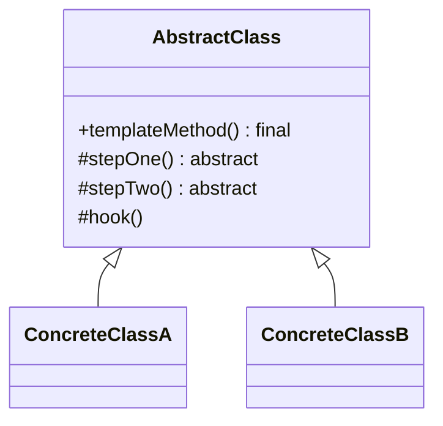

# Template Method

**Category:** Behavioral

## O problema

Várias variantes de um processo compartilham a mesma forma geral — os mesmos passos, na mesma
ordem — mas diferem em como um ou dois desses passos são de fato executados. Duplicar o
processo inteiro pra cada variante faz com que as partes compartilhadas (ordenação, tratamento
de erro, qualquer coisa que não deveria variar) se distanciem com o tempo, e uma correção de
bug na lógica compartilhada precisa ser aplicada a cada cópia separadamente.

## A solução

Colocar a sequência fixa de passos numa classe base como um método `final`, com cada passo
delegado a um método abstrato (ou um "hook" opcionalmente sobrescrevível). Subclasses preenchem
os passos; elas não conseguem reordenar, pular, ou duplicar a própria sequência, porque nunca a
enxergam.



## Exemplo clássico

[`classic/Game`](src/main/java/com/designpatterns/behavioral/templatemethod/classic/Game.java)
fixa a sequência `initialize() → startPlay() → endPlay() → announceWinner()` num `play()`
`final`. [`Chess`](src/main/java/com/designpatterns/behavioral/templatemethod/classic/Chess.java)
e [`Checkers`](src/main/java/com/designpatterns/behavioral/templatemethod/classic/Checkers.java)
implementam os três passos obrigatórios de forma diferente, e `announceWinner()` é um **hook** —
um passo com uma implementação padrão vazia que uma subclasse pode sobrescrever mas não é
obrigada a. Chess o sobrescreve; Checkers não, e isso é uma escolha completamente válida.
[`GameTest`](src/test/java/com/designpatterns/behavioral/templatemethod/classic/GameTest.java)
verifica a ordem exata dos passos pros dois, e que o log do Checkers tem uma entrada a menos
que o do Chess porque ele deixou o hook no padrão.

## Exemplo aplicado: pipeline de migração de sistema legado

[`applied/LegacyMigrationPipeline`](src/main/java/com/designpatterns/behavioral/templatemethod/applied/LegacyMigrationPipeline.java)
fixa `read → validate → transform → write` num `migrate()` `final`.
[`CobolFixedWidthMigrationPipeline`](src/main/java/com/designpatterns/behavioral/templatemethod/applied/CobolFixedWidthMigrationPipeline.java)
faz parsing de registros posicionais de largura fixa; [`CsvLegacyMigrationPipeline`](src/main/java/com/designpatterns/behavioral/templatemethod/applied/CsvLegacyMigrationPipeline.java)
faz parsing de registros separados por vírgula — dois formatos de exportação legados da mesma
época, ambos migrando pro mesmo formato JSON moderno através da mesma forma de pipeline. Como
`validate()` roda antes de `transform()`/`write()` dentro da sequência fixa, uma falha de
validação nunca pode acidentalmente chegar ao [`MigrationSink`](src/main/java/com/designpatterns/behavioral/templatemethod/applied/MigrationSink.java)
— nenhuma subclasse consegue errar essa ordenação, porque nenhuma subclasse controla a
ordenação.
[`LegacyMigrationPipelineTest`](src/test/java/com/designpatterns/behavioral/templatemethod/applied/LegacyMigrationPipelineTest.java)
cobre os dois formatos migrando com sucesso e os dois rejeitando um registro malformado antes
que qualquer coisa seja escrita.

## Quando não usar

- Se os passos na verdade não compartilham uma ordem fixa — cada variante poderia razoavelmente
  rodar seus passos de forma diferente, ou pular alguns — esse é o padrão errado; isso está mais
  perto de [Strategy](../../behavioral/strategy) (trocar o algoritmo inteiro) do que Template
  Method (fixar o esqueleto, variar os passos).
- Herança é todo o mecanismo aqui, o que significa que uma subclasse só consegue customizar um
  processo por vez e não consegue facilmente misturar passos de hierarquias não relacionadas.
  Se essa flexibilidade importa mais do que o esqueleto compartilhado, abordagens baseadas em
  composição (passando implementações de passo diretamente) costumam envelhecer melhor.
- Hooks demais tornam a sequência fixa difícil de acompanhar — se quase todo passo é opcional,
  o "template" não está mais realmente templando nada.

## Cobertura de testes

100% de cobertura de instrução, 100% de cobertura de branch (JaCoCo). Reproduza você mesmo:

```bash
./gradlew :behavioral:templatemethod:jacocoTestReport
```

Relatório em `behavioral/templatemethod/build/reports/jacoco/test/html/index.html`.

## Leitura complementar

- Gamma, E., Helm, R., Johnson, R., & Vlissides, J. (1994). *Design Patterns: Elements of
  Reusable Object-Oriented Software*. Addison-Wesley. — o Capítulo 5 formaliza o Template
  Method, incluindo a terminologia de "hook operation" usada aqui pra `announceWinner()`, e
  nomeia o Princípio de Hollywood ("não nos chame, nós te chamamos") como a ideia por trás
  dele: o método `final` da classe base é que chama o código da subclasse, nunca o contrário.
- Fowler, M. (1999). *Refactoring: Improving the Design of Existing Code*. Addison-Wesley. —
  cataloga "Form Template Method" como uma refatoração nomeada pra exatamente o problema
  inicial deste módulo: duas subclasses com procedimentos quase idênticos que diferem só em
  alguns passos, separadas num template compartilhado mais os pontos reais de variação.
