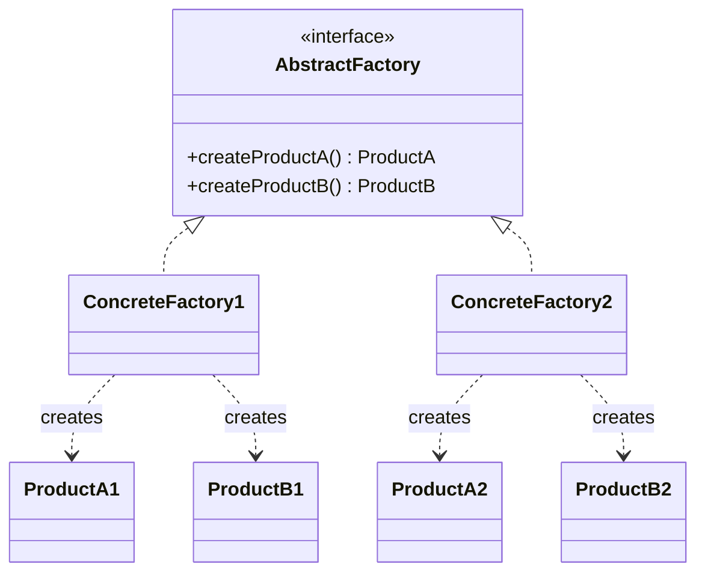

# Abstract Factory

**Category:** Creational

## El problema

Algunos productos solo tienen sentido en familias: un botón de Windows junto a un checkbox de
Mac se ve y se comporta mal, un documento de póliza nacional emparejado con una tasa de prima
internacional es simplemente incorrecto. Si cada punto de llamada construye cada producto con su
propio `new`, nada impide un desajuste de familia — el compilador no puede ver que `WinButton` y
`MacCheckbox` debían ir juntos, y un error de tipeo o una línea copiada y pegada produce
silenciosamente un grafo de objetos inconsistente.

## La solución

Agrupar los métodos de creación relacionados detrás de una interfaz de fábrica, un método por
producto de la familia. Una implementación concreta de la fábrica siempre devuelve productos de
la misma familia, así que un punto de llamada que depende solo de la interfaz de la fábrica
(nunca de las clases concretas de producto) físicamente no puede mezclar familias — no queda
ninguna llamada a constructor que pueda equivocarse.



## Ejemplo clásico

[`classic/UiFactory`](src/main/java/com/designpatterns/creational/abstractfactory/classic/UiFactory.java)
es el kit de UI multiplataforma clásico de los libros: un `Button` y un `Checkbox` por familia,
[`WinUiFactory`](src/main/java/com/designpatterns/creational/abstractfactory/classic/WinUiFactory.java)
produciendo `WinButton`/`WinCheckbox` y
[`MacUiFactory`](src/main/java/com/designpatterns/creational/abstractfactory/classic/MacUiFactory.java)
produciendo `MacButton`/`MacCheckbox`.
[`UiFactoryTest`](src/test/java/com/designpatterns/creational/abstractfactory/classic/UiFactoryTest.java)
verifica que cada fábrica renderiza sus dos componentes en el estilo propio de esa plataforma,
nunca en el de la otra.

## Ejemplo aplicado: emisión de póliza de seguro nacional vs. internacional

[`applied/InsuranceProductFactory`](src/main/java/com/designpatterns/creational/abstractfactory/applied/InsuranceProductFactory.java)
produce un `PolicyDocument` y un `PremiumCalculator` como una sola familia:
[`DomesticInsuranceProductFactory`](src/main/java/com/designpatterns/creational/abstractfactory/applied/DomesticInsuranceProductFactory.java)
siempre empareja un documento en formato nacional con la tasa nacional del 2%,
[`InternationalInsuranceProductFactory`](src/main/java/com/designpatterns/creational/abstractfactory/applied/InternationalInsuranceProductFactory.java)
siempre empareja el documento en formato internacional con la tasa internacional del 3,5%.
[`InsuranceProductIssuer`](src/main/java/com/designpatterns/creational/abstractfactory/applied/InsuranceProductIssuer.java)
depende solo de la interfaz `InsuranceProductFactory` — cambiar toda la familia de producto de
una póliza es un argumento de constructor, nunca una rama dentro de la lógica de emisión misma.

Este módulo también es uno de los dos del catálogo (junto con [Singleton](../singleton)) que
incorpora Spring Context a propósito:
[`DomesticInsuranceConfig`](src/main/java/com/designpatterns/creational/abstractfactory/applied/DomesticInsuranceConfig.java)
es una clase `@Configuration` cuyos métodos `@Bean` son, en la práctica, los mismos métodos de
creación que `DomesticInsuranceProductFactory` — solo que resueltos por el contenedor en vez de
llamados a mano. El patrón es el mismo en ambos casos; solo cambia quién invoca los métodos de
creación.
[`InsuranceProductIssuerTest`](src/test/java/com/designpatterns/creational/abstractfactory/applied/InsuranceProductIssuerTest.java)
cubre ambas fábricas artesanales de punta a punta, y
[`DomesticInsuranceConfigTest`](src/test/java/com/designpatterns/creational/abstractfactory/applied/DomesticInsuranceConfigTest.java)
verifica que la familia gestionada por Spring sea igual de coherente.

## Cuándo no usarlo

- Si solo hay un producto, o la familia nunca crece más allá de un miembro, un Factory Method
  simple dice lo mismo con menos maquinaria.
- Si se agregan nuevos *tipos* de producto con frecuencia (no nuevas familias, sino nuevos
  miembros dentro de una familia — por ejemplo, agregar un `Slider` junto a
  `Button`/`Checkbox`), cada fábrica concreta necesita un método nuevo, lo que significa editar
  cada implementación existente — el trade-off clásico de Abstract Factory de "fácil agregar una
  familia, difícil agregar un tipo de producto."
- No recurra a él solo porque dos clases se construyen cerca una de la otra. El punto es
  garantizar que *solo* puedan construirse juntas como un conjunto compatible — si mezclarlas
  siguiera siendo válido, este patrón está resolviendo un problema que no existe aquí.

## Cobertura de pruebas

100% de cobertura de instrucciones (la cobertura de ramas reporta "n/a" — nada en este módulo
ramifica; es todo delegación directa a la familia correcta). Reprodúzcalo usted mismo:

```bash
./gradlew :creational:abstractfactory:jacocoTestReport
```

Informe en `creational/abstractfactory/build/reports/jacoco/test/html/index.html`.

## Lecturas adicionales

- Gamma, E., Helm, R., Johnson, R., & Vlissides, J. (1994). *Design Patterns: Elements of
  Reusable Object-Oriented Software*. Addison-Wesley. — el Capítulo 3 formaliza Abstract
  Factory.
- Johnson, R., & Foote, B. (1988). "Designing Reusable Classes." *Journal of Object-Oriented
  Programming*, 1(2), 22-35. — formalización temprana del "protocolo" que una familia de clases
  relacionadas debe compartir, la misma idea de coherencia de familia que este patrón codifica
  estructuralmente.
