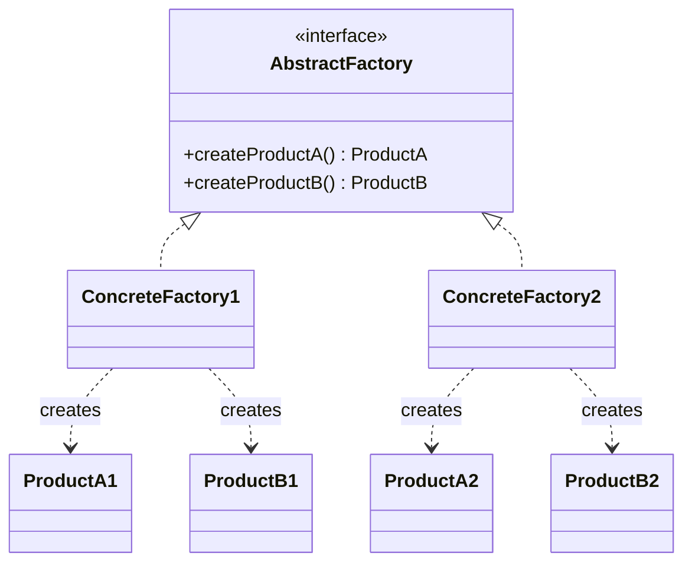

# Abstract Factory

**Category:** Creational

## The problem

Some products only make sense in families: a Windows button next to a Mac checkbox looks and
behaves wrong, a domestic policy document paired with an international premium rate is simply
incorrect. If callers construct each product with its own `new`, nothing stops a family mismatch
— the compiler can't see that `WinButton` and `MacCheckbox` were meant to travel together, and a
typo or a copy-pasted line silently produces an inconsistent object graph.

## The solution

Group the related creation methods behind one factory interface, one method per product in the
family. A concrete factory implementation always returns products from the same family, so a
caller that only depends on the factory interface (never on the concrete product classes)
physically cannot mix families — there's no constructor call left for it to get wrong.



## Classic example

[`classic/UiFactory`](src/main/java/com/designpatterns/creational/abstractfactory/classic/UiFactory.java)
is the textbook cross-platform UI toolkit: a `Button` and a `Checkbox` per family,
[`WinUiFactory`](src/main/java/com/designpatterns/creational/abstractfactory/classic/WinUiFactory.java)
producing `WinButton`/`WinCheckbox` and
[`MacUiFactory`](src/main/java/com/designpatterns/creational/abstractfactory/classic/MacUiFactory.java)
producing `MacButton`/`MacCheckbox`.
[`UiFactoryTest`](src/test/java/com/designpatterns/creational/abstractfactory/classic/UiFactoryTest.java)
asserts that each factory renders both of its components in that platform's own style, never
the other one's.

## Applied example: domestic vs. international insurance policy issuance

[`applied/InsuranceProductFactory`](src/main/java/com/designpatterns/creational/abstractfactory/applied/InsuranceProductFactory.java)
produces a `PolicyDocument` and a `PremiumCalculator` as one family:
[`DomesticInsuranceProductFactory`](src/main/java/com/designpatterns/creational/abstractfactory/applied/DomesticInsuranceProductFactory.java)
always pairs a domestic-format document with the domestic 2% rate,
[`InternationalInsuranceProductFactory`](src/main/java/com/designpatterns/creational/abstractfactory/applied/InternationalInsuranceProductFactory.java)
always pairs the international-format document with the international 3.5% rate.
[`InsuranceProductIssuer`](src/main/java/com/designpatterns/creational/abstractfactory/applied/InsuranceProductIssuer.java)
depends only on the `InsuranceProductFactory` interface — swapping the entire product family for
a policy is one constructor argument, never a branch inside the issuance logic itself.

This module is also one of two in the catalog (alongside [Singleton](../singleton)) that brings
in Spring Context on purpose:
[`DomesticInsuranceConfig`](src/main/java/com/designpatterns/creational/abstractfactory/applied/DomesticInsuranceConfig.java)
is a `@Configuration` class whose `@Bean` methods are, in effect, the same creation methods as
`DomesticInsuranceProductFactory` — just resolved by the container instead of called by hand. The
pattern is the same either way; only who invokes the creation methods changes.
[`InsuranceProductIssuerTest`](src/test/java/com/designpatterns/creational/abstractfactory/applied/InsuranceProductIssuerTest.java)
covers both hand-rolled factories end to end, and
[`DomesticInsuranceConfigTest`](src/test/java/com/designpatterns/creational/abstractfactory/applied/DomesticInsuranceConfigTest.java)
verifies the Spring-managed family is just as coherent.

## When not to use it

- If there's only one product, or the family never grows past one member, a plain Factory Method
  says the same thing with less machinery.
- If new product *kinds* get added often (not new families, but new members within a family —
  e.g. adding a `Slider` alongside `Button`/`Checkbox`), every concrete factory needs a new
  method, which means editing every existing implementation — the classic Abstract Factory
  trade-off of "easy to add a family, hard to add a product kind."
- Don't reach for it just because two classes happen to be constructed near each other. The
  point is enforcing that they can *only* be constructed together as a matching set — if mixing
  them would still be valid, this pattern is solving a problem that doesn't exist here.

## Test coverage

100% instruction coverage (branch coverage reports "n/a" — nothing in this module branches; it's
all straight-line delegation to the right family). Reproduce it yourself:

```bash
./gradlew :creational:abstractfactory:jacocoTestReport
```

Report at `creational/abstractfactory/build/reports/jacoco/test/html/index.html`.

## Further reading

- Gamma, E., Helm, R., Johnson, R., & Vlissides, J. (1994). *Design Patterns: Elements of
  Reusable Object-Oriented Software*. Addison-Wesley. — Chapter 3 formalizes Abstract Factory.
- Johnson, R., & Foote, B. (1988). "Designing Reusable Classes." *Journal of Object-Oriented
  Programming*, 1(2), 22-35. — early formalization of the "protocol" a family of related classes
  must share, the same family-consistency idea this pattern encodes structurally.
