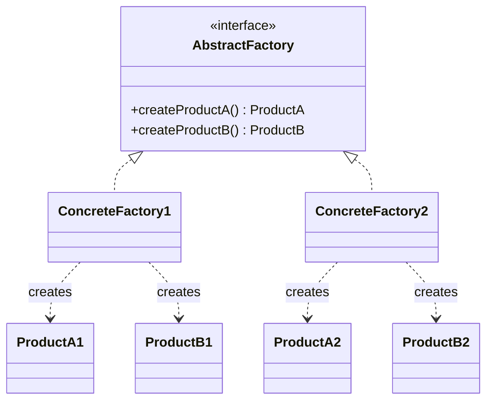

# Abstract Factory

**Category:** Creational

## O problema

Alguns produtos só fazem sentido em famílias: um botão do Windows ao lado de um checkbox do Mac
fica visualmente e comportamentalmente errado, um documento de apólice nacional pareado com uma
taxa de prêmio internacional está simplesmente incorreto. Se cada ponto de chamada constrói cada
produto com seu próprio `new`, nada impede um descompasso de família — o compilador não enxerga
que `WinButton` e `MacCheckbox` deveriam andar juntos, e um erro de digitação ou uma linha
copiada e colada silenciosamente produz um grafo de objetos inconsistente.

## A solução

Agrupar os métodos de criação relacionados atrás de uma interface de fábrica, um método por
produto da família. Uma implementação concreta da fábrica sempre retorna produtos da mesma
família, então um ponto de chamada que depende só da interface da fábrica (nunca das classes
concretas de produto) fisicamente não consegue misturar famílias — não sobra nenhuma chamada de
construtor pra ele errar.



## Exemplo clássico

[`classic/UiFactory`](src/main/java/com/designpatterns/creational/abstractfactory/classic/UiFactory.java)
é o kit de UI multiplataforma clássico dos livros: um `Button` e um `Checkbox` por família,
[`WinUiFactory`](src/main/java/com/designpatterns/creational/abstractfactory/classic/WinUiFactory.java)
produzindo `WinButton`/`WinCheckbox` e
[`MacUiFactory`](src/main/java/com/designpatterns/creational/abstractfactory/classic/MacUiFactory.java)
produzindo `MacButton`/`MacCheckbox`.
[`UiFactoryTest`](src/test/java/com/designpatterns/creational/abstractfactory/classic/UiFactoryTest.java)
verifica que cada fábrica renderiza os dois componentes no estilo daquela plataforma, nunca no
da outra.

## Exemplo aplicado: emissão de apólice de seguro nacional vs. internacional

[`applied/InsuranceProductFactory`](src/main/java/com/designpatterns/creational/abstractfactory/applied/InsuranceProductFactory.java)
produz um `PolicyDocument` e um `PremiumCalculator` como uma única família:
[`DomesticInsuranceProductFactory`](src/main/java/com/designpatterns/creational/abstractfactory/applied/DomesticInsuranceProductFactory.java)
sempre pareia um documento em formato nacional com a taxa nacional de 2%,
[`InternationalInsuranceProductFactory`](src/main/java/com/designpatterns/creational/abstractfactory/applied/InternationalInsuranceProductFactory.java)
sempre pareia o documento em formato internacional com a taxa internacional de 3,5%.
[`InsuranceProductIssuer`](src/main/java/com/designpatterns/creational/abstractfactory/applied/InsuranceProductIssuer.java)
depende só da interface `InsuranceProductFactory` — trocar a família de produto inteira de uma
apólice é um argumento de construtor, nunca um branch dentro da lógica de emissão em si.

Este módulo também é um dos dois do catálogo (junto com [Singleton](../singleton)) que traz o
Spring Context de propósito:
[`DomesticInsuranceConfig`](src/main/java/com/designpatterns/creational/abstractfactory/applied/DomesticInsuranceConfig.java)
é uma classe `@Configuration` cujos métodos `@Bean` são, na prática, os mesmos métodos de
criação de `DomesticInsuranceProductFactory` — só que resolvidos pelo container em vez de
chamados manualmente. O padrão é o mesmo dos dois jeitos; só quem invoca os métodos de criação
muda.
[`InsuranceProductIssuerTest`](src/test/java/com/designpatterns/creational/abstractfactory/applied/InsuranceProductIssuerTest.java)
cobre as duas fábricas artesanais de ponta a ponta, e
[`DomesticInsuranceConfigTest`](src/test/java/com/designpatterns/creational/abstractfactory/applied/DomesticInsuranceConfigTest.java)
verifica que a família gerenciada pelo Spring é igualmente coerente.

## Quando não usar

- Se existe só um produto, ou a família nunca cresce além de um membro, um Factory Method
  simples diz a mesma coisa com menos maquinário.
- Se novos *tipos* de produto são adicionados com frequência (não novas famílias, mas novos
  membros dentro de uma família — por exemplo, adicionar um `Slider` junto de
  `Button`/`Checkbox`), toda fábrica concreta precisa de um método novo, o que significa editar
  toda implementação existente — o trade-off clássico do Abstract Factory de "fácil adicionar
  uma família, difícil adicionar um tipo de produto."
- Não recorra a ele só porque duas classes acontecem de ser construídas perto uma da outra. O
  ponto é garantir que elas *só* possam ser construídas juntas como um conjunto compatível — se
  misturá-las ainda seria válido, este padrão está resolvendo um problema que não existe aqui.

## Cobertura de testes

100% de cobertura de instrução (cobertura de branch reporta "n/a" — nada neste módulo ramifica;
é tudo delegação direta pra família certa). Reproduza você mesmo:

```bash
./gradlew :creational:abstractfactory:jacocoTestReport
```

Relatório em `creational/abstractfactory/build/reports/jacoco/test/html/index.html`.

## Leitura complementar

- Gamma, E., Helm, R., Johnson, R., & Vlissides, J. (1994). *Design Patterns: Elements of
  Reusable Object-Oriented Software*. Addison-Wesley. — o Capítulo 3 formaliza o Abstract
  Factory.
- Johnson, R., & Foote, B. (1988). "Designing Reusable Classes." *Journal of Object-Oriented
  Programming*, 1(2), 22-35. — formalização inicial do "protocolo" que uma família de classes
  relacionadas precisa compartilhar, a mesma ideia de coerência de família que este padrão
  codifica estruturalmente.
