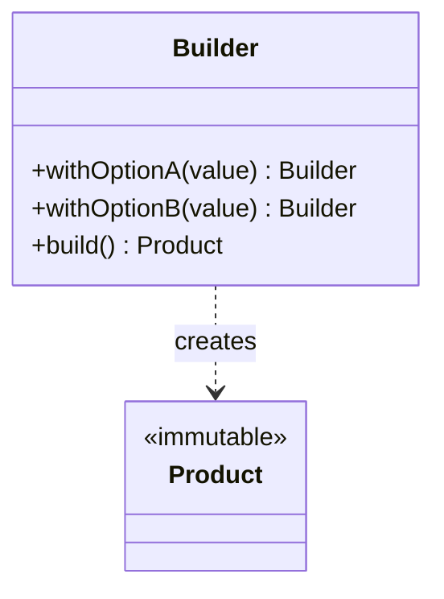

# Builder

**Category:** Creational

## El problema

Algunos objetos tienen muchos campos, la mayoría opcionales, y solo algunos obligatorios. Un
constructor que recibe todos ellos resulta ilegible en el punto de llamada (`new Computer("Ryzen
9", 32, 1024, true, false, "extended-warranty")` — ¿cuál booleano era cuál?), y uno que gana una
sobrecarga nueva por cada combinación de campos opcionales (el "telescoping constructor") se
multiplica combinatoriamente a medida que se agregan más opciones. Usar setters en vez de
constructor resuelve la legibilidad, pero deja el objeto mutable y posiblemente incompleto si
quien lo llama olvida un campo obligatorio.

## La solución

Mover la construcción a un objeto separado que acumula valores campo por campo mediante una API
fluida y encadenable, y solo produce el objeto real (inmutable) en la llamada final a `build()`.



## Ejemplo clásico

[`classic/Computer`](src/main/java/com/designpatterns/creational/builder/classic/Computer.java)
es el builder fluido clásico de los libros: un `cpu` obligatorio, tres campos opcionales con
valores por defecto razonables (`ramGb`, `storageGb`, `hasGraphicsCard`), y un constructor
privado, de modo que la única forma de obtener un `Computer` es mediante
`Computer.builder(cpu)....build()`.
[`ComputerTest`](src/test/java/com/designpatterns/creational/builder/classic/ComputerTest.java)
verifica que los valores por defecto se aplican cuando no se define nada más, que sobrescribir
un campo no afecta a los demás, y que un campo obligatorio nulo falla rápido con un NPE en vez
de producir un objeto incompleto.

## Ejemplo aplicado: ensamblaje de propuesta de financiamiento vehicular

[`applied/AutoLoanProposal`](src/main/java/com/designpatterns/creational/builder/applied/AutoLoanProposal.java)
es la misma estructura aplicada a una propuesta de financiamiento vehicular, del tipo que se
ensambla en el punto de venta de un banco: dos campos obligatorios (solicitante, precio del
vehículo) y cuatro adicionales opcionales e independientes (número de cuotas, seguro, un
vehículo usado como garantía, una tasa promocional) que no aplican a todo negocio. Un
constructor común aquí obligaría a cada punto de llamada a pasar `false, false, null, false`
para los negocios que omiten todo adicional — el builder deja que cada punto de llamada exprese
exactamente lo que solicita, nada más.
[`AutoLoanProposalTest`](src/test/java/com/designpatterns/creational/builder/applied/AutoLoanProposalTest.java)
cubre el plazo por defecto, todos los adicionales combinados, y las dos fallas de validación
(precio no positivo, número de cuotas no positivo).

## Cuándo no usarlo

- Si el objeto tiene dos o tres campos y ningún valor por defecto significativo, un builder es
  ceremonia sin beneficio — un constructor o un método de fábrica estático es más claro.
- Si todo campo es en realidad obligatorio, un builder solo pospone el problema de "olvidé algo"
  de la compilación (argumento de constructor faltante) a la ejecución (llamada a `build()`
  faltante) — un constructor común con métodos de fábrica al estilo de parámetros nombrados es
  más seguro.
- No recurra a un builder para evitar una clase que hace demasiado. Si los "campos opcionales"
  son en realidad modos distintos del mismo objeto, tipos separados suelen modelar mejor el
  dominio que un objeto con una docena de interruptores.

## Cobertura de pruebas

100% de cobertura de instrucciones, 100% de cobertura de ramas (JaCoCo). Reprodúzcalo usted
mismo:

```bash
./gradlew :creational:builder:jacocoTestReport
```

Informe en `creational/builder/build/reports/jacoco/test/html/index.html`.

## Lecturas adicionales

- Gamma, E., Helm, R., Johnson, R., & Vlissides, J. (1994). *Design Patterns: Elements of
  Reusable Object-Oriented Software*. Addison-Wesley. — el Capítulo 3 formaliza Builder.
- Bloch, J. (2018). *Effective Java* (3.ª ed.), Item 2: "Consider a builder when faced with many
  constructor parameters." Addison-Wesley. — exactamente el problema del telescoping constructor
  con el que abre este módulo, y el argumento estándar del Java moderno para recurrir a este
  patrón.
