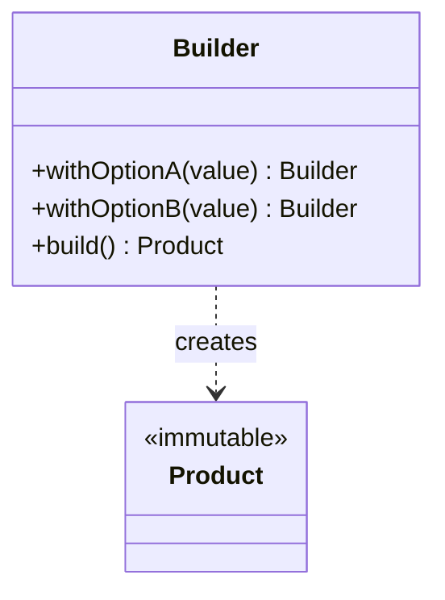

# Builder

**Category:** Creational

## The problem

Some objects have many fields, most of them optional, and only a few required. A constructor
that takes all of them is unreadable at the call site (`new Computer("Ryzen 9", 32, 1024, true,
false, "extended-warranty")` — which boolean was which?), and one that grows a new overload for
every combination of optional fields (the "telescoping constructor") multiplies combinatorially
as more options are added. Setters instead of a constructor fix readability but leave the object
mutable and possibly half-built if a caller forgets a required field.

## The solution

Move construction into a separate object that accumulates values field by field through a
fluent, chainable API, and only produces the real (immutable) object on the final `build()`
call.



## Classic example

[`classic/Computer`](src/main/java/com/designpatterns/creational/builder/classic/Computer.java)
is the textbook fluent builder: a required `cpu`, three optional fields with sensible defaults
(`ramGb`, `storageGb`, `hasGraphicsCard`), and a private constructor so the only way to get a
`Computer` at all is through `Computer.builder(cpu)....build()`.
[`ComputerTest`](src/test/java/com/designpatterns/creational/builder/classic/ComputerTest.java)
checks the defaults apply when nothing else is set, that overriding one field doesn't disturb
the others, and that a null required field fails fast with an NPE rather than producing a
half-built object.

## Applied example: vehicle-financing proposal assembly

[`applied/AutoLoanProposal`](src/main/java/com/designpatterns/creational/builder/applied/AutoLoanProposal.java)
is the same shape applied to a vehicle-financing proposal, the kind assembled at a bank's point
of sale: two required fields (applicant, vehicle price) and four independent optional add-ons
(installment count, insurance, a trade-in as collateral, a promotional rate) that don't all
apply to every deal. A plain constructor here would force every call site to pass `false, false,
null, false` for the deals that skip every add-on — the builder lets each call site read as
exactly what it requests, nothing more.
[`AutoLoanProposalTest`](src/test/java/com/designpatterns/creational/builder/applied/AutoLoanProposalTest.java)
covers the default term, every add-on combined, and the two validation failures (non-positive
price, non-positive installment count).

## When not to use it

- If the object has two or three fields and no meaningful defaults, a builder is ceremony for
  no benefit — a constructor or a static factory method is clearer.
- If every field is actually required, a builder just defers the "did I forget something"
  problem from compile time (missing constructor argument) to runtime (missing `build()` call) —
  a plain constructor with named-parameter-style factory methods is safer.
- Don't reach for a builder to work around a class that's doing too much. If the "optional
  fields" are really different modes of the same object, separate types usually model the
  domain better than one object with a dozen toggles.

## Test coverage

100% instruction coverage, 100% branch coverage (JaCoCo). Reproduce it yourself:

```bash
./gradlew :creational:builder:jacocoTestReport
```

Report at `creational/builder/build/reports/jacoco/test/html/index.html`.

## Further reading

- Gamma, E., Helm, R., Johnson, R., & Vlissides, J. (1994). *Design Patterns: Elements of
  Reusable Object-Oriented Software*. Addison-Wesley. — Chapter 3 formalizes Builder.
- Bloch, J. (2018). *Effective Java* (3rd ed.), Item 2: "Consider a builder when faced with many
  constructor parameters." Addison-Wesley. — the exact telescoping-constructor problem this
  module opens with, and the standard modern-Java argument for reaching for this pattern.
