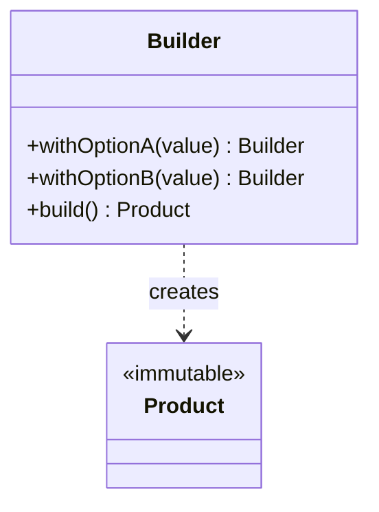

# Builder

**Category:** Creational

## O problema

Alguns objetos têm muitos campos, a maioria opcionais, e só alguns obrigatórios. Um construtor
que recebe todos eles fica ilegível no ponto de chamada (`new Computer("Ryzen 9", 32, 1024, true,
false, "extended-warranty")` — qual booleano era qual?), e um que ganha uma sobrecarga nova pra
cada combinação de campos opcionais (o "telescoping constructor") multiplica combinatoriamente
conforme mais opções são adicionadas. Setters em vez de construtor resolvem a legibilidade, mas
deixam o objeto mutável e possivelmente incompleto se quem chama esquecer um campo obrigatório.

## A solução

Mover a construção pra um objeto separado que acumula valores campo a campo por uma API fluente
e encadeável, e só produz o objeto real (imutável) na chamada final de `build()`.



## Exemplo clássico

[`classic/Computer`](src/main/java/com/designpatterns/creational/builder/classic/Computer.java)
é o builder fluente clássico dos livros: um `cpu` obrigatório, três campos opcionais com valores
padrão sensatos (`ramGb`, `storageGb`, `hasGraphicsCard`), e um construtor privado, de modo que a
única forma de obter um `Computer` é através de `Computer.builder(cpu)....build()`.
[`ComputerTest`](src/test/java/com/designpatterns/creational/builder/classic/ComputerTest.java)
verifica que os padrões se aplicam quando nada mais é definido, que sobrescrever um campo não
afeta os outros, e que um campo obrigatório nulo falha rápido com um NPE em vez de produzir um
objeto incompleto.

## Exemplo aplicado: montagem de proposta de financiamento de veículo

[`applied/AutoLoanProposal`](src/main/java/com/designpatterns/creational/builder/applied/AutoLoanProposal.java)
é a mesma estrutura aplicada a uma proposta de financiamento de veículo, do tipo montada no
ponto de venda de um banco: dois campos obrigatórios (solicitante, preço do veículo) e quatro
adicionais opcionais e independentes (número de parcelas, seguro, um veículo usado como
garantia, uma taxa promocional) que não se aplicam a todo negócio. Um construtor comum aqui
forçaria cada ponto de chamada a passar `false, false, null, false` pros negócios que dispensam
todo adicional — o builder deixa cada ponto de chamada ler exatamente o que solicita, nada mais.
[`AutoLoanProposalTest`](src/test/java/com/designpatterns/creational/builder/applied/AutoLoanProposalTest.java)
cobre o prazo padrão, todos os adicionais combinados, e as duas falhas de validação (preço não
positivo, número de parcelas não positivo).

## Quando não usar

- Se o objeto tem dois ou três campos e nenhum valor padrão significativo, um builder é
  cerimônia sem benefício — um construtor ou um método de fábrica estático é mais claro.
- Se todo campo é de fato obrigatório, um builder só adia o problema de "esqueci algo" da
  compilação (argumento de construtor faltando) pra execução (chamada de `build()` faltando) —
  um construtor comum com métodos de fábrica no estilo de parâmetros nomeados é mais seguro.
- Não recorra a um builder pra contornar uma classe que faz coisa demais. Se os "campos
  opcionais" são na verdade modos diferentes do mesmo objeto, tipos separados costumam modelar
  o domínio melhor do que um objeto com uma dúzia de chaves liga/desliga.

## Cobertura de testes

100% de cobertura de instrução, 100% de cobertura de branch (JaCoCo). Reproduza você mesmo:

```bash
./gradlew :creational:builder:jacocoTestReport
```

Relatório em `creational/builder/build/reports/jacoco/test/html/index.html`.

## Leitura complementar

- Gamma, E., Helm, R., Johnson, R., & Vlissides, J. (1994). *Design Patterns: Elements of
  Reusable Object-Oriented Software*. Addison-Wesley. — o Capítulo 3 formaliza o Builder.
- Bloch, J. (2018). *Effective Java* (3ª ed.), Item 2: "Consider a builder when faced with many
  constructor parameters." Addison-Wesley. — exatamente o problema do telescoping constructor
  com que este módulo abre, e o argumento padrão do Java moderno pra recorrer a este padrão.
