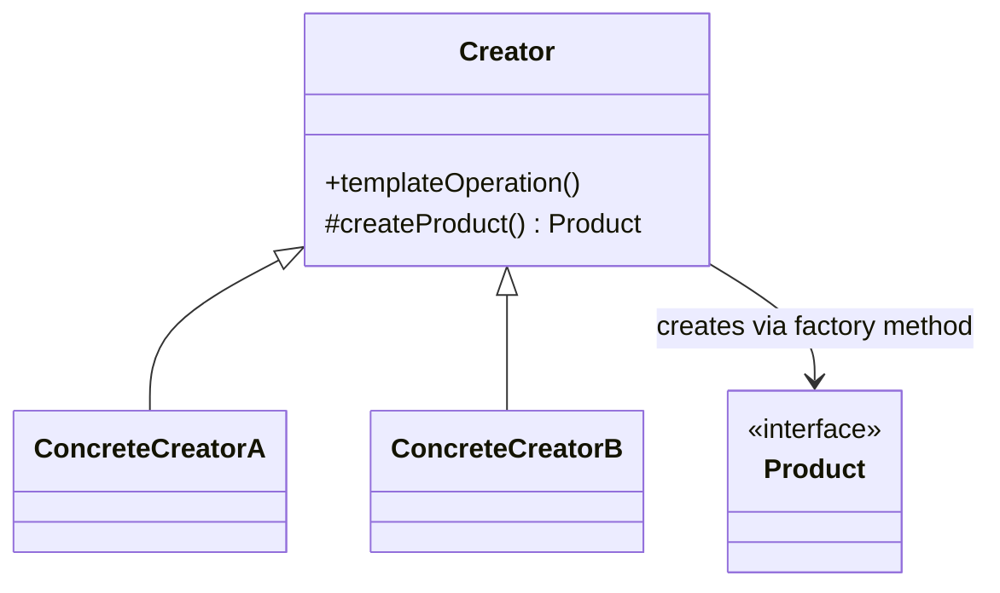

# Factory Method

**Category:** Creational

## El problema

Una clase tiene un procedimiento fijo que ejecutar, pero un paso de ese procedimiento — qué
objeto concreto crear — necesita variar. Poner `new ConcreteThing()` directo en el
procedimiento lo ata a una subclase específica, de modo que soportar una variante nueva
significa editar código que ya funciona, y la lógica del propio procedimiento (validación,
configuración compartida) termina duplicada en todo lugar que también necesita elegir una
variante.

## La solución

Poner el procedimiento fijo en una clase base, y aplazar la decisión de "qué objeto crear" a un
método abstracto que las subclases sobrescriben. La clase base llama a su propio método de
fábrica abstracto de forma polimórfica — nunca necesita saber qué producto concreto va a
recibir realmente.



## Ejemplo clásico

[`classic/NotificationCreator`](src/main/java/com/designpatterns/creational/factorymethod/classic/NotificationCreator.java)
define `send(recipient, message)` una única vez — incluyendo un paso de validación que cada
subclase hereda gratis — y aplaza `createNotification()` a [`EmailNotificationCreator`](src/main/java/com/designpatterns/creational/factorymethod/classic/EmailNotificationCreator.java)
y [`SmsNotificationCreator`](src/main/java/com/designpatterns/creational/factorymethod/classic/SmsNotificationCreator.java).
Ninguna subclase toca `send()`; solo dicen qué [`Notification`](src/main/java/com/designpatterns/creational/factorymethod/classic/Notification.java)
se construye. [`NotificationCreatorTest`](src/test/java/com/designpatterns/creational/factorymethod/classic/NotificationCreatorTest.java)
verifica que ambos creators concretos enrutan al tipo de notificación correcto, y que la
validación compartida en la clase base se aplica a ambos sin que ninguna subclase tenga que
implementarla.

## Ejemplo aplicado: selección de proveedor de pago

[`applied/PaymentProviderCreator`](src/main/java/com/designpatterns/creational/factorymethod/applied/PaymentProviderCreator.java)
mantiene un paso compartido real — validación de monto — y aplaza `createProvider()` a
[`PixPaymentProviderCreator`](src/main/java/com/designpatterns/creational/factorymethod/applied/PixPaymentProviderCreator.java),
[`BoletoPaymentProviderCreator`](src/main/java/com/designpatterns/creational/factorymethod/applied/BoletoPaymentProviderCreator.java),
y [`CreditCardPaymentProviderCreator`](src/main/java/com/designpatterns/creational/factorymethod/applied/CreditCardPaymentProviderCreator.java).
[`PaymentCheckout`](src/main/java/com/designpatterns/creational/factorymethod/applied/PaymentCheckout.java)
busca el creator correcto por [`PaymentMethod`](src/main/java/com/designpatterns/creational/factorymethod/applied/PaymentMethod.java)
y le llama `charge()` — un gateway de pagos real que agrega un cuarto método más adelante
significa agregar una clase de creator nueva, y obtiene el paso de validación de monto gratis,
sin copiarlo.
[`PaymentCheckoutTest`](src/test/java/com/designpatterns/creational/factorymethod/applied/PaymentCheckoutTest.java)
cubre los tres proveedores, la validación compartida disparándose sin importar el método, y el
caso de falla de método no registrado.

## Cuándo no usarlo

- Si no hay un procedimiento compartido real alrededor del paso de creación — solo "elegir una
  implementación y delegarle por completo" — eso es [Strategy](../../behavioral/strategy), no
  Factory Method. La señal es si la clase base realmente hace algo por sí misma (validación,
  configuración compartida) más allá de llamar al método de fábrica.
- Para un objeto único sin familia de variantes, un constructor común o un método de fábrica
  estático es más simple — Factory Method vale su complejidad cuando las subclases realmente
  necesitan intercambiar el producto sin tocar el algoritmo compartido.
- Si la "familia de objetos relacionados" necesita mantenerse consistente como conjunto (no solo
  un producto a la vez), eso es [Abstract Factory](../abstractfactory) cuando llegue, no
  Factory Method.

## Cobertura de pruebas

100% de cobertura de instrucciones, 100% de cobertura de ramas (JaCoCo). Reprodúzcalo usted
mismo:

```bash
./gradlew :creational:factorymethod:jacocoTestReport
```

Informe en `creational/factorymethod/build/reports/jacoco/test/html/index.html`.

## Lecturas adicionales

- Gamma, E., Helm, R., Johnson, R., & Vlissides, J. (1994). *Design Patterns: Elements of
  Reusable Object-Oriented Software*. Addison-Wesley. — el Capítulo 3 formaliza Factory Method;
  el propio ejemplo conductor del libro (un editor de documentos aplazando qué subclase de
  `Document` crear) es el antecesor directo de la estructura de este módulo.
- Liskov, B., & Wing, J. (1994). "A Behavioral Notion of Subtyping." *ACM Transactions on
  Programming Languages and Systems*, 16(6), 1811–1841. — todo producto concreto devuelto por
  un método de fábrica debe poder usarse en cualquier lugar donde se espera el tipo base
  `Product`; esa es exactamente la sustituibilidad que formaliza este artículo, y exactamente
  lo que permite que `NotificationCreator.send()` y `PaymentProviderCreator.charge()` sigan
  ignorando qué tipo concreto recibieron de vuelta.
