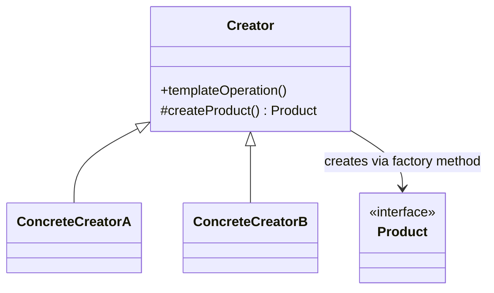

# Factory Method

**Category:** Creational

## The problem

A class has a fixed procedure to run, but one step of that procedure — which concrete object to
create — needs to vary. Hard-coding `new ConcreteThing()` inside the procedure ties it to one
specific subclass, so supporting a new variant means editing code that already works, and the
procedure's own logic (validation, shared setup) ends up duplicated in every place that also
needs to pick a variant.

## The solution

Put the fixed procedure in a base class, and defer the "which object to create" decision to an
abstract method that subclasses override. The base class calls its own abstract factory method
polymorphically — it never needs to know which concrete product it's actually going to get.



## Classic example

[`classic/NotificationCreator`](src/main/java/com/designpatterns/creational/factorymethod/classic/NotificationCreator.java)
defines `send(recipient, message)` once — including a validation step every subclass inherits
for free — and defers `createNotification()` to [`EmailNotificationCreator`](src/main/java/com/designpatterns/creational/factorymethod/classic/EmailNotificationCreator.java)
and [`SmsNotificationCreator`](src/main/java/com/designpatterns/creational/factorymethod/classic/SmsNotificationCreator.java).
Neither subclass touches `send()` itself; they only say which [`Notification`](src/main/java/com/designpatterns/creational/factorymethod/classic/Notification.java)
gets built. [`NotificationCreatorTest`](src/test/java/com/designpatterns/creational/factorymethod/classic/NotificationCreatorTest.java)
checks both concrete creators route to the right notification type, and that the shared
validation in the base class applies to both without either subclass having to implement it.

## Applied example: payment provider selection

[`applied/PaymentProviderCreator`](src/main/java/com/designpatterns/creational/factorymethod/applied/PaymentProviderCreator.java)
holds one real shared step — amount validation — and defers `createProvider()` to
[`PixPaymentProviderCreator`](src/main/java/com/designpatterns/creational/factorymethod/applied/PixPaymentProviderCreator.java),
[`BoletoPaymentProviderCreator`](src/main/java/com/designpatterns/creational/factorymethod/applied/BoletoPaymentProviderCreator.java),
and [`CreditCardPaymentProviderCreator`](src/main/java/com/designpatterns/creational/factorymethod/applied/CreditCardPaymentProviderCreator.java).
[`PaymentCheckout`](src/main/java/com/designpatterns/creational/factorymethod/applied/PaymentCheckout.java)
looks up the right creator by [`PaymentMethod`](src/main/java/com/designpatterns/creational/factorymethod/applied/PaymentMethod.java)
and calls `charge()` on it — a real payment gateway adding a fourth method later means adding one
new creator class, and it gets the amount-validation step for free, without copying it.
[`PaymentCheckoutTest`](src/test/java/com/designpatterns/creational/factorymethod/applied/PaymentCheckoutTest.java)
covers all three providers, the shared validation firing regardless of method, and the
unregistered-method failure case.

## When not to use it

- If there's no real shared procedure around the creation step — just "pick an implementation
  and delegate to it entirely" — that's [Strategy](../../behavioral/strategy), not Factory
  Method. The tell is whether the base class actually does something itself (validation, shared
  setup) beyond calling the factory method.
- For a one-off object with no family of variants, a plain constructor or a static factory
  method is simpler — Factory Method earns its complexity when subclasses genuinely need to
  swap the product without touching the shared algorithm.
- If the "family of related objects" needs to stay consistent as a set (not just one product at
  a time), that's [Abstract Factory](../abstractfactory) once it lands, not Factory Method.

## Test coverage

100% instruction coverage, 100% branch coverage (JaCoCo). Reproduce it yourself:

```bash
./gradlew :creational:factorymethod:jacocoTestReport
```

Report at `creational/factorymethod/build/reports/jacoco/test/html/index.html`.

## Further reading

- Gamma, E., Helm, R., Johnson, R., & Vlissides, J. (1994). *Design Patterns: Elements of
  Reusable Object-Oriented Software*. Addison-Wesley. — Chapter 3 formalizes Factory Method;
  the book's own running example (a document editor deferring which `Document` subclass to
  create) is the direct ancestor of this module's structure.
- Liskov, B., & Wing, J. (1994). "A Behavioral Notion of Subtyping." *ACM Transactions on
  Programming Languages and Systems*, 16(6), 1811–1841. — every concrete product returned by a
  factory method must be usable anywhere the base `Product` type is expected; that's exactly the
  substitutability this paper formalizes, and exactly what lets `NotificationCreator.send()` and
  `PaymentProviderCreator.charge()` stay ignorant of which concrete type they got back.
