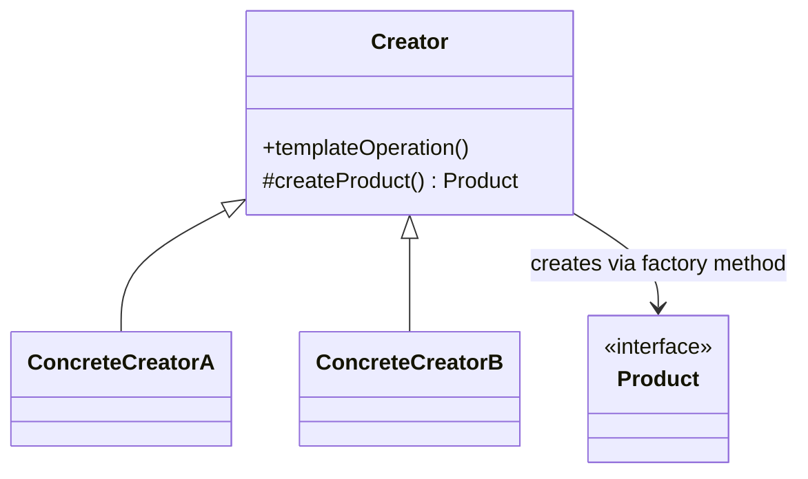

# Factory Method

**Category:** Creational

## O problema

Uma classe tem um procedimento fixo pra executar, mas um passo desse procedimento — qual objeto
concreto criar — precisa variar. Colocar `new ConcreteThing()` direto no procedimento o amarra a
uma subclasse específica, de modo que suportar uma variante nova significa editar código que já
funciona, e a lógica do próprio procedimento (validação, configuração compartilhada) acaba
duplicada em todo lugar que também precisa escolher uma variante.

## A solução

Colocar o procedimento fixo numa classe base, e adiar a decisão de "qual objeto criar" pra um
método abstrato que as subclasses sobrescrevem. A classe base chama seu próprio método de
fábrica abstrato de forma polimórfica — ela nunca precisa saber qual produto concreto vai
realmente receber.



## Exemplo clássico

[`classic/NotificationCreator`](src/main/java/com/designpatterns/creational/factorymethod/classic/NotificationCreator.java)
define `send(recipient, message)` uma única vez — incluindo um passo de validação que toda
subclasse herda de graça — e adia `createNotification()` pra [`EmailNotificationCreator`](src/main/java/com/designpatterns/creational/factorymethod/classic/EmailNotificationCreator.java)
e [`SmsNotificationCreator`](src/main/java/com/designpatterns/creational/factorymethod/classic/SmsNotificationCreator.java).
Nenhuma das subclasses toca em `send()`; elas só dizem qual [`Notification`](src/main/java/com/designpatterns/creational/factorymethod/classic/Notification.java)
é construída. [`NotificationCreatorTest`](src/test/java/com/designpatterns/creational/factorymethod/classic/NotificationCreatorTest.java)
verifica que os dois creators concretos roteiam pro tipo certo de notificação, e que a
validação compartilhada na classe base se aplica a ambos sem que nenhuma subclasse precise
implementá-la.

## Exemplo aplicado: seleção de provedor de pagamento

[`applied/PaymentProviderCreator`](src/main/java/com/designpatterns/creational/factorymethod/applied/PaymentProviderCreator.java)
mantém um passo compartilhado real — validação de valor — e adia `createProvider()` pra
[`PixPaymentProviderCreator`](src/main/java/com/designpatterns/creational/factorymethod/applied/PixPaymentProviderCreator.java),
[`BoletoPaymentProviderCreator`](src/main/java/com/designpatterns/creational/factorymethod/applied/BoletoPaymentProviderCreator.java),
e [`CreditCardPaymentProviderCreator`](src/main/java/com/designpatterns/creational/factorymethod/applied/CreditCardPaymentProviderCreator.java).
[`PaymentCheckout`](src/main/java/com/designpatterns/creational/factorymethod/applied/PaymentCheckout.java)
busca o creator certo por [`PaymentMethod`](src/main/java/com/designpatterns/creational/factorymethod/applied/PaymentMethod.java)
e chama `charge()` nele — um gateway de pagamento real adicionando um quarto método depois
significa adicionar uma classe de creator nova, e ela ganha o passo de validação de valor de
graça, sem copiá-lo.
[`PaymentCheckoutTest`](src/test/java/com/designpatterns/creational/factorymethod/applied/PaymentCheckoutTest.java)
cobre os três provedores, a validação compartilhada disparando independente do método, e o
caso de falha de método não registrado.

## Quando não usar

- Se não há um procedimento compartilhado real em volta do passo de criação — só "escolher uma
  implementação e delegar totalmente a ela" — isso é [Strategy](../../behavioral/strategy), não
  Factory Method. O sinal é se a classe base de fato faz algo por conta própria (validação,
  configuração compartilhada) além de chamar o método de fábrica.
- Pra um objeto único sem família de variantes, um construtor comum ou um método de fábrica
  estático é mais simples — o Factory Method só compensa a complexidade quando subclasses
  genuinamente precisam trocar o produto sem tocar no algoritmo compartilhado.
- Se a "família de objetos relacionados" precisa se manter consistente como um conjunto (não só
  um produto por vez), isso é [Abstract Factory](../abstractfactory) quando chegar, não Factory
  Method.

## Cobertura de testes

100% de cobertura de instrução, 100% de cobertura de branch (JaCoCo). Reproduza você mesmo:

```bash
./gradlew :creational:factorymethod:jacocoTestReport
```

Relatório em `creational/factorymethod/build/reports/jacoco/test/html/index.html`.

## Leitura complementar

- Gamma, E., Helm, R., Johnson, R., & Vlissides, J. (1994). *Design Patterns: Elements of
  Reusable Object-Oriented Software*. Addison-Wesley. — o Capítulo 3 formaliza o Factory
  Method; o próprio exemplo condutor do livro (um editor de documentos adiando qual subclasse
  de `Document` criar) é o ancestral direto da estrutura deste módulo.
- Liskov, B., & Wing, J. (1994). "A Behavioral Notion of Subtyping." *ACM Transactions on
  Programming Languages and Systems*, 16(6), 1811–1841. — todo produto concreto retornado por
  um método de fábrica precisa ser utilizável em qualquer lugar onde o tipo base `Product` é
  esperado; essa é exatamente a substituibilidade que esse artigo formaliza, e exatamente o que
  permite que `NotificationCreator.send()` e `PaymentProviderCreator.charge()` permaneçam
  ignorantes de qual tipo concreto receberam de volta.
