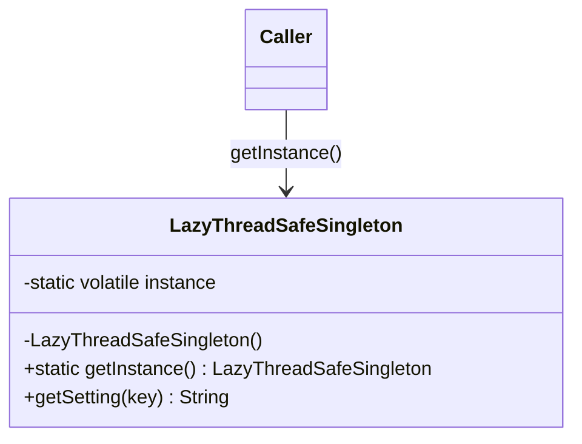

# Singleton

**Category:** Creational

## El problema

Algunos recursos genuinamente necesitan exactamente una instancia compartida por proceso: un
registro de configuración, un pool de conexiones, una tabla de límites regulatorios. Si cada
llamador construye su propia copia, o se desperdicia el costo de construirla repetidamente o —
peor — distintas partes del sistema terminan viendo copias diferentes, posiblemente obsoletas,
de lo que debería ser una única fuente de verdad. Acertar esta garantía de "una instancia" bajo
acceso concurrente es más difícil de lo que parece: una comprobación ingenua
`if (instance == null) instance = new Thing()` tiene una condición de carrera en la que dos
hilos pueden pasar la comprobación de nulo antes de que cualquiera haya asignado el campo.

## La solución

Ocultar el constructor, exponer un único punto de acceso, y hacer que ese punto de acceso sea
seguro bajo el primer uso concurrente.



## Ejemplo clásico

[`classic/LazyThreadSafeSingleton`](src/main/java/com/designpatterns/creational/singleton/classic/LazyThreadSafeSingleton.java)
es el singleton de double-checked locking clásico de los libros: un campo `volatile`, una
comprobación de nulo fuera del lock (camino rápido una vez inicializado), y una segunda
comprobación de nulo dentro de un bloque `synchronized` (de modo que solo el primer hilo que
pasa realmente construye la instancia). El campo debe ser `volatile` — sin eso, un hilo podría
observar una referencia no nula a un objeto cuyo constructor todavía no terminó de escribir sus
campos, porque la JVM tiene permitido reordenar la escritura en `instance` antes de las
escrituras que ocurren dentro del constructor.

[`LazyThreadSafeSingletonTest`](src/test/java/com/designpatterns/creational/singleton/classic/LazyThreadSafeSingletonTest.java)
dispara 50 hilos contra `getInstance()` simultáneamente (sincronizados con un `CountDownLatch`
para que realmente compitan en la primera llamada) y verifica que cada hilo observó exactamente
la misma instancia.

## Ejemplo aplicado: registro de límites regulatorios de PIX

[`applied/HandRolledLimitRegistry`](src/main/java/com/designpatterns/creational/singleton/applied/HandRolledLimitRegistry.java)
modela una tabla central de límites de PIX definidos por BACEN (tope diario, tope nocturno
reducido) que lee cada validador de transacciones concurrente. Recargar estos límites en cada
llamada de validación sería un desperdicio, y los validadores que corren concurrentemente deben
ver todos los mismos valores — exactamente el escenario para el que existe el patrón, aplicado
con la misma mecánica de double-checked locking que el ejemplo clásico.

[`applied/SpringManagedLimitRegistry`](src/main/java/com/designpatterns/creational/singleton/applied/SpringManagedLimitRegistry.java)
implementa el mismo contrato `LimitRegistry` **sin ninguna maquinaria de singleton** — es una
clase simple. La garantía de instancia única proviene enteramente del alcance de bean
predeterminado de Spring (`singleton`), conectado en [`SingletonRegistryConfig`](src/main/java/com/designpatterns/creational/singleton/applied/SingletonRegistryConfig.java).
[`SpringManagedLimitRegistryTest`](src/test/java/com/designpatterns/creational/singleton/applied/SpringManagedLimitRegistryTest.java)
lo demuestra: dos llamadas a `context.getBean(...)` devuelven la misma referencia, con cero
código de bloqueo escrito a mano. La misma garantía, dos formas de obtenerla — una la construye
usted mismo, la otra un contenedor se la da gratis una vez que acepta la dependencia.

## Cuándo no usarlo

- Si el requisito de "instancia compartida" es en realidad solo "acceso global conveniente",
  prefiera pasar la dependencia explícitamente (inyección por constructor) — los singletons
  ocultan dependencias y dificultan aislar las pruebas.
- Si ya está dentro de un contenedor de DI (Spring, en el propio ejemplo de este repositorio),
  deje que el contenedor gestione el alcance de singleton; el código `getInstance()` hecho a
  mano junto a un contenedor es redundante y confuso.
- Si la "instancia única" necesita variar por solicitud, por inquilino, o por hilo, ese es el
  alcance equivocado por completo — recurra a un bean con alcance definido o a un `ThreadLocal`.

## Cobertura de pruebas

97% de cobertura de instrucciones, 87% de cobertura de ramas (JaCoCo). Reprodúzcalo usted
mismo:

```bash
./gradlew :creational:singleton:jacocoTestReport
```

Informe en `creational/singleton/build/reports/jacoco/test/html/index.html`.

## Lecturas adicionales

- Gamma, E., Helm, R., Johnson, R., & Vlissides, J. (1994). *Design Patterns: Elements of
  Reusable Object-Oriented Software*. Addison-Wesley. — el Capítulo 3 formaliza Singleton en
  sí; todo módulo de este repositorio se remonta a este libro.
- Pugh, W., Bacon, D., Bloch, J., et al. ["Double-Checked Locking is Broken" Declaration](https://www.cs.umd.edu/~pugh/java/memoryModel/DoubleCheckedLocking.html).
  University of Maryland. — el razonamiento exacto de por qué `getInstance()` necesita más que
  una comprobación de nulo bajo el modelo de memoria previo a Java 5, y por qué un campo simple
  (sin `volatile`) no es suficiente.
- Manson, J., Pugh, W., & Adve, S. V. (2005). "The Java Memory Model." En *Proceedings of the
  32nd ACM SIGPLAN-SIGACT Symposium on Principles of Programming Languages (POPL '05)*,
  378–391. — la formalización del JSR-133 que hace que `volatile` sea suficiente para corregir
  el double-checked locking; este es el artículo en el que se apoya, en última instancia, la
  corrección en `LazyThreadSafeSingleton`.
