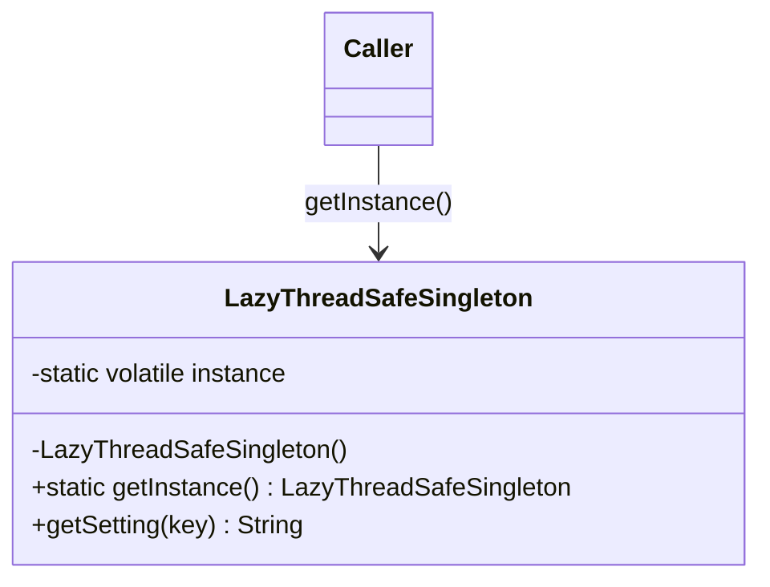

# Singleton

**Category:** Creational

## The problem

Some resources genuinely need exactly one shared instance per process: a configuration
registry, a connection pool, a regulatory limit table. If every caller constructs its own
copy, you either waste the cost of building it repeatedly or — worse — different parts of
the system end up looking at different, possibly stale, copies of what should be one source
of truth. Getting this "one instance" guarantee right under concurrent access is harder than
it looks: a naive `if (instance == null) instance = new Thing()` check has a race where two
threads can both pass the null check before either has assigned the field.

## The solution

Hide the constructor, expose a single access point, and make that access point safe under
concurrent first use.



## Classic example

[`classic/LazyThreadSafeSingleton`](src/main/java/com/designpatterns/creational/singleton/classic/LazyThreadSafeSingleton.java)
is the textbook double-checked-locking singleton: a `volatile` field, a null check outside
the lock (fast path once initialized), and a second null check inside a `synchronized` block
(so only the first thread through actually constructs the instance). The field must be
`volatile` — without it, a thread could observe a non-null reference to an object whose
constructor hasn't finished writing its fields yet, because the JVM is allowed to reorder
the write to `instance` ahead of the writes happening inside the constructor.

[`LazyThreadSafeSingletonTest`](src/test/java/com/designpatterns/creational/singleton/classic/LazyThreadSafeSingletonTest.java)
fires 50 threads at `getInstance()` simultaneously (synchronized with a `CountDownLatch` so
they actually contend on the first call) and asserts every thread observed the exact same
instance.

## Applied example: PIX regulatory limit registry

[`applied/HandRolledLimitRegistry`](src/main/java/com/designpatterns/creational/singleton/applied/HandRolledLimitRegistry.java)
models a central table of BACEN-defined PIX limits (daily cap, reduced nighttime cap) that
every concurrent transaction validator reads. Reloading these limits per validation call
would be wasteful, and validators running concurrently must all see the same values — exactly
the scenario the pattern exists for, applied with the same double-checked-locking mechanics
as the classic example.

[`applied/SpringManagedLimitRegistry`](src/main/java/com/designpatterns/creational/singleton/applied/SpringManagedLimitRegistry.java)
implements the same `LimitRegistry` contract with **no singleton machinery at all** — it's a
plain class. The single-instance guarantee comes entirely from Spring's default bean scope
(`singleton`), wired in [`SingletonRegistryConfig`](src/main/java/com/designpatterns/creational/singleton/applied/SingletonRegistryConfig.java).
[`SpringManagedLimitRegistryTest`](src/test/java/com/designpatterns/creational/singleton/applied/SpringManagedLimitRegistryTest.java)
proves it: two `context.getBean(...)` calls return the same reference, with zero
hand-written locking code. Same guarantee, two ways to get it — one you build yourself,
one a container gives you for free once you accept the dependency.

## When not to use it

- If the "shared instance" requirement is really just "convenient global access," prefer
  passing the dependency explicitly (constructor injection) — singletons hide dependencies
  and make tests harder to isolate.
- If you're already inside a DI container (Spring, in this repo's own example), let the
  container manage the singleton scope; hand-rolled `getInstance()` code next to a container
  is redundant and confusing.
- If the "single instance" needs to vary per-request, per-tenant, or per-thread, this is the
  wrong scope entirely — reach for a scoped bean or a `ThreadLocal` instead.

## Test coverage

97% instruction coverage, 87% branch coverage (JaCoCo). Reproduce it yourself:

```bash
./gradlew :creational:singleton:jacocoTestReport
```

Report at `creational/singleton/build/reports/jacoco/test/html/index.html`.
