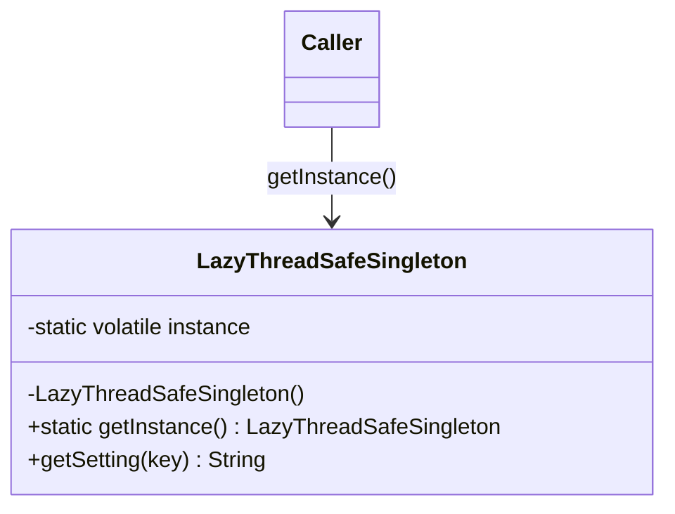

# Singleton

**Category:** Creational

## O problema

Alguns recursos genuinamente precisam de exatamente uma instância compartilhada por processo:
um registro de configuração, um pool de conexões, uma tabela de limites regulatórios. Se cada
chamador constrói sua própria cópia, ou se desperdiça o custo de construí-la repetidamente ou —
pior — partes diferentes do sistema acabam enxergando cópias diferentes, possivelmente
desatualizadas, do que deveria ser uma única fonte de verdade. Acertar essa garantia de "uma
instância" sob acesso concorrente é mais difícil do que parece: uma checagem ingênua
`if (instance == null) instance = new Thing()` tem uma condição de corrida em que duas threads
podem passar pela checagem de nulo antes que qualquer uma tenha atribuído o campo.

## A solução

Esconder o construtor, expor um único ponto de acesso, e tornar esse ponto de acesso seguro sob
primeiro uso concorrente.



## Exemplo clássico

[`classic/LazyThreadSafeSingleton`](src/main/java/com/designpatterns/creational/singleton/classic/LazyThreadSafeSingleton.java)
é o singleton de double-checked locking clássico dos livros: um campo `volatile`, uma checagem
de nulo fora do lock (caminho rápido depois de inicializado), e uma segunda checagem de nulo
dentro de um bloco `synchronized` (de modo que só a primeira thread que passa de fato constrói a
instância). O campo precisa ser `volatile` — sem isso, uma thread poderia observar uma
referência não nula a um objeto cujo construtor ainda não terminou de escrever seus campos,
porque a JVM tem permissão de reordenar a escrita em `instance` antes das escritas que acontecem
dentro do construtor.

[`LazyThreadSafeSingletonTest`](src/test/java/com/designpatterns/creational/singleton/classic/LazyThreadSafeSingletonTest.java)
dispara 50 threads em `getInstance()` simultaneamente (sincronizadas com um `CountDownLatch` pra
que de fato disputem na primeira chamada) e verifica que toda thread observou exatamente a
mesma instância.

## Exemplo aplicado: registro de limites regulatórios do PIX

[`applied/HandRolledLimitRegistry`](src/main/java/com/designpatterns/creational/singleton/applied/HandRolledLimitRegistry.java)
modela uma tabela central de limites do PIX definidos pelo BACEN (teto diário, teto noturno
reduzido) que todo validador de transação concorrente lê. Recarregar esses limites a cada
chamada de validação seria um desperdício, e validadores rodando concorrentemente precisam
todos enxergar os mesmos valores — exatamente o cenário pro qual o padrão existe, aplicado com a
mesma mecânica de double-checked locking do exemplo clássico.

[`applied/SpringManagedLimitRegistry`](src/main/java/com/designpatterns/creational/singleton/applied/SpringManagedLimitRegistry.java)
implementa o mesmo contrato `LimitRegistry` **sem nenhuma maquinaria de singleton** — é uma
classe simples. A garantia de instância única vem inteiramente do escopo de bean padrão do
Spring (`singleton`), conectado em [`SingletonRegistryConfig`](src/main/java/com/designpatterns/creational/singleton/applied/SingletonRegistryConfig.java).
[`SpringManagedLimitRegistryTest`](src/test/java/com/designpatterns/creational/singleton/applied/SpringManagedLimitRegistryTest.java)
prova isso: duas chamadas a `context.getBean(...)` retornam a mesma referência, com zero código
de locking escrito à mão. Mesma garantia, duas formas de obtê-la — uma você constrói você
mesmo, a outra um container te dá de graça uma vez que você aceita a dependência.

## Quando não usar

- Se a exigência de "instância compartilhada" é na verdade só "acesso global conveniente",
  prefira passar a dependência explicitamente (injeção via construtor) — singletons escondem
  dependências e dificultam isolar testes.
- Se você já está dentro de um container de DI (Spring, no próprio exemplo deste repositório),
  deixe o container gerenciar o escopo de singleton; código `getInstance()` feito à mão ao lado
  de um container é redundante e confuso.
- Se a "instância única" precisa variar por requisição, por tenant, ou por thread, esse é o
  escopo errado por completo — recorra a um bean com escopo ou a um `ThreadLocal`.

## Cobertura de testes

97% de cobertura de instrução, 87% de cobertura de branch (JaCoCo). Reproduza você mesmo:

```bash
./gradlew :creational:singleton:jacocoTestReport
```

Relatório em `creational/singleton/build/reports/jacoco/test/html/index.html`.

## Leitura complementar

- Gamma, E., Helm, R., Johnson, R., & Vlissides, J. (1994). *Design Patterns: Elements of
  Reusable Object-Oriented Software*. Addison-Wesley. — o Capítulo 3 formaliza o Singleton em
  si; todo módulo deste repositório remonta a esse livro.
- Pugh, W., Bacon, D., Bloch, J., et al. ["Double-Checked Locking is Broken" Declaration](https://www.cs.umd.edu/~pugh/java/memoryModel/DoubleCheckedLocking.html).
  University of Maryland. — o raciocínio exato de por que `getInstance()` precisa de mais do que
  uma checagem de nulo sob o modelo de memória pré-Java-5, e por que um campo simples (sem
  `volatile`) não é suficiente.
- Manson, J., Pugh, W., & Adve, S. V. (2005). "The Java Memory Model." Em *Proceedings of the
  32nd ACM SIGPLAN-SIGACT Symposium on Principles of Programming Languages (POPL '05)*,
  378–391. — a formalização do JSR-133 que torna `volatile` suficiente pra corrigir o
  double-checked locking; esse é o artigo em que a correção em `LazyThreadSafeSingleton` se
  apoia, em última instância.
