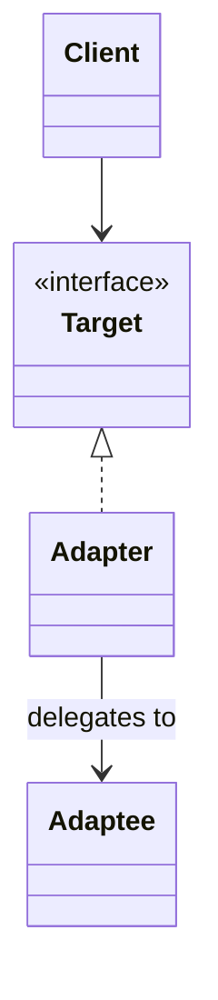

# Adapter

**Category:** Structural

## El problema

Dos piezas de código necesitan comunicarse, pero sus interfaces no coinciden: nombres de método
distintos, formas de parámetros distintas, convenciones de manejo de errores distintas. Las dos
razones más comunes por las que esto sucede son (a) un lado es una API heredada o de terceros
que no se puede cambiar, y (b) el lado "nuevo" se diseñó sin saber del antiguo. Reescribir el
lado heredado a menudo no es una opción — puede ser un sistema mainframe, un SDK de proveedor, o
simplemente código con un radio de impacto demasiado grande para tocar.

## La solución

Introducir un envoltorio delgado que implemente la interfaz que el cliente espera, y traduzca
cada llamada a lo que el adaptado realmente entiende.



## Ejemplo clásico

[`classic/EnumerationIteratorAdapter`](src/main/java/com/designpatterns/structural/adapter/classic/EnumerationIteratorAdapter.java)
es el ejemplo canónico en Java de este patrón: adapta el contrato `Enumeration` previo a Java 2
(`hasMoreElements()` / `nextElement()`) al contrato moderno `Iterator`
(`hasNext()` / `next()`), de modo que el código escrito contra `Iterator` — bucles for-each,
streams — puede consumir cualquier cosa que solo exponga un `Enumeration`. Esto es exactamente
lo que resuelve la contraparte de `Collections.enumeration()` en el propio JDK.
[`EnumerationIteratorAdapterTest`](src/test/java/com/designpatterns/structural/adapter/classic/EnumerationIteratorAdapterTest.java)
recorre una enumeración envuelta de principio a fin y verifica que lanza
`NoSuchElementException` una vez agotada, igual que cualquier otro `Iterator`.

## Ejemplo aplicado: fachada sobre un sistema de cuentas de mainframe

[`applied/MainframeAccountGateway`](src/main/java/com/designpatterns/structural/adapter/applied/MainframeAccountGateway.java)
representa un sistema real de cuentas mainframe/COBOL: registros posicionales de ancho fijo
(`ACCOUNT[10] + NAME[25] + BALANCE_CENTS[10] + STATUS[1]`) y una excepción comprobada ante un
fallo — el tipo de interfaz que realmente se encuentra al modernizar un sistema bancario central
de décadas, no una hipotética.

[`applied/MainframeAccountLookupAdapter`](src/main/java/com/designpatterns/structural/adapter/applied/MainframeAccountLookupAdapter.java)
expone ese gateway detrás del contrato moderno [`AccountLookupPort`](src/main/java/com/designpatterns/structural/adapter/applied/AccountLookupPort.java)
del que depende el código nuevo de microservicios. El código nuevo nunca analiza una cadena de
ancho fijo ni captura una `MainframeUnavailableException` comprobada — el adapter absorbe
ambas cosas, traduciendo la excepción comprobada heredada en una `AccountLookupException` no
comprobada en el límite. Esta es la misma forma de poner una fachada sobre un mainframe real
durante un esfuerzo de modernización: el sistema heredado no cambia, pero nada aguas abajo del
adapter necesita saber que existe.
[`MainframeAccountLookupAdapterTest`](src/test/java/com/designpatterns/structural/adapter/applied/MainframeAccountLookupAdapterTest.java)
cubre el análisis de registros, el registro-centinela de "cuenta desconocida", y la traducción
de la excepción.

## Cuándo no usarlo

- Si usted controla ambos lados de la interfaz y solo son inconsistentes por accidente,
  corrija la inconsistencia en vez de adaptarse a su alrededor — un adapter debería tender un
  puente entre dos cosas que cada una tiene una razón legítima para ser como es.
- No deje que los adapters acumulen lógica de negocio. El trabajo de un adapter es traducción,
  no validación ni toma de decisiones — si empieza a hacer cualquiera de las dos, esa lógica
  pertenece una capa más arriba.
- Si está adaptando la misma interfaz en muchos lugares no relacionados, considere si una
  verdadera capa anticorrupción (un pequeño módulo interno, no solo una clase) encaja mejor que
  esparcir adapters por toda la base de código.

## Cobertura de pruebas

100% de cobertura de instrucciones, 100% de cobertura de ramas (JaCoCo). Reprodúzcalo usted
mismo:

```bash
./gradlew :structural:adapter:jacocoTestReport
```

Informe en `structural/adapter/build/reports/jacoco/test/html/index.html`.

## Lecturas adicionales

- Gamma, E., Helm, R., Johnson, R., & Vlissides, J. (1994). *Design Patterns: Elements of
  Reusable Object-Oriented Software*. Addison-Wesley. — el Capítulo 4 formaliza Adapter (tanto
  la variante de objeto como la de clase).
- Meyer, B. (1988). *Object-Oriented Software Construction*. Prentice Hall. — introduce el
  Principio Abierto-Cerrado; un adapter es una aplicación directa de él, extendiendo la
  compatibilidad con una interfaz nueva sin modificar ni al cliente ni al adaptado.
- Evans, E. (2003). *Domain-Driven Design: Tackling Complexity in the Heart of Software*.
  Addison-Wesley. — introduce la Anti-Corruption Layer, la generalización a nivel de módulo de
  lo que un único Adapter hace a nivel de clase; referenciada directamente en "Cuándo no
  usarlo" arriba.
