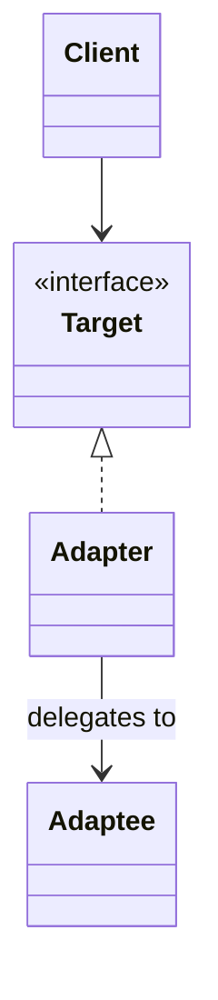

# Adapter

**Category:** Structural

## The problem

Two pieces of code need to talk to each other, but their interfaces don't match: different
method names, different parameter shapes, different error-handling conventions. The two most
common reasons this happens are (a) one side is a legacy or third-party API you can't change,
and (b) the "new" side was designed without knowing about the old one. Rewriting the legacy
side is often not an option — it might be a mainframe system, a vendor SDK, or just code with
too much blast radius to touch.

## The solution

Introduce a thin wrapper that implements the interface the client expects, and translates
each call into whatever the adaptee actually understands.



## Classic example

[`classic/EnumerationIteratorAdapter`](src/main/java/com/designpatterns/structural/adapter/classic/EnumerationIteratorAdapter.java)
is the canonical Java example of this pattern: it adapts the pre-Java-2 `Enumeration`
contract (`hasMoreElements()` / `nextElement()`) to the modern `Iterator` contract
(`hasNext()` / `next()`), so code written against `Iterator` — for-each loops, streams — can
consume anything that only exposes an `Enumeration`. This is exactly what
`Collections.enumeration()`'s counterpart solves in the JDK itself.
[`EnumerationIteratorAdapterTest`](src/test/java/com/designpatterns/structural/adapter/classic/EnumerationIteratorAdapterTest.java)
walks a wrapped enumeration end to end and checks it throws `NoSuchElementException` once
exhausted, same as any other `Iterator`.

## Applied example: fronting a mainframe account system

[`applied/MainframeAccountGateway`](src/main/java/com/designpatterns/structural/adapter/applied/MainframeAccountGateway.java)
stands in for a real mainframe/COBOL account system: fixed-width positional records
(`ACCOUNT[10] + NAME[25] + BALANCE_CENTS[10] + STATUS[1]`) and a checked exception on
failure — the kind of interface you actually get modernizing a decades-old core banking
system, not a hypothetical one.

[`applied/MainframeAccountLookupAdapter`](src/main/java/com/designpatterns/structural/adapter/applied/MainframeAccountLookupAdapter.java)
exposes that gateway behind the modern [`AccountLookupPort`](src/main/java/com/designpatterns/structural/adapter/applied/AccountLookupPort.java)
contract that new microservices code depends on. New code never parses a fixed-width string
or catches a checked `MainframeUnavailableException` — the adapter absorbs both, translating
the legacy checked exception into an unchecked `AccountLookupException` at the boundary. This
is the same shape as fronting a real mainframe during a modernization effort: the legacy
system doesn't change, but nothing downstream of the adapter has to know it exists.
[`MainframeAccountLookupAdapterTest`](src/test/java/com/designpatterns/structural/adapter/applied/MainframeAccountLookupAdapterTest.java)
covers record parsing, the "unknown account" sentinel record, and the exception translation.

## When not to use it

- If you control both sides of the interface and they're just inconsistent by accident, fix
  the inconsistency instead of adapting around it — an adapter should bridge two things that
  each have a legitimate reason to look the way they do.
- Don't let adapters accumulate business logic. An adapter's job is translation, not
  validation or decision-making — if it starts doing either, that logic belongs one layer up.
- If you're adapting the same interface in many unrelated places, consider whether a
  proper anti-corruption layer (a small internal module, not just one class) is a better fit
  than scattering adapters through the codebase.

## Test coverage

100% instruction coverage, 100% branch coverage (JaCoCo). Reproduce it yourself:

```bash
./gradlew :structural:adapter:jacocoTestReport
```

Report at `structural/adapter/build/reports/jacoco/test/html/index.html`.
