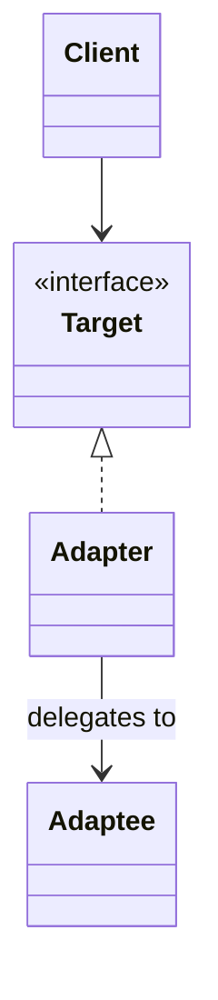

# Adapter

**Category:** Structural

## O problema

Duas partes de código precisam conversar entre si, mas suas interfaces não batem: nomes de
método diferentes, formatos de parâmetro diferentes, convenções de tratamento de erro
diferentes. Os dois motivos mais comuns pra isso acontecer são (a) um dos lados é uma API legada
ou de terceiros que você não pode mudar, e (b) o lado "novo" foi projetado sem saber da
existência do antigo. Reescrever o lado legado muitas vezes não é uma opção — pode ser um
sistema de mainframe, um SDK de fornecedor, ou simplesmente código com raio de impacto grande
demais pra mexer.

## A solução

Introduzir um wrapper fino que implementa a interface que o cliente espera, e traduz cada
chamada pro que o adaptado de fato entende.



## Exemplo clássico

[`classic/EnumerationIteratorAdapter`](src/main/java/com/designpatterns/structural/adapter/classic/EnumerationIteratorAdapter.java)
é o exemplo canônico em Java desse padrão: ele adapta o contrato `Enumeration` de antes do
Java 2 (`hasMoreElements()` / `nextElement()`) pro contrato moderno `Iterator`
(`hasNext()` / `next()`), de modo que código escrito contra `Iterator` — loops for-each,
streams — consegue consumir qualquer coisa que só exponha um `Enumeration`. É exatamente isso
que a contraparte de `Collections.enumeration()` resolve no próprio JDK.
[`EnumerationIteratorAdapterTest`](src/test/java/com/designpatterns/structural/adapter/classic/EnumerationIteratorAdapterTest.java)
percorre uma enumeração envolvida de ponta a ponta e verifica que ela lança
`NoSuchElementException` quando esgotada, igual a qualquer outro `Iterator`.

## Exemplo aplicado: fachada sobre um sistema de contas de mainframe

[`applied/MainframeAccountGateway`](src/main/java/com/designpatterns/structural/adapter/applied/MainframeAccountGateway.java)
representa um sistema real de contas mainframe/COBOL: registros posicionais de largura fixa
(`ACCOUNT[10] + NAME[25] + BALANCE_CENTS[10] + STATUS[1]`) e uma exceção checada em caso de
falha — o tipo de interface que você de fato encontra ao modernizar um sistema bancário central
de décadas, não uma hipotética.

[`applied/MainframeAccountLookupAdapter`](src/main/java/com/designpatterns/structural/adapter/applied/MainframeAccountLookupAdapter.java)
expõe esse gateway atrás do contrato moderno [`AccountLookupPort`](src/main/java/com/designpatterns/structural/adapter/applied/AccountLookupPort.java)
do qual código novo de microsserviços depende. Código novo nunca faz parsing de uma string de
largura fixa nem captura uma `MainframeUnavailableException` checada — o adapter absorve os
dois, traduzindo a exceção checada legada numa `AccountLookupException` não checada na
fronteira. Essa é a mesma forma de colocar uma fachada sobre um mainframe real durante um
esforço de modernização: o sistema legado não muda, mas nada a jusante do adapter precisa saber
que ele existe.
[`MainframeAccountLookupAdapterTest`](src/test/java/com/designpatterns/structural/adapter/applied/MainframeAccountLookupAdapterTest.java)
cobre o parsing de registro, o registro-sentinela de "conta desconhecida", e a tradução da
exceção.

## Quando não usar

- Se você controla os dois lados da interface e eles só estão inconsistentes por acidente,
  corrija a inconsistência em vez de adaptar em torno dela — um adapter deveria fazer a ponte
  entre duas coisas que cada uma tem um motivo legítimo pra ser do jeito que é.
- Não deixe adapters acumularem lógica de negócio. O trabalho de um adapter é tradução, não
  validação ou tomada de decisão — se ele começa a fazer qualquer uma das duas, essa lógica
  pertence uma camada acima.
- Se você está adaptando a mesma interface em muitos lugares não relacionados, considere se uma
  camada anti-corrupção de verdade (um módulo interno pequeno, não só uma classe) é um encaixe
  melhor do que espalhar adapters pela base de código.

## Cobertura de testes

100% de cobertura de instrução, 100% de cobertura de branch (JaCoCo). Reproduza você mesmo:

```bash
./gradlew :structural:adapter:jacocoTestReport
```

Relatório em `structural/adapter/build/reports/jacoco/test/html/index.html`.

## Leitura complementar

- Gamma, E., Helm, R., Johnson, R., & Vlissides, J. (1994). *Design Patterns: Elements of
  Reusable Object-Oriented Software*. Addison-Wesley. — o Capítulo 4 formaliza o Adapter (tanto
  a variante de objeto quanto a de classe).
- Meyer, B. (1988). *Object-Oriented Software Construction*. Prentice Hall. — introduz o
  Princípio Aberto-Fechado; um adapter é uma aplicação direta dele, estendendo compatibilidade
  com uma interface nova sem modificar nem o cliente nem o adaptado.
- Evans, E. (2003). *Domain-Driven Design: Tackling Complexity in the Heart of Software*.
  Addison-Wesley. — introduz a Anti-Corruption Layer, a generalização em nível de módulo do que
  um único Adapter faz em nível de classe; referenciada diretamente em "Quando não usar" acima.
