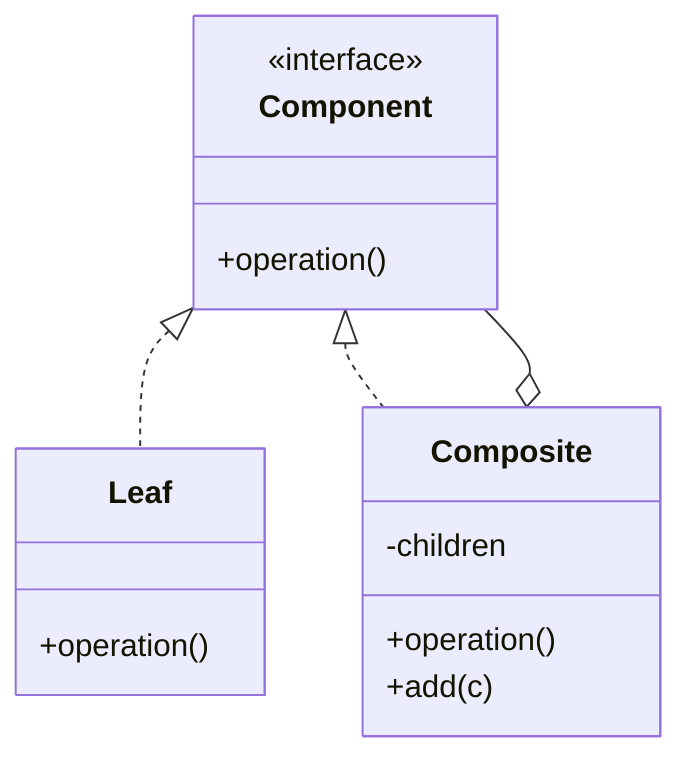

# Composite

**Category:** Structural

## El problema

Algunas cosas tienen forma de árbol de manera natural: un sistema de archivos, un organigrama,
un conjunto de reglas de negocio que combinan otras reglas. Un código que tiene que tratar un
elemento hoja único y un grupo entero de elementos de forma distinta — comprobando `if
(isGroup) { ... } else { ... }` en todas partes — desarrolla un caso especial en cada nivel de
anidamiento, y agregar un nivel más de agrupación significa tocar cada lugar que hacía esa
comprobación.

## La solución

Darle a las hojas y a los grupos la misma interfaz. Un grupo la implementa delegando a cada uno
de sus hijos y combinando sus resultados; una hoja la implementa directamente. Los llamadores
trabajan con la interfaz y nunca necesitan saber o comprobar si están sosteniendo un elemento
único o un subárbol entero — un grupo puede contener otro grupo, a cualquier profundidad, sin
código extra en ningún lado.



## Ejemplo clásico

[`classic/FileSystemComponent`](src/main/java/com/designpatterns/structural/composite/classic/FileSystemComponent.java)
es el ejemplo canónico: [`FileLeaf`](src/main/java/com/designpatterns/structural/composite/classic/FileLeaf.java)
reporta su propio tamaño, y [`Directory`](src/main/java/com/designpatterns/structural/composite/classic/Directory.java)
reporta la suma de los tamaños de sus hijos — recursivamente, de modo que un directorio que
contiene directorios que contienen archivos simplemente funciona, con exactamente la misma
implementación de una línea de `sizeBytes()` sin importar cuán profundo sea realmente el árbol.
[`DirectoryTest`](src/test/java/com/designpatterns/structural/composite/classic/DirectoryTest.java)
cubre una hoja única, un directorio plano, y un árbol anidado en tres niveles.

## Ejemplo aplicado: motor de reglas de aprobación de crédito componible

[`applied/ApprovalRule`](src/main/java/com/designpatterns/structural/composite/applied/ApprovalRule.java)
está implementada por reglas hoja — [`MinimumIncomeRule`](src/main/java/com/designpatterns/structural/composite/applied/MinimumIncomeRule.java),
[`MaximumLoanToIncomeRatioRule`](src/main/java/com/designpatterns/structural/composite/applied/MaximumLoanToIncomeRatioRule.java),
[`NoActiveDefaultsRule`](src/main/java/com/designpatterns/structural/composite/applied/NoActiveDefaultsRule.java)
— y por dos grupos de reglas compuestos, [`AllOfRuleGroup`](src/main/java/com/designpatterns/structural/composite/applied/AllOfRuleGroup.java)
y [`AnyOfRuleGroup`](src/main/java/com/designpatterns/structural/composite/applied/AnyOfRuleGroup.java),
cualquiera de los cuales puede contener reglas hoja *u otros grupos de reglas*. Eso es lo que
permite que una política de aprobación real exprese algo como "ingreso mínimo Y (razón
préstamo-ingreso OK O sin incumplimientos activos)" como un único árbol compuesto de objetos
`ApprovalRule`, evaluado con una sola llamada a `isSatisfied()`, en vez de una expresión
booleana escrita a mano que hay que rederivar cada vez que cambia la política.
[`ApprovalRuleTest`](src/test/java/com/designpatterns/structural/composite/applied/ApprovalRuleTest.java)
cubre un grupo de reglas plano aprobando y rechazando solicitudes, un grupo de reglas anidado
dentro de otro grupo de reglas, y que ambos tipos de grupo construyen una `description()`
legible a partir de las descripciones de sus propios hijos.

## Cuándo no usarlo

- Si el "árbol" solo tiene un nivel (una lista plana, nunca grupos anidados), Composite es
  maquinaria innecesaria — una `List<Rule>` simple y un bucle hacen el mismo trabajo con menos
  indirección.
- Composite facilita agregar un componente nuevo que satisface la interfaz pero en realidad no
  se comporta como una parte bien formada del árbol (una hoja que intenta tener hijos, por
  ejemplo). Mantenga el contrato de la interfaz lo bastante simple para que cada implementador
  pueda cumplirlo de manera significativa.
- Si las hojas y los grupos realmente necesitan operaciones muy distintas (no solo "la misma
  operación, calculada de forma diferente"), forzarlos a una única interfaz crea métodos que no
  tienen sentido para un lado o el otro — no fuerce la forma si el dominio en realidad no la
  tiene.

## Cobertura de pruebas

100% de cobertura de instrucciones, 100% de cobertura de ramas (JaCoCo). Reprodúzcalo usted
mismo:

```bash
./gradlew :structural:composite:jacocoTestReport
```

Informe en `structural/composite/build/reports/jacoco/test/html/index.html`.

## Lecturas adicionales

- Gamma, E., Helm, R., Johnson, R., & Vlissides, J. (1994). *Design Patterns: Elements of
  Reusable Object-Oriented Software*. Addison-Wesley. — el Capítulo 4 formaliza Composite; el
  propio ejemplo del libro es exactamente el ejemplo clásico de este repositorio, un editor de
  gráficos/documentos que trata un grupo de figuras y una figura única de manera uniforme.
- Liskov, B., & Wing, J. (1994). "A Behavioral Notion of Subtyping." *ACM Transactions on
  Programming Languages and Systems*, 16(6), 1811–1841. — el mismo principio de
  sustituibilidad citado en los módulos [Strategy](../../behavioral/strategy) y
  [Factory Method](../../creational/factorymethod) de este repositorio es lo que hace que
  Composite funcione: un llamador que sostiene una `ApprovalRule` debe comportarse
  correctamente sin importar si en realidad sostiene una regla hoja o un árbol de reglas
  anidado completo.
