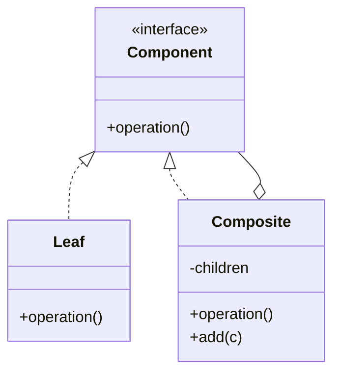

# Composite

**Category:** Structural

## The problem

Some things are naturally tree-shaped: a file system, an org chart, a set of business rules
that combine other rules. Code that has to treat a single leaf item and a whole group of items
differently — checking `if (isGroup) { ... } else { ... }` everywhere — grows a special case at
every level of nesting, and adding one more level of grouping means touching every place that
made that check.

## The solution

Give leaves and groups the same interface. A group implements it by delegating to each of its
children and combining their results; a leaf implements it directly. Callers work with the
interface and never need to know or check whether they're holding a single item or an entire
subtree — a group can contain another group, to any depth, with no extra code anywhere.



## Classic example

[`classic/FileSystemComponent`](src/main/java/com/designpatterns/structural/composite/classic/FileSystemComponent.java)
is the canonical example: [`FileLeaf`](src/main/java/com/designpatterns/structural/composite/classic/FileLeaf.java)
reports its own size, and [`Directory`](src/main/java/com/designpatterns/structural/composite/classic/Directory.java)
reports the sum of its children's sizes — recursively, so a directory containing directories
containing files still just works, with the exact same one-line `sizeBytes()` implementation
regardless of how deep the tree actually is.
[`DirectoryTest`](src/test/java/com/designpatterns/structural/composite/classic/DirectoryTest.java)
covers a single leaf, a flat directory, and a tree nested three levels deep.

## Applied example: composable credit approval rule engine

[`applied/ApprovalRule`](src/main/java/com/designpatterns/structural/composite/applied/ApprovalRule.java)
is implemented by leaf rules — [`MinimumIncomeRule`](src/main/java/com/designpatterns/structural/composite/applied/MinimumIncomeRule.java),
[`MaximumLoanToIncomeRatioRule`](src/main/java/com/designpatterns/structural/composite/applied/MaximumLoanToIncomeRatioRule.java),
[`NoActiveDefaultsRule`](src/main/java/com/designpatterns/structural/composite/applied/NoActiveDefaultsRule.java)
— and by two composite rule groups, [`AllOfRuleGroup`](src/main/java/com/designpatterns/structural/composite/applied/AllOfRuleGroup.java)
and [`AnyOfRuleGroup`](src/main/java/com/designpatterns/structural/composite/applied/AnyOfRuleGroup.java),
either of which can contain leaf rules *or other rule groups*. That's what lets a real approval
policy express something like "minimum income AND (loan-to-income ratio OK OR no active
defaults)" as one composed tree of `ApprovalRule` objects, evaluated with a single
`isSatisfied()` call, instead of a hand-written boolean expression that has to be re-derived
every time the policy changes.
[`ApprovalRuleTest`](src/test/java/com/designpatterns/structural/composite/applied/ApprovalRuleTest.java)
covers a flat rule group approving and rejecting applications, a rule group nested inside
another rule group, and that both group types build a readable `description()` out of their
children's own descriptions.

## When not to use it

- If the "tree" only ever has one level (a flat list, never nested groups), Composite is
  unnecessary machinery — a plain `List<Rule>` and a loop does the same job with less
  indirection.
- Composite makes it easy to add a new component that satisfies the interface but doesn't
  really behave like a well-formed part of the tree (a leaf that tries to have children, say).
  Keep the interface's contract simple enough that every implementer can honor it meaningfully.
- If leaves and groups genuinely need very different operations (not just "the same operation,
  computed differently"), forcing them into one interface creates methods that don't make sense
  for one side or the other — don't force the shape if the domain doesn't actually have it.

## Test coverage

100% instruction coverage, 100% branch coverage (JaCoCo). Reproduce it yourself:

```bash
./gradlew :structural:composite:jacocoTestReport
```

Report at `structural/composite/build/reports/jacoco/test/html/index.html`.

## Further reading

- Gamma, E., Helm, R., Johnson, R., & Vlissides, J. (1994). *Design Patterns: Elements of
  Reusable Object-Oriented Software*. Addison-Wesley. — Chapter 4 formalizes Composite; the
  book's own example is exactly this repo's classic one, a graphics/document editor treating a
  group of shapes and a single shape uniformly.
- Liskov, B., & Wing, J. (1994). "A Behavioral Notion of Subtyping." *ACM Transactions on
  Programming Languages and Systems*, 16(6), 1811–1841. — the same substitutability principle
  cited in this repo's [Strategy](../../behavioral/strategy) and [Factory Method](../../creational/factorymethod)
  modules is what makes Composite work at all: a caller holding an `ApprovalRule` must behave
  correctly whether it's actually holding a leaf rule or an entire nested rule tree.
