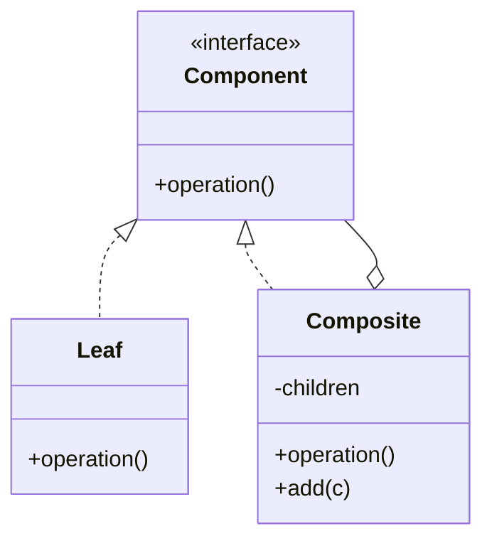

# Composite

**Category:** Structural

## O problema

Algumas coisas têm forma de árvore naturalmente: um sistema de arquivos, um organograma, um
conjunto de regras de negócio que combinam outras regras. Código que precisa tratar um item
folha único e um grupo inteiro de itens de forma diferente — checando `if (isGroup) { ... }
else { ... }` em todo lugar — cresce um caso especial em cada nível de aninhamento, e
adicionar mais um nível de agrupamento significa tocar em todo lugar que fazia essa checagem.

## A solução

Dar a folhas e grupos a mesma interface. Um grupo a implementa delegando pra cada um de seus
filhos e combinando os resultados; uma folha a implementa diretamente. Chamadores trabalham com
a interface e nunca precisam saber ou checar se estão segurando um item único ou uma subárvore
inteira — um grupo pode conter outro grupo, até qualquer profundidade, sem código extra em
lugar nenhum.



## Exemplo clássico

[`classic/FileSystemComponent`](src/main/java/com/designpatterns/structural/composite/classic/FileSystemComponent.java)
é o exemplo canônico: [`FileLeaf`](src/main/java/com/designpatterns/structural/composite/classic/FileLeaf.java)
reporta seu próprio tamanho, e [`Directory`](src/main/java/com/designpatterns/structural/composite/classic/Directory.java)
reporta a soma dos tamanhos dos seus filhos — recursivamente, de modo que um diretório contendo
diretórios contendo arquivos simplesmente funciona, com exatamente a mesma implementação de uma
linha de `sizeBytes()` independente de quão fundo a árvore realmente é.
[`DirectoryTest`](src/test/java/com/designpatterns/structural/composite/classic/DirectoryTest.java)
cobre uma folha única, um diretório plano, e uma árvore aninhada em três níveis.

## Exemplo aplicado: motor de regras de aprovação de crédito componível

[`applied/ApprovalRule`](src/main/java/com/designpatterns/structural/composite/applied/ApprovalRule.java)
é implementada por regras folha — [`MinimumIncomeRule`](src/main/java/com/designpatterns/structural/composite/applied/MinimumIncomeRule.java),
[`MaximumLoanToIncomeRatioRule`](src/main/java/com/designpatterns/structural/composite/applied/MaximumLoanToIncomeRatioRule.java),
[`NoActiveDefaultsRule`](src/main/java/com/designpatterns/structural/composite/applied/NoActiveDefaultsRule.java)
— e por dois grupos de regras compostos, [`AllOfRuleGroup`](src/main/java/com/designpatterns/structural/composite/applied/AllOfRuleGroup.java)
e [`AnyOfRuleGroup`](src/main/java/com/designpatterns/structural/composite/applied/AnyOfRuleGroup.java),
qualquer um dos quais pode conter regras folha *ou outros grupos de regras*. É isso que
permite que uma política de aprovação real expresse algo como "renda mínima E (razão
empréstimo-renda OK OU nenhum default ativo)" como uma única árvore composta de objetos
`ApprovalRule`, avaliada com uma única chamada `isSatisfied()`, em vez de uma expressão
booleana escrita à mão que precisa ser re-derivada toda vez que a política muda.
[`ApprovalRuleTest`](src/test/java/com/designpatterns/structural/composite/applied/ApprovalRuleTest.java)
cobre um grupo de regras plano aprovando e rejeitando aplicações, um grupo de regras aninhado
dentro de outro grupo de regras, e que os dois tipos de grupo constroem uma `description()`
legível a partir das descrições dos próprios filhos.

## Quando não usar

- Se a "árvore" só tem um nível (uma lista plana, nunca grupos aninhados), Composite é
  maquinaria desnecessária — uma `List<Rule>` simples e um loop fazem o mesmo trabalho com
  menos indireção.
- Composite facilita adicionar um componente novo que satisfaz a interface mas não se comporta
  realmente como uma parte bem-formada da árvore (uma folha que tenta ter filhos, digamos).
  Mantenha o contrato da interface simples o suficiente pra que todo implementador consiga
  honrá-lo de forma significativa.
- Se folhas e grupos genuinamente precisam de operações muito diferentes (não só "a mesma
  operação, computada de forma diferente"), forçá-los numa única interface cria métodos que não
  fazem sentido pra um lado ou pro outro — não force a forma se o domínio não a tem de fato.

## Cobertura de testes

100% de cobertura de instrução, 100% de cobertura de branch (JaCoCo). Reproduza você mesmo:

```bash
./gradlew :structural:composite:jacocoTestReport
```

Relatório em `structural/composite/build/reports/jacoco/test/html/index.html`.

## Leitura complementar

- Gamma, E., Helm, R., Johnson, R., & Vlissides, J. (1994). *Design Patterns: Elements of
  Reusable Object-Oriented Software*. Addison-Wesley. — o Capítulo 4 formaliza o Composite; o
  próprio exemplo do livro é exatamente o exemplo clássico deste repositório, um editor de
  gráficos/documentos tratando um grupo de formas e uma forma única de maneira uniforme.
- Liskov, B., & Wing, J. (1994). "A Behavioral Notion of Subtyping." *ACM Transactions on
  Programming Languages and Systems*, 16(6), 1811–1841. — o mesmo princípio de
  substituibilidade citado nos módulos [Strategy](../../behavioral/strategy) e
  [Factory Method](../../creational/factorymethod) deste repositório é o que faz o Composite
  funcionar: um chamador segurando uma `ApprovalRule` precisa se comportar corretamente
  independente de estar segurando de fato uma regra folha ou uma árvore de regras inteira
  aninhada.
