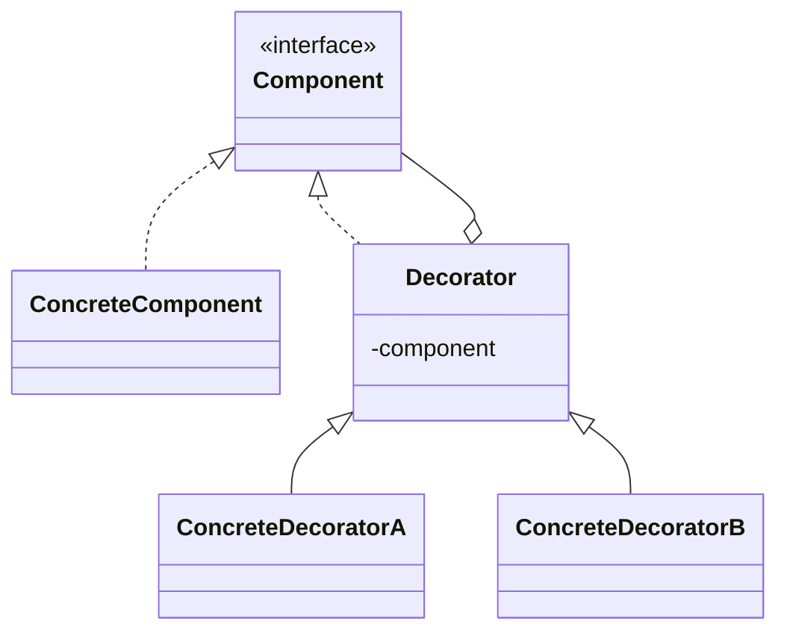

# Decorator

**Category:** Structural

## El problema

Un objeto necesita responsabilidades extra agregadas, pero no toda instancia necesita la misma
combinación de extras, y la herencia no puede expresar eso con limpieza. Modelar cada
combinación como una subclase (`EspressoWithMilk`, `EspressoWithMilkAndSugar`,
`EspressoWithSugarAndSugar`, ...) explota combinatoriamente, y queda fijo en tiempo de
compilación — una subclase no se puede agregar ni quitar de un objeto una vez construido. Lo que
se necesita es una forma de envolver un objeto en capas de comportamiento, elegidas y apiladas
en tiempo de ejecución.

## La solución

Darle al envoltorio la misma interfaz de lo que envuelve, para que pueda sustituirlo en
cualquier lugar, y hacer que delegue al objeto envuelto además de agregar su propio
comportamiento antes o después. Apile envoltorios para combinar responsabilidades; cada uno
solo conoce la interfaz, nunca la clase concreta debajo.



## Ejemplo clásico

[`classic/Beverage`](src/main/java/com/designpatterns/structural/decorator/classic/Beverage.java)
es el ejemplo canónico de la cafetería: un [`Espresso`](src/main/java/com/designpatterns/structural/decorator/classic/Espresso.java)
envuelto en [`Milk`](src/main/java/com/designpatterns/structural/decorator/classic/Milk.java)
y/o [`Sugar`](src/main/java/com/designpatterns/structural/decorator/classic/Sugar.java), cada
uno agregando su propio texto a `description()` y sus propios centavos a `costCents()` encima
de lo que envuelve. `new Sugar(new Milk(new Espresso()))` sigue siendo un `Beverage` — nada
distingue una bebida decorada de una simple a nivel de tipo, que es exactamente el punto.
[`BeverageDecoratorTest`](src/test/java/com/designpatterns/structural/decorator/classic/BeverageDecoratorTest.java)
cubre una bebida sin decorar, una pila de dos condimentos distintos, y el mismo condimento
aplicado dos veces (probando que los decoradores se componen, no solo alternan una bandera).

## Ejemplo aplicado: pipeline de enriquecimiento de transacciones

[`applied/CoreTransactionProcessor`](src/main/java/com/designpatterns/structural/decorator/applied/CoreTransactionProcessor.java)
está envuelto por [`FraudCheckDecorator`](src/main/java/com/designpatterns/structural/decorator/applied/FraudCheckDecorator.java),
[`LgpdAuditDecorator`](src/main/java/com/designpatterns/structural/decorator/applied/LgpdAuditDecorator.java)
(la ley brasileña de protección de datos) y [`RateLimitDecorator`](src/main/java/com/designpatterns/structural/decorator/applied/RateLimitDecorator.java)
— cada uno una preocupación que un pipeline de pagos real necesita, y cada uno se puede agregar
o quitar sin tocar el procesador central ni los demás. `RateLimitDecorator` también muestra que
un decorador no tiene que solo agregar comportamiento *después* de delegar: una vez que un
pagador supera la cuota, devuelve su propio resultado y nunca llama al resto de la cadena — el
mismo corte que un limitador de tasa real necesita.
[`TransactionProcessorDecoratorTest`](src/test/java/com/designpatterns/structural/decorator/applied/TransactionProcessorDecoratorTest.java)
cubre la pila completa aprobando una transacción normal (verificando que el rastro de auditoría
esté en el orden exacto de envoltura), la verificación de fraude marcando una grande, y el
limitador de tasa tanto dejando pasar transacciones como cortando al superar la cuota.

## Cuándo no usarlo

- Si solo existe una combinación fija de comportamiento extra, un decorador es indirección sin
  beneficio — basta con poner el comportamiento en la clase.
- Una cadena larga de decoradores puede dificultar la depuración: un stack trace pasa por cada
  capa, y "qué hace realmente este objeto" exige leer toda la cadena, no solo una clase.
  Mantenga las cadenas cortas y el trabajo de cada decorador acotado.
- Si el "comportamiento extra" necesita cambiar lo que el objeto *es*, no solo agregar a lo que
  *hace* (cambiando su identidad o tipo), un decorador es la herramienta equivocada — eso es
  trabajo de otro patrón (Strategy, State) o simplemente un diseño distinto.

## Cobertura de pruebas

100% de cobertura de instrucciones, 100% de cobertura de ramas (JaCoCo). Reprodúzcalo usted
mismo:

```bash
./gradlew :structural:decorator:jacocoTestReport
```

Informe en `structural/decorator/build/reports/jacoco/test/html/index.html`.

## Lecturas adicionales

- Gamma, E., Helm, R., Johnson, R., & Vlissides, J. (1994). *Design Patterns: Elements of
  Reusable Object-Oriented Software*. Addison-Wesley. — el Capítulo 4 formaliza Decorator.
- Bloch, J. (2018). *Effective Java* (3.ª ed.), Item 18: "Favor composition over inheritance."
  Addison-Wesley. — el principio general del que Decorator es una aplicación estructurada: la
  explosión de subclases del ejemplo del café es exactamente el modo de falla contra el que
  advierte este ítem.
