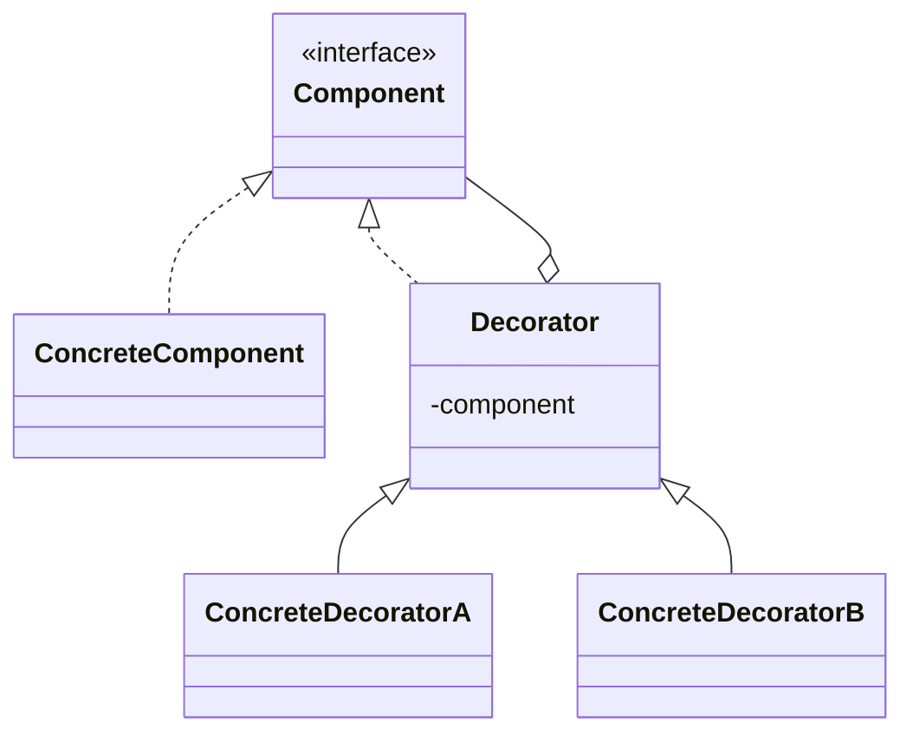

# Decorator

**Category:** Structural

## The problem

An object needs extra responsibilities added to it, but not every instance needs the same
combination of extras, and inheritance can't express that cleanly. Modeling every combination
as a subclass (`EspressoWithMilk`, `EspressoWithMilkAndSugar`, `EspressoWithSugarAndSugar`, ...)
explodes combinatorially, and it's fixed at compile time — a subclass can't be added or removed
from an object once it's built. What's needed is a way to wrap an object in layers of behavior,
chosen and stacked at runtime.

## The solution

Give the wrapper the same interface as the thing it wraps, so it can stand in for it anywhere,
and have it delegate to the wrapped object plus add its own behavior before or after. Stack
wrappers to combine responsibilities; each one only knows about the interface, never the
concrete class underneath.



## Classic example

[`classic/Beverage`](src/main/java/com/designpatterns/structural/decorator/classic/Beverage.java)
is the canonical coffee-shop example: an [`Espresso`](src/main/java/com/designpatterns/structural/decorator/classic/Espresso.java)
wrapped in [`Milk`](src/main/java/com/designpatterns/structural/decorator/classic/Milk.java)
and/or [`Sugar`](src/main/java/com/designpatterns/structural/decorator/classic/Sugar.java), each
adding its own text to `description()` and its own cents to `costCents()` on top of whatever it
wraps. `new Sugar(new Milk(new Espresso()))` is still a `Beverage` — nothing distinguishes a
decorated beverage from a plain one at the type level, which is exactly the point.
[`BeverageDecoratorTest`](src/test/java/com/designpatterns/structural/decorator/classic/BeverageDecoratorTest.java)
covers an undecorated beverage, a stack of two different condiments, and the same condiment
applied twice (proving decorators compose, not just toggle a flag).

## Applied example: transaction enrichment pipeline

[`applied/CoreTransactionProcessor`](src/main/java/com/designpatterns/structural/decorator/applied/CoreTransactionProcessor.java)
is wrapped by [`FraudCheckDecorator`](src/main/java/com/designpatterns/structural/decorator/applied/FraudCheckDecorator.java),
[`LgpdAuditDecorator`](src/main/java/com/designpatterns/structural/decorator/applied/LgpdAuditDecorator.java)
(Brazil's data-protection law), and [`RateLimitDecorator`](src/main/java/com/designpatterns/structural/decorator/applied/RateLimitDecorator.java)
— each one a concern a real payments pipeline needs, and each one addable or removable without
touching the core processor or the others. `RateLimitDecorator` also shows a decorator doesn't
have to just add behavior *after* delegating: once a payer is over quota it returns its own
result and never calls the rest of the chain at all, the same short-circuiting a real rate
limiter needs.
[`TransactionProcessorDecoratorTest`](src/test/java/com/designpatterns/structural/decorator/applied/TransactionProcessorDecoratorTest.java)
covers the full stack approving a normal transaction (checking the audit trail is in the exact
wrapping order), the fraud check flagging a large one, and the rate limiter both passing
transactions through and short-circuiting once the quota is exceeded.

## When not to use it

- If there's only ever one fixed combination of extra behavior, a decorator is indirection for
  no benefit — just put the behavior in the class.
- A long decorator chain can make debugging harder: a stack trace runs through every layer, and
  "what does this object actually do" requires reading the whole chain, not just one class. Keep
  chains short and each decorator's job narrow.
- If the "extra behavior" needs to change what the object *is*, not just add to what it *does*
  (changing its identity or type), a decorator is the wrong tool — that's a different pattern's
  job (Strategy, State) or just a different design.

## Test coverage

100% instruction coverage, 100% branch coverage (JaCoCo). Reproduce it yourself:

```bash
./gradlew :structural:decorator:jacocoTestReport
```

Report at `structural/decorator/build/reports/jacoco/test/html/index.html`.

## Further reading

- Gamma, E., Helm, R., Johnson, R., & Vlissides, J. (1994). *Design Patterns: Elements of
  Reusable Object-Oriented Software*. Addison-Wesley. — Chapter 4 formalizes Decorator.
- Bloch, J. (2018). *Effective Java* (3rd ed.), Item 18: "Favor composition over inheritance."
  Addison-Wesley. — the general principle Decorator is a structured application of: the coffee
  example's subclass explosion is exactly the failure mode this item warns against.
