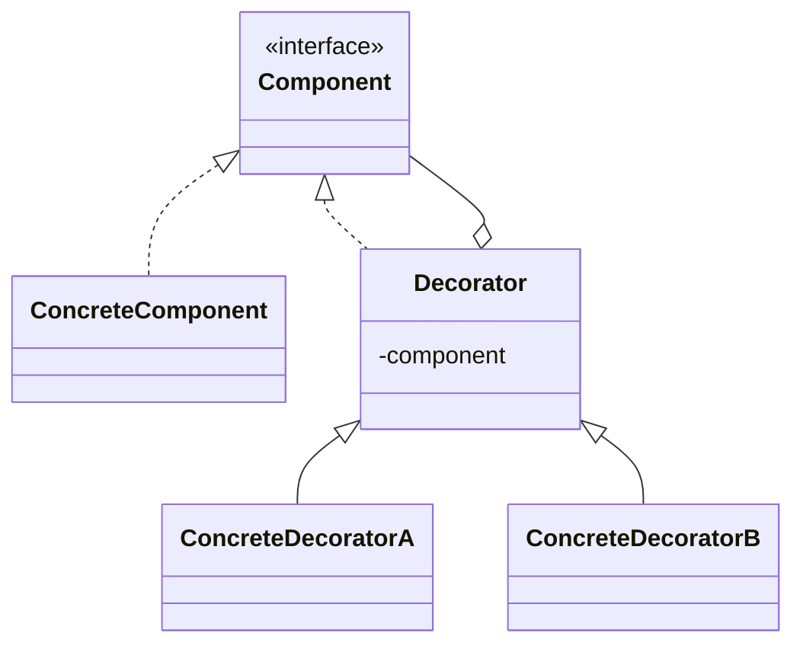

# Decorator

**Category:** Structural

## O problema

Um objeto precisa de responsabilidades extras adicionadas a ele, mas nem toda instância precisa
da mesma combinação de extras, e herança não consegue expressar isso com limpeza. Modelar cada
combinação como uma subclasse (`EspressoWithMilk`, `EspressoWithMilkAndSugar`,
`EspressoWithSugarAndSugar`, ...) explode combinatoriamente, e fica fixo em tempo de compilação
— uma subclasse não pode ser adicionada ou removida de um objeto depois de construído. O que se
precisa é de uma forma de envolver um objeto em camadas de comportamento, escolhidas e
empilhadas em tempo de execução.

## A solução

Dar ao wrapper a mesma interface da coisa que ele envolve, pra que possa substituí-la em
qualquer lugar, e fazê-lo delegar ao objeto envolvido além de adicionar seu próprio
comportamento antes ou depois. Empilhe wrappers pra combinar responsabilidades; cada um só
conhece a interface, nunca a classe concreta por baixo.



## Exemplo clássico

[`classic/Beverage`](src/main/java/com/designpatterns/structural/decorator/classic/Beverage.java)
é o exemplo canônico da cafeteria: um [`Espresso`](src/main/java/com/designpatterns/structural/decorator/classic/Espresso.java)
envolto em [`Milk`](src/main/java/com/designpatterns/structural/decorator/classic/Milk.java)
e/ou [`Sugar`](src/main/java/com/designpatterns/structural/decorator/classic/Sugar.java), cada
um adicionando seu próprio texto a `description()` e seus próprios centavos a `costCents()` em
cima do que envolve. `new Sugar(new Milk(new Espresso()))` continua sendo um `Beverage` — nada
distingue uma bebida decorada de uma simples no nível do tipo, que é exatamente o objetivo.
[`BeverageDecoratorTest`](src/test/java/com/designpatterns/structural/decorator/classic/BeverageDecoratorTest.java)
cobre uma bebida sem decoração, uma pilha de dois condimentos diferentes, e o mesmo condimento
aplicado duas vezes (provando que decoradores compõem, não só alternam uma flag).

## Exemplo aplicado: pipeline de enriquecimento de transação

[`applied/CoreTransactionProcessor`](src/main/java/com/designpatterns/structural/decorator/applied/CoreTransactionProcessor.java)
é envolvido por [`FraudCheckDecorator`](src/main/java/com/designpatterns/structural/decorator/applied/FraudCheckDecorator.java),
[`LgpdAuditDecorator`](src/main/java/com/designpatterns/structural/decorator/applied/LgpdAuditDecorator.java)
(a lei brasileira de proteção de dados) e [`RateLimitDecorator`](src/main/java/com/designpatterns/structural/decorator/applied/RateLimitDecorator.java)
— cada um uma preocupação que um pipeline de pagamentos real precisa, e cada um adicionável ou
removível sem tocar no processador central nem nos outros. `RateLimitDecorator` também mostra
que um decorador não precisa só adicionar comportamento *depois* de delegar: uma vez que um
pagador ultrapassa a cota, ele retorna seu próprio resultado e nunca chama o resto da cadeia —
o mesmo short-circuit que um limitador de taxa real precisa.
[`TransactionProcessorDecoratorTest`](src/test/java/com/designpatterns/structural/decorator/applied/TransactionProcessorDecoratorTest.java)
cobre a pilha completa aprovando uma transação normal (verificando que a trilha de auditoria
está na ordem exata de envolvimento), a checagem de fraude sinalizando uma grande, e o limitador
de taxa tanto deixando transações passarem quanto fazendo o short-circuit ao ultrapassar a cota.

## Quando não usar

- Se só existe uma combinação fixa de comportamento extra, um decorador é indireção sem
  benefício — basta colocar o comportamento na classe.
- Uma cadeia longa de decoradores pode dificultar a depuração: um stack trace passa por cada
  camada, e "o que esse objeto realmente faz" exige ler a cadeia inteira, não só uma classe.
  Mantenha as cadeias curtas e o trabalho de cada decorador estreito.
- Se o "comportamento extra" precisa mudar o que o objeto *é*, não só adicionar ao que ele
  *faz* (mudando sua identidade ou tipo), um decorador é a ferramenta errada — isso é trabalho
  de outro padrão (Strategy, State) ou só um design diferente.

## Cobertura de testes

100% de cobertura de instrução, 100% de cobertura de branch (JaCoCo). Reproduza você mesmo:

```bash
./gradlew :structural:decorator:jacocoTestReport
```

Relatório em `structural/decorator/build/reports/jacoco/test/html/index.html`.

## Leitura complementar

- Gamma, E., Helm, R., Johnson, R., & Vlissides, J. (1994). *Design Patterns: Elements of
  Reusable Object-Oriented Software*. Addison-Wesley. — o Capítulo 4 formaliza o Decorator.
- Bloch, J. (2018). *Effective Java* (3ª ed.), Item 18: "Favor composition over inheritance."
  Addison-Wesley. — o princípio geral do qual o Decorator é uma aplicação estruturada: a
  explosão de subclasses do exemplo do café é exatamente o modo de falha contra o qual este
  item alerta.
