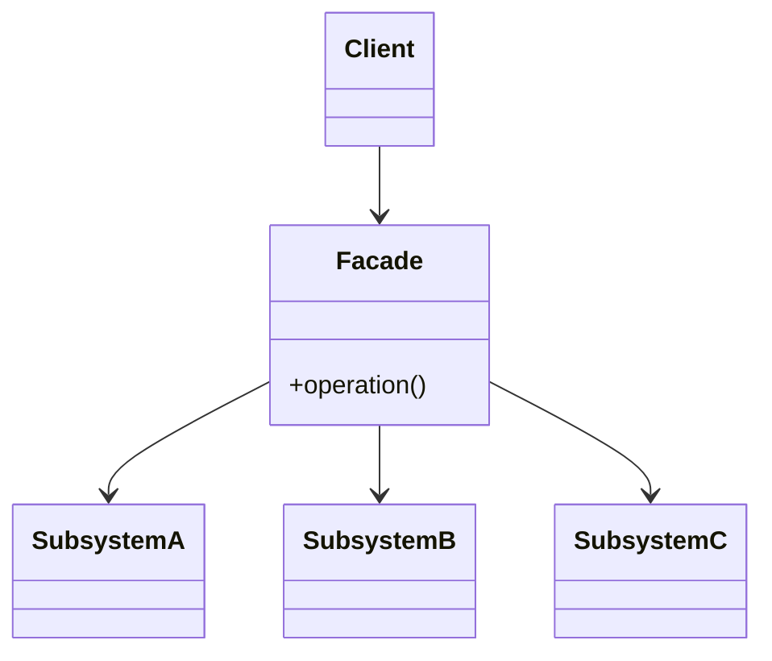

# Facade

**Category:** Structural

## El problema

Lograr que algo se haga requiere coordinar varios subsistemas en un orden específico — llamar
a este servicio, luego a aquel, avanzar solo si cada paso tiene éxito. Cada llamador que
necesita ese resultado o duplica esa lógica de orquestación, o tiene que aprender los internos
de cada subsistema solo para usarlos correctamente. Los propios subsistemas están bien por sí
solos; lo que falta es una puerta de entrada más simple para el caso común.

## La solución

Agregar una clase que sepa cómo coordinar los subsistemas correctamente, y darle eso a los
llamadores en vez de los propios subsistemas. Los subsistemas no cambian y siguen siendo
utilizables directamente para llamadores con necesidades más específicas — la fachada es un
punto de entrada más simple adicional, no un reemplazo.



## Ejemplo clásico

[`classic/HomeTheaterFacade`](src/main/java/com/designpatterns/structural/facade/classic/HomeTheaterFacade.java)
es el ejemplo canónico: `watchMovie()` enciende el [`Projector`](src/main/java/com/designpatterns/structural/facade/classic/Projector.java),
lo pone en modo panorámico, enciende el [`Amplifier`](src/main/java/com/designpatterns/structural/facade/classic/Amplifier.java)
y ajusta su volumen, luego enciende el [`DvdPlayer`](src/main/java/com/designpatterns/structural/facade/classic/DvdPlayer.java)
e inicia la película — seis llamadas a través de tres subsistemas, en el único orden que
realmente funciona, detrás de un solo método.
[`HomeTheaterFacadeTest`](src/test/java/com/designpatterns/structural/facade/classic/HomeTheaterFacadeTest.java)
verifica la secuencia exacta.

## Ejemplo aplicado: orquestación de portabilidad salarial

[`applied/SalaryPortabilityFacade`](src/main/java/com/designpatterns/structural/facade/applied/SalaryPortabilityFacade.java)
coordina [`AccountVerificationService`](src/main/java/com/designpatterns/structural/facade/applied/AccountVerificationService.java)
(esta cuenta es siquiera elegible), [`BacenLookupService`](src/main/java/com/designpatterns/structural/facade/applied/BacenLookupService.java)
(dónde se paga actualmente el salario de este pagador, según el registro del banco central), y
[`NotificationService`](src/main/java/com/designpatterns/structural/facade/applied/NotificationService.java)
(avisar al titular de la cuenta que está programado) — cortando en el momento en que cualquier
paso falla, de modo que una cuenta no elegible nunca dispara una consulta a BACEN, y un pagador
sin banco de nómina registrado nunca dispara una notificación. Ninguno de los tres servicios de
subsistema sabe que existen los otros dos; solo la fachada lo sabe.
[`SalaryPortabilityFacadeTest`](src/test/java/com/designpatterns/structural/facade/applied/SalaryPortabilityFacadeTest.java)
cubre el camino feliz completo y ambos casos de corte.

## Cuándo no usarlo

- Si los llamadores realmente necesitan control fino sobre los subsistemas (órdenes distintos,
  saltar pasos, parámetros distintos por llamada), una fachada que solo expone una operación
  gruesa estorba — exponga los subsistemas directamente para esos llamadores en su lugar.
- Una fachada que crece suficientes opciones y parámetros para cubrir la necesidad de cada
  llamador deja de ser una simplificación y se convierte en otro subsistema que aprender — si
  eso está pasando, la orquestación probablemente pertenece a un servicio de capa de aplicación
  en vez de una única clase "fachada".
- No use una fachada para ocultar un diseño de subsistema genuinamente malo. Eso disimula lo
  incómodo para los llamadores de la fachada, pero quien use los subsistemas directamente
  igual tiene que lidiar con ello.

## Cobertura de pruebas

100% de cobertura de instrucciones, 100% de cobertura de ramas (JaCoCo). Reprodúzcalo usted
mismo:

```bash
./gradlew :structural:facade:jacocoTestReport
```

Informe en `structural/facade/build/reports/jacoco/test/html/index.html`.

## Lecturas adicionales

- Gamma, E., Helm, R., Johnson, R., & Vlissides, J. (1994). *Design Patterns: Elements of
  Reusable Object-Oriented Software*. Addison-Wesley. — el Capítulo 4 formaliza Facade.
- Evans, E. (2003). *Domain-Driven Design: Tackling Complexity in the Heart of Software*.
  Addison-Wesley. — describe los Application Services como la capa que orquesta objetos de
  dominio e infraestructura para cumplir un caso de uso; `SalaryPortabilityFacade` tiene
  exactamente esa forma, solo con el nombre del patrón del GoF en vez del nombre de la capa de
  DDD, ya que este repositorio enseña patrones de a uno en vez de una arquitectura en capas
  completa.
