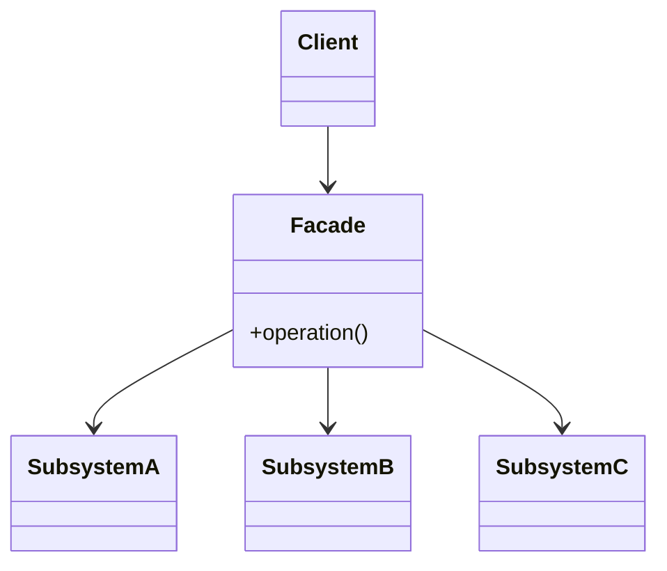

# Facade

**Category:** Structural

## The problem

Getting something done requires coordinating several subsystems in a specific order — call
this service, then that one, only proceed if each step succeeds. Every caller that needs this
outcome either duplicates that orchestration logic, or has to learn the internals of every
subsystem just to use them correctly. The subsystems themselves are fine on their own; what's
missing is a simpler front door for the common case.

## The solution

Add one class that knows how to coordinate the subsystems correctly, and give callers that
instead of the subsystems themselves. The subsystems don't change and stay usable directly for
callers with more specific needs — the facade is an additional simpler entry point, not a
replacement.



## Classic example

[`classic/HomeTheaterFacade`](src/main/java/com/designpatterns/structural/facade/classic/HomeTheaterFacade.java)
is the canonical example: `watchMovie()` powers on the [`Projector`](src/main/java/com/designpatterns/structural/facade/classic/Projector.java),
sets it to widescreen, powers on the [`Amplifier`](src/main/java/com/designpatterns/structural/facade/classic/Amplifier.java)
and sets its volume, then powers on the [`DvdPlayer`](src/main/java/com/designpatterns/structural/facade/classic/DvdPlayer.java)
and starts the movie — six calls across three subsystems, in the one order that actually works,
behind one method. [`HomeTheaterFacadeTest`](src/test/java/com/designpatterns/structural/facade/classic/HomeTheaterFacadeTest.java)
asserts the exact sequence.

## Applied example: salary portability orchestration

[`applied/SalaryPortabilityFacade`](src/main/java/com/designpatterns/structural/facade/applied/SalaryPortabilityFacade.java)
coordinates [`AccountVerificationService`](src/main/java/com/designpatterns/structural/facade/applied/AccountVerificationService.java)
(is this account even eligible), [`BacenLookupService`](src/main/java/com/designpatterns/structural/facade/applied/BacenLookupService.java)
(where is this payer's salary currently paid, per the central bank's registry), and
[`NotificationService`](src/main/java/com/designpatterns/structural/facade/applied/NotificationService.java)
(tell the account holder it's scheduled) — short-circuiting the moment any step fails, so an
ineligible account never triggers a BACEN lookup, and a payer with no registered payroll bank
never triggers a notification. None of the three subsystem services know the other two exist;
only the facade does. [`SalaryPortabilityFacadeTest`](src/test/java/com/designpatterns/structural/facade/applied/SalaryPortabilityFacadeTest.java)
covers the full happy path and both short-circuit cases.

## When not to use it

- If callers genuinely need fine-grained control over the subsystems (different orders,
  skipping steps, different parameters per call), a facade that only exposes one coarse
  operation gets in the way — expose the subsystems directly for those callers instead.
- A facade that grows enough options and parameters to cover every caller's needs stops being a
  simplification and becomes another subsystem to learn — if that's happening, the orchestration
  probably belongs in an application-layer service instead of a single "facade" class.
- Don't use a facade to hide a genuinely bad subsystem design. It papers over the awkwardness
  for the facade's callers, but anyone using the subsystems directly still has to deal with it.

## Test coverage

100% instruction coverage, 100% branch coverage (JaCoCo). Reproduce it yourself:

```bash
./gradlew :structural:facade:jacocoTestReport
```

Report at `structural/facade/build/reports/jacoco/test/html/index.html`.

## Further reading

- Gamma, E., Helm, R., Johnson, R., & Vlissides, J. (1994). *Design Patterns: Elements of
  Reusable Object-Oriented Software*. Addison-Wesley. — Chapter 4 formalizes Facade.
- Evans, E. (2003). *Domain-Driven Design: Tackling Complexity in the Heart of Software*.
  Addison-Wesley. — describes Application Services as the layer that orchestrates domain
  objects and infrastructure to fulfill one use case; `SalaryPortabilityFacade` is exactly that
  shape, just named after the GoF pattern instead of the DDD layer, since this repo teaches
  patterns one at a time rather than a full layered architecture.
