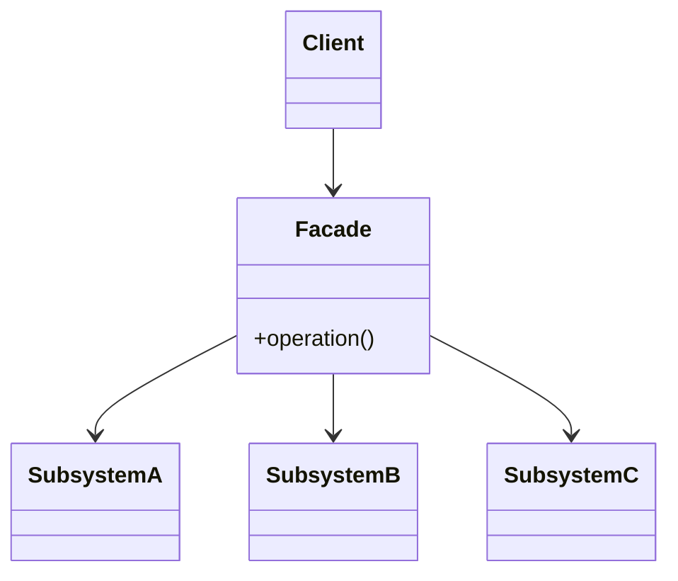

# Facade

**Category:** Structural

## O problema

Fazer algo acontecer exige coordenar vários subsistemas numa ordem específica — chamar esse
serviço, depois aquele, só prosseguir se cada passo tiver sucesso. Todo chamador que precisa
desse resultado ou duplica essa lógica de orquestração, ou tem que aprender os detalhes internos
de todo subsistema só pra usá-los corretamente. Os próprios subsistemas estão bem sozinhos; o
que falta é uma porta de entrada mais simples pro caso comum.

## A solução

Adicionar uma classe que sabe como coordenar os subsistemas corretamente, e dar aos chamadores
ela em vez dos próprios subsistemas. Os subsistemas não mudam e continuam utilizáveis
diretamente por chamadores com necessidades mais específicas — a fachada é um ponto de entrada
mais simples adicional, não uma substituição.



## Exemplo clássico

[`classic/HomeTheaterFacade`](src/main/java/com/designpatterns/structural/facade/classic/HomeTheaterFacade.java)
é o exemplo canônico: `watchMovie()` liga o [`Projector`](src/main/java/com/designpatterns/structural/facade/classic/Projector.java),
coloca em modo widescreen, liga o [`Amplifier`](src/main/java/com/designpatterns/structural/facade/classic/Amplifier.java)
e ajusta seu volume, então liga o [`DvdPlayer`](src/main/java/com/designpatterns/structural/facade/classic/DvdPlayer.java)
e inicia o filme — seis chamadas através de três subsistemas, na única ordem que de fato
funciona, atrás de um único método.
[`HomeTheaterFacadeTest`](src/test/java/com/designpatterns/structural/facade/classic/HomeTheaterFacadeTest.java)
verifica a sequência exata.

## Exemplo aplicado: orquestração de portabilidade de salário

[`applied/SalaryPortabilityFacade`](src/main/java/com/designpatterns/structural/facade/applied/SalaryPortabilityFacade.java)
coordena [`AccountVerificationService`](src/main/java/com/designpatterns/structural/facade/applied/AccountVerificationService.java)
(essa conta é sequer elegível), [`BacenLookupService`](src/main/java/com/designpatterns/structural/facade/applied/BacenLookupService.java)
(onde o salário desse pagador é pago atualmente, segundo o registro do banco central), e
[`NotificationService`](src/main/java/com/designpatterns/structural/facade/applied/NotificationService.java)
(avisar o titular da conta que está agendado) — fazendo short-circuit no momento em que
qualquer passo falha, de modo que uma conta inelegível nunca dispara uma consulta ao BACEN, e
um pagador sem banco de folha registrado nunca dispara uma notificação. Nenhum dos três
serviços de subsistema sabe que os outros dois existem; só a fachada sabe.
[`SalaryPortabilityFacadeTest`](src/test/java/com/designpatterns/structural/facade/applied/SalaryPortabilityFacadeTest.java)
cobre o caminho feliz completo e os dois casos de short-circuit.

## Quando não usar

- Se os chamadores genuinamente precisam de controle fino sobre os subsistemas (ordens
  diferentes, pulando passos, parâmetros diferentes por chamada), uma fachada que só expõe uma
  operação grosseira atrapalha — exponha os subsistemas diretamente pra esses chamadores em vez
  disso.
- Uma fachada que cresce opções e parâmetros suficientes pra cobrir a necessidade de todo
  chamador para de ser uma simplificação e vira mais um subsistema pra aprender — se isso está
  acontecendo, a orquestração provavelmente pertence a um serviço de camada de aplicação em vez
  de uma única classe "fachada".
- Não use uma fachada pra esconder um design de subsistema genuinamente ruim. Isso disfarça a
  estranheza pros chamadores da fachada, mas quem usa os subsistemas diretamente ainda tem que
  lidar com ela.

## Cobertura de testes

100% de cobertura de instrução, 100% de cobertura de branch (JaCoCo). Reproduza você mesmo:

```bash
./gradlew :structural:facade:jacocoTestReport
```

Relatório em `structural/facade/build/reports/jacoco/test/html/index.html`.

## Leitura complementar

- Gamma, E., Helm, R., Johnson, R., & Vlissides, J. (1994). *Design Patterns: Elements of
  Reusable Object-Oriented Software*. Addison-Wesley. — o Capítulo 4 formaliza o Facade.
- Evans, E. (2003). *Domain-Driven Design: Tackling Complexity in the Heart of Software*.
  Addison-Wesley. — descreve Application Services como a camada que orquestra objetos de
  domínio e infraestrutura pra cumprir um caso de uso; `SalaryPortabilityFacade` tem exatamente
  essa forma, só com o nome do padrão do GoF em vez do nome da camada do DDD, já que este
  repositório ensina padrões um de cada vez em vez de uma arquitetura em camadas completa.
