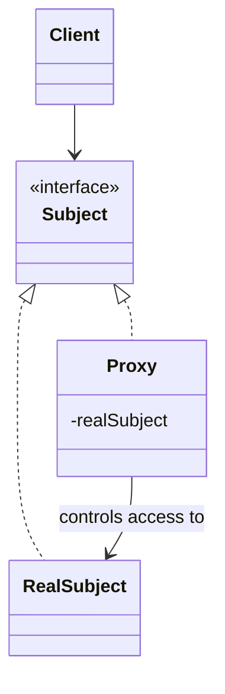

# Proxy

**Category:** Structural

## El problema

Acceder a un objeto directamente a veces es costoso, lento, o necesita una verificación
aplicada cada vez — una llamada de red, la carga de un recurso grande, una comprobación de
permisos. Hacer que cada llamador recuerde aplicar esa lógica por sí mismo (verificar el caché
primero, comprobar permisos, aplazar la carga hasta que realmente se necesite) significa que la
lógica termina duplicada u olvidada en algún punto de llamada eventualmente.

## La solución

Introducir un sustituto que implemente exactamente la misma interfaz que el objeto real, y
poner la lógica extra (caché, carga perezosa, control de acceso) dentro del sustituto en vez de
en cada punto de llamada. Los llamadores mantienen el proxy y lo usan exactamente como lo real
— no pueden notar la diferencia solo por la interfaz.



## Ejemplo clásico

[`classic/ImageProxy`](src/main/java/com/designpatterns/structural/proxy/classic/ImageProxy.java)
implementa la misma interfaz [`Image`](src/main/java/com/designpatterns/structural/proxy/classic/Image.java)
que [`RealImage`](src/main/java/com/designpatterns/structural/proxy/classic/RealImage.java),
pero no construye la imagen real (costosa de cargar) hasta la primera llamada a `display()` —
el proxy virtual canónico, aplazando una carga costosa hasta que realmente se necesita en vez
de en el momento de la construcción.
[`ImageProxyTest`](src/test/java/com/designpatterns/structural/proxy/classic/ImageProxyTest.java)
verifica que la imagen real genuinamente no se carga antes de la primera llamada a `display()`,
y que una segunda llamada reutiliza la misma imagen ya cargada en vez de recargarla.

## Ejemplo aplicado: caché de una consulta costosa a un buró de crédito

[`applied/CachingCreditScoreProxy`](src/main/java/com/designpatterns/structural/proxy/applied/CachingCreditScoreProxy.java)
implementa el mismo contrato [`CreditScoreBureau`](src/main/java/com/designpatterns/structural/proxy/applied/CreditScoreBureau.java)
que [`ExternalCreditScoreBureau`](src/main/java/com/designpatterns/structural/proxy/applied/ExternalCreditScoreBureau.java)
— un sustituto de una llamada real a un buró externo que es lenta y, en producción, se cobra
por solicitud. Un flujo de aprobación de crédito que llama a `lookupScore()` varias veces para
el mismo solicitante (una en la admisión, otra en el underwriting, otra en la aprobación final,
digamos) solo dispara una llamada externa real; cada llamada posterior a la primera se atiende
desde el caché del proxy.
[`CachingCreditScoreProxyTest`](src/test/java/com/designpatterns/structural/proxy/applied/CachingCreditScoreProxyTest.java)
prueba esto directamente contando las llamadas reales al buró subyacente, y confirma que
solicitantes distintos siguen disparando cada uno su propia consulta real.

## Cuándo no usarlo

- Si la operación "costosa" realmente necesita ejecutarse cada vez (los datos subyacentes
  cambian entre llamadas y la desactualización es inaceptable), guardarla en caché detrás de un
  proxy introduce un bug de corrección, no una optimización. Conozca la tolerancia a datos
  desactualizados antes de recurrir a esto.
- Un caché que nunca desaloja nada es una fuga de memoria esperando a ocurrir en cuanto el
  espacio de claves sea ilimitado (vea `RateLimitDecorator` en el módulo [Decorator](../../structural/decorator)
  de este repositorio para el mismo tipo de preocupación con contadores por pagador) — un caché
  real necesita una política de desalojo o expiración, que este ejemplo deliberadamente mínimo
  no incluye.
- Si el objetivo es agregar comportamiento nuevo encima de un objeto en vez de controlar el
  acceso a él, eso es [Decorator](../../structural/decorator), no Proxy — ambos patrones tienen
  diagramas de clases casi idénticos y se distinguen por la intención, no por la estructura.

## Cobertura de pruebas

100% de cobertura de instrucciones, 100% de cobertura de ramas (JaCoCo). Reprodúzcalo usted
mismo:

```bash
./gradlew :structural:proxy:jacocoTestReport
```

Informe en `structural/proxy/build/reports/jacoco/test/html/index.html`.

## Lecturas adicionales

- Gamma, E., Helm, R., Johnson, R., & Vlissides, J. (1994). *Design Patterns: Elements of
  Reusable Object-Oriented Software*. Addison-Wesley. — el Capítulo 4 formaliza Proxy, nombrando
  explícitamente el proxy virtual (creación de objeto costosa, perezosa — `ImageProxy` aquí) y
  el proxy de protección (control de acceso) como dos de sus variantes principales, y contrasta
  Proxy con Decorator por intención, no por estructura.
- Belady, L. A. (1966). "A Study of Replacement Algorithms for a Virtual-Storage Computer."
  *IBM Systems Journal*, 5(2), 78–101. — el artículo fundacional sobre política de reemplazo de
  caché; directamente relevante para la advertencia de "Cuándo no usarlo" arriba, ya que el
  caché de `CachingCreditScoreProxy` deliberadamente no tiene ninguna política de desalojo, que
  es lo primero que necesitaría una versión de producción.
