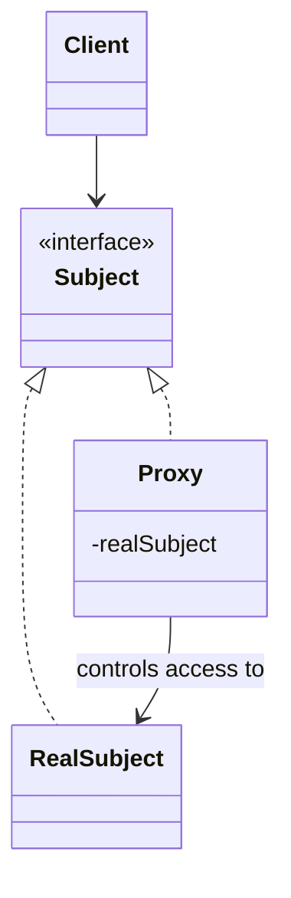

# Proxy

**Category:** Structural

## The problem

Accessing an object directly is sometimes expensive, slow, or needs a check applied every
time — a network call, a large resource load, a permission check. Making every caller
remember to apply that logic themselves (check the cache first, verify permission, delay
loading until actually needed) means the logic gets duplicated or forgotten at some call site
eventually.

## The solution

Introduce a stand-in that implements the exact same interface as the real object, and put the
extra logic (caching, lazy loading, access control) inside the stand-in instead of at every
call site. Callers hold the proxy and use it exactly like the real thing — they can't tell the
difference from the interface alone.



## Classic example

[`classic/ImageProxy`](src/main/java/com/designpatterns/structural/proxy/classic/ImageProxy.java)
implements the same [`Image`](src/main/java/com/designpatterns/structural/proxy/classic/Image.java)
interface as [`RealImage`](src/main/java/com/designpatterns/structural/proxy/classic/RealImage.java),
but doesn't construct the (expensive-to-load) real image until the first `display()` call —
the canonical virtual proxy, delaying a costly load until it's actually needed instead of at
construction time. [`ImageProxyTest`](src/test/java/com/designpatterns/structural/proxy/classic/ImageProxyTest.java)
checks the real image genuinely isn't loaded before the first `display()` call, and that a
second call reuses the same loaded image rather than reloading it.

## Applied example: caching an expensive credit-score bureau lookup

[`applied/CachingCreditScoreProxy`](src/main/java/com/designpatterns/structural/proxy/applied/CachingCreditScoreProxy.java)
implements the same [`CreditScoreBureau`](src/main/java/com/designpatterns/structural/proxy/applied/CreditScoreBureau.java)
contract as [`ExternalCreditScoreBureau`](src/main/java/com/designpatterns/structural/proxy/applied/ExternalCreditScoreBureau.java)
— a stand-in for a real external bureau call that's slow and, in production, billed per
request. A loan-approval flow that calls `lookupScore()` several times for the same applicant
(once at intake, again at underwriting, again at final approval, say) only triggers one real
external call; every call after the first is served from the proxy's cache.
[`CachingCreditScoreProxyTest`](src/test/java/com/designpatterns/structural/proxy/applied/CachingCreditScoreProxyTest.java)
proves this directly by counting real calls on the underlying bureau, and confirms different
applicants each still trigger their own real lookup.

## When not to use it

- If the "expensive" operation genuinely needs to run every time (the underlying data changes
  between calls and staleness is unacceptable), caching it behind a proxy introduces a
  correctness bug, not an optimization. Know the staleness tolerance before reaching for this.
- A cache that never evicts anything is a memory leak waiting to happen once the key space is
  unbounded (see this repo's [Decorator](../../structural/decorator) module's `RateLimitDecorator`
  for the same shape of concern with per-payer counters) — a real cache needs an eviction or
  expiry policy, which this deliberately minimal example doesn't include.
- If the goal is adding new behavior on top of an object rather than controlling access to it,
  that's [Decorator](../../structural/decorator), not Proxy — the two patterns have nearly
  identical class diagrams and are told apart by intent, not structure.

## Test coverage

100% instruction coverage, 100% branch coverage (JaCoCo). Reproduce it yourself:

```bash
./gradlew :structural:proxy:jacocoTestReport
```

Report at `structural/proxy/build/reports/jacoco/test/html/index.html`.

## Further reading

- Gamma, E., Helm, R., Johnson, R., & Vlissides, J. (1994). *Design Patterns: Elements of
  Reusable Object-Oriented Software*. Addison-Wesley. — Chapter 4 formalizes Proxy, explicitly
  naming the virtual proxy (lazy, expensive-object creation — `ImageProxy` here) and the
  protection proxy (access control) as two of its main variants, and contrasts Proxy with
  Decorator on intent, not structure.
- Belady, L. A. (1966). "A Study of Replacement Algorithms for a Virtual-Storage Computer."
  *IBM Systems Journal*, 5(2), 78–101. — the foundational paper on cache replacement policy;
  directly relevant to the "When not to use it" warning above, since `CachingCreditScoreProxy`'s
  cache deliberately has no eviction policy at all, which is the first thing a production
  version would need.
