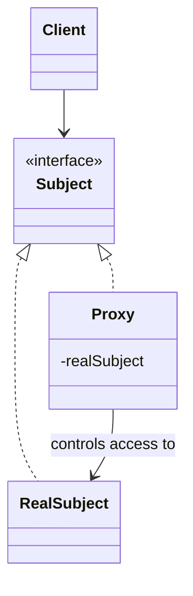

# Proxy

**Category:** Structural

## O problema

Acessar um objeto diretamente às vezes é caro, lento, ou precisa de uma checagem aplicada toda
vez — uma chamada de rede, o carregamento de um recurso grande, uma verificação de permissão.
Fazer com que todo chamador se lembre de aplicar essa lógica por conta própria (checar o cache
primeiro, verificar permissão, adiar o carregamento até realmente precisar) significa que a
lógica acaba duplicada ou esquecida em algum ponto de chamada eventualmente.

## A solução

Introduzir um substituto que implementa exatamente a mesma interface do objeto real, e colocar
a lógica extra (cache, carregamento preguiçoso, controle de acesso) dentro do substituto em vez
de em cada ponto de chamada. Chamadores seguram o proxy e o usam exatamente como a coisa real —
eles não conseguem notar a diferença só pela interface.



## Exemplo clássico

[`classic/ImageProxy`](src/main/java/com/designpatterns/structural/proxy/classic/ImageProxy.java)
implementa a mesma interface [`Image`](src/main/java/com/designpatterns/structural/proxy/classic/Image.java)
que [`RealImage`](src/main/java/com/designpatterns/structural/proxy/classic/RealImage.java),
mas não constrói a imagem real (cara de carregar) até a primeira chamada de `display()` — o
proxy virtual canônico, adiando um carregamento custoso até de fato ser necessário em vez de no
momento da construção.
[`ImageProxyTest`](src/test/java/com/designpatterns/structural/proxy/classic/ImageProxyTest.java)
verifica que a imagem real genuinamente não é carregada antes da primeira chamada de
`display()`, e que uma segunda chamada reutiliza a mesma imagem já carregada em vez de
recarregá-la.

## Exemplo aplicado: cache de uma consulta cara a um bureau de crédito

[`applied/CachingCreditScoreProxy`](src/main/java/com/designpatterns/structural/proxy/applied/CachingCreditScoreProxy.java)
implementa o mesmo contrato [`CreditScoreBureau`](src/main/java/com/designpatterns/structural/proxy/applied/CreditScoreBureau.java)
que [`ExternalCreditScoreBureau`](src/main/java/com/designpatterns/structural/proxy/applied/ExternalCreditScoreBureau.java)
— um substituto pra uma chamada real a um bureau externo que é lenta e, em produção, cobrada
por requisição. Um fluxo de aprovação de crédito que chama `lookupScore()` várias vezes pro
mesmo solicitante (uma na entrada, outra no underwriting, outra na aprovação final, digamos) só
dispara uma chamada externa real; toda chamada depois da primeira é atendida pelo cache do
proxy.
[`CachingCreditScoreProxyTest`](src/test/java/com/designpatterns/structural/proxy/applied/CachingCreditScoreProxyTest.java)
prova isso diretamente contando chamadas reais no bureau subjacente, e confirma que
solicitantes diferentes ainda disparam cada um sua própria consulta real.

## Quando não usar

- Se a operação "cara" genuinamente precisa rodar toda vez (os dados subjacentes mudam entre
  chamadas e desatualização é inaceitável), colocá-la em cache atrás de um proxy introduz um
  bug de correção, não uma otimização. Conheça a tolerância a dados desatualizados antes de
  recorrer a isso.
- Um cache que nunca descarta nada é um vazamento de memória esperando pra acontecer assim que
  o espaço de chaves for ilimitado (ver o `RateLimitDecorator` do módulo [Decorator](../../structural/decorator)
  deste repositório pra o mesmo tipo de preocupação com contadores por pagador) — um cache real
  precisa de uma política de descarte ou expiração, que este exemplo deliberadamente mínimo não
  inclui.
- Se o objetivo é adicionar comportamento novo em cima de um objeto em vez de controlar acesso
  a ele, isso é [Decorator](../../structural/decorator), não Proxy — os dois padrões têm
  diagramas de classe quase idênticos e se distinguem pela intenção, não pela estrutura.

## Cobertura de testes

100% de cobertura de instrução, 100% de cobertura de branch (JaCoCo). Reproduza você mesmo:

```bash
./gradlew :structural:proxy:jacocoTestReport
```

Relatório em `structural/proxy/build/reports/jacoco/test/html/index.html`.

## Leitura complementar

- Gamma, E., Helm, R., Johnson, R., & Vlissides, J. (1994). *Design Patterns: Elements of
  Reusable Object-Oriented Software*. Addison-Wesley. — o Capítulo 4 formaliza o Proxy,
  nomeando explicitamente o proxy virtual (criação de objeto cara, preguiçosa — `ImageProxy`
  aqui) e o proxy de proteção (controle de acesso) como duas de suas variantes principais, e
  contrasta Proxy com Decorator pela intenção, não pela estrutura.
- Belady, L. A. (1966). "A Study of Replacement Algorithms for a Virtual-Storage Computer."
  *IBM Systems Journal*, 5(2), 78–101. — o artigo fundacional sobre política de substituição de
  cache; diretamente relevante ao aviso de "Quando não usar" acima, já que o cache do
  `CachingCreditScoreProxy` deliberadamente não tem política de descarte nenhuma, que é a
  primeira coisa que uma versão de produção precisaria.
